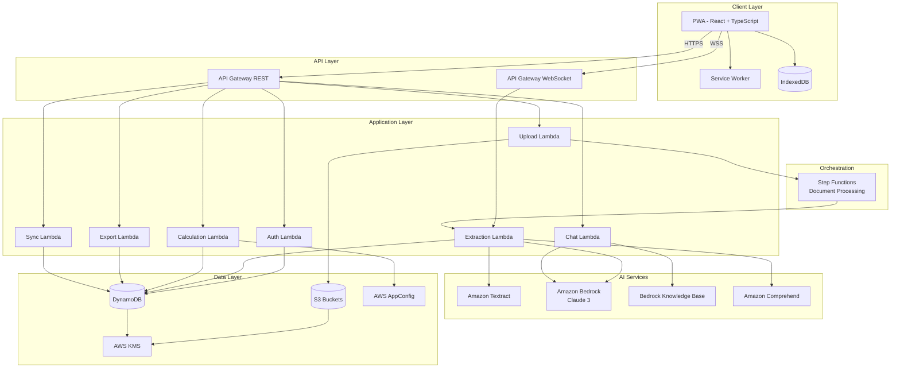
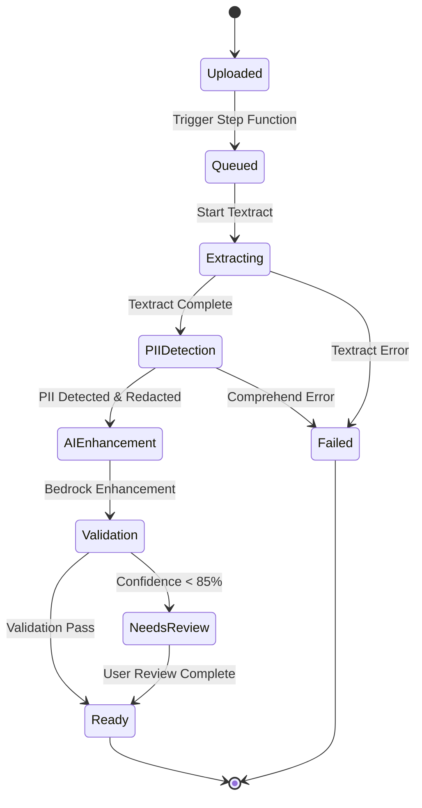
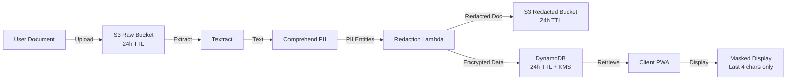

# Technical Design Document: Bharat Tax Mitra

## Overview

Bharat Tax Mitra is an offline-first Progressive Web Application (PWA) that simplifies income tax filing for Indian taxpayers in Tier-2 and Tier-3 cities. The system combines AI-powered document extraction with deterministic tax calculation to provide an accessible, privacy-focused tax filing experience.

### Core Design Principles

1. **Offline-First**: All critical functionality works without network connectivity using Service Workers and IndexedDB
2. **Privacy by Design**: 24-hour TTL on all PII data, encryption at rest and in transit, minimal data retention
3. **AI-Assisted, Human-Verified**: AI extracts data but users always review and approve before submission
4. **Deterministic Tax Calculation**: Tax engine uses rule-based computation (not ML) for accuracy and auditability
5. **Mobile-First**: Optimized for smartphone users with limited bandwidth and touch interfaces

### Technology Stack

**Frontend:**
- React 18 with TypeScript
- Tailwind CSS for responsive design
- Workbox for Service Worker management
- IndexedDB (via Dexie.js) for local storage
- Web Crypto API for client-side encryption

**Backend:**
- AWS API Gateway (REST + WebSocket)
- AWS Lambda (Node.js 20.x runtime)
- AWS Step Functions for document processing workflows
- Amazon DynamoDB for data persistence
- Amazon S3 for document storage
- AWS KMS for encryption key management
- AWS AppConfig for tax rules configuration

**AI/ML Services:**
- Amazon Textract for OCR and form extraction
- Amazon Bedrock (Claude 3 Sonnet) for chat assistant
- Amazon Bedrock Knowledge Bases for RAG over tax documentation
- Amazon Comprehend for PII detection

**Monitoring:**
- Amazon CloudWatch for logs and metrics
- AWS X-Ray for distributed tracing
- CloudWatch Alarms for failure rate monitoring

## Architecture

### System Architecture Diagram



### Offline-First Architecture

The PWA implements a sophisticated offline-first strategy:

1. **Service Worker Caching Strategy:**
   - **App Shell**: Cache-first for HTML, CSS, JS bundles
   - **API Responses**: Network-first with cache fallback for GET requests
   - **Static Assets**: Cache-first with background update for images, fonts
   - **Documents**: No caching (privacy requirement)

2. **IndexedDB Schema:**
   - `profiles`: User profile data and preferences
   - `taxSessions`: Active tax filing sessions with extracted data
   - `pendingRequests`: Queue of operations to sync when online
   - `savedDrafts`: Auto-saved form data every 30 seconds
   - `taxRules`: Cached tax calculation rules from AppConfig
   - `languagePacks`: Translations for offline multi-language support
   - `faqCache`: Common chat assistant responses

3. **Sync Protocol:**
   - Background Sync API triggers when connectivity restored
   - Conflict resolution: User edits always take precedence over extracted values
   - Optimistic UI updates with rollback on sync failure
   - Exponential backoff for failed sync attempts (1s, 2s, 4s, 8s, max 30s)

### Document Processing Pipeline



**Step Function Workflow:**

1. **Upload Step**: Lambda receives document, uploads to S3 raw bucket, returns upload ID
2. **Textract Step**: Invoke Textract AnalyzeDocument with FORMS and TABLES features
3. **PII Detection Step**: Run Comprehend DetectPiiEntities on extracted text
4. **Redaction Step**: Create redacted version in S3, apply KMS encryption
5. **AI Enhancement Step**: Use Bedrock to validate and enhance extracted key-value pairs
6. **Confidence Scoring Step**: Calculate field-level confidence scores
7. **Storage Step**: Write to DynamoDB with 24-hour TTL
8. **Notification Step**: Send WebSocket message to client with extraction results

### Privacy Architecture

**Data Flow with Privacy Controls:**



**Privacy Guarantees:**

1. **Encryption at Rest**: All S3 objects and DynamoDB items encrypted with KMS customer-managed keys
2. **Encryption in Transit**: TLS 1.3 for all API calls, WSS for WebSocket
3. **TTL Enforcement**: CloudWatch Events trigger daily Lambda to verify TTL deletions
4. **PII Minimization**: Only store PII necessary for tax calculation, redact in all displays
5. **Client-Side Encryption**: IndexedDB data encrypted with Web Crypto API using device-specific key
6. **No Cross-User Data Leakage**: DynamoDB partition key includes user ID, RLS policies enforced

## Components and Interfaces

### Frontend Components

**Component Hierarchy:**

```
App
├── LanguageSelector
├── AuthFlow
│   ├── MobileInput
│   ├── OTPVerification
│   └── RegimeSelection
├── Dashboard
│   ├── ConnectivityIndicator
│   ├── ProgressTracker
│   └── QuickActions
├── DocumentUpload
│   ├── FileDropzone
│   ├── UploadProgress
│   └── QueuedUploads (offline)
├── DataReview
│   ├── ExtractedFieldsPanel
│   ├── DocumentViewer
│   ├── ValidationWarnings
│   └── CompletenessScore
├── TaxCalculation
│   ├── RegimeComparison
│   ├── DeductionBreakdown
│   └── TaxLiabilityCard
├── ChatAssistant
│   ├── ChatWindow
│   ├── ContextualHelp
│   └── FAQOfflineCache
├── Export
│   ├── JSONPreview
│   ├── PDFSummary
│   └── DownloadButtons
└── Settings
    ├── LanguageSwitch
    ├── DataManagement
    └── SyncStatus
```

**Key Component Specifications:**

**1. DocumentUpload Component**

```typescript
interface DocumentUploadProps {
  onUploadComplete: (uploadId: string) => void;
  onUploadError: (error: Error) => void;
  maxFileSize: number; // 10MB
  acceptedTypes: string[]; // ['application/pdf', 'image/jpeg', 'image/png']
}

interface UploadState {
  status: 'idle' | 'uploading' | 'queued' | 'processing' | 'complete' | 'error';
  progress: number; // 0-100
  uploadId?: string;
  error?: string;
}
```

**2. DataReview Component**

```typescript
interface ExtractedField {
  fieldName: string;
  originalValue: string | number;
  userValue?: string | number;
  confidence: number; // 0-100
  isModified: boolean;
  validationStatus: 'valid' | 'warning' | 'error';
  validationMessage?: string;
}

interface DataReviewProps {
  extractedData: ExtractedField[];
  documentUrl: string;
  onFieldUpdate: (fieldName: string, newValue: string | number) => void;
  onValidationOverride: (fieldName: string) => void;
}
```

**3. TaxCalculation Component**

```typescript
interface TaxCalculationResult {
  regime: 'old' | 'new';
  grossTotalIncome: number;
  totalDeductions: number;
  taxableIncome: number;
  taxLiability: number;
  effectiveTaxRate: number;
  deductionBreakdown: {
    section80C: number;
    section80D: number;
    hra: number;
    standardDeduction: number;
  };
}

interface RegimeComparisonProps {
  oldRegimeResult: TaxCalculationResult;
  newRegimeResult: TaxCalculationResult;
  recommendedRegime: 'old' | 'new';
  savingsAmount: number;
}
```

### Backend API Interfaces

**REST API Endpoints:**

**1. Authentication API**

```
POST /auth/send-otp
Request: { mobileNumber: string, languageCode: string }
Response: { requestId: string, expiresAt: number }

POST /auth/verify-otp
Request: { requestId: string, otp: string }
Response: { accessToken: string, refreshToken: string, userId: string }

POST /auth/refresh
Request: { refreshToken: string }
Response: { accessToken: string }
```

**2. Document Upload API**

```
POST /documents/upload
Headers: { Authorization: Bearer <token> }
Request: multipart/form-data { file: File, documentType: 'form16' | 'ais' | 'bank' }
Response: { uploadId: string, status: 'queued', estimatedTime: number }

GET /documents/{uploadId}/status
Response: { 
  uploadId: string, 
  status: 'queued' | 'processing' | 'complete' | 'failed',
  progress: number,
  extractedData?: ExtractedData
}
```

**3. Tax Calculation API**

```
POST /tax/calculate
Request: {
  userId: string,
  financialYear: string,
  regime: 'old' | 'new' | 'both',
  incomeData: IncomeData,
  deductions: DeductionData
}
Response: {
  oldRegime?: TaxCalculationResult,
  newRegime?: TaxCalculationResult,
  recommendation: 'old' | 'new'
}

GET /tax/rules/{financialYear}
Response: { version: string, rules: TaxRules }
```

**4. Export API**

```
POST /export/json
Request: { userId: string, sessionId: string, itrType: 'ITR1' | 'ITR2' | 'ITR3' | 'ITR4' }
Response: { 
  jsonData: object, 
  validationStatus: 'valid' | 'invalid',
  errors?: ValidationError[]
}

POST /export/pdf
Request: { userId: string, sessionId: string }
Response: { pdfUrl: string, expiresAt: number }
```

**5. Chat Assistant API**

```
POST /chat/message
Request: { 
  userId: string, 
  sessionId: string, 
  message: string, 
  context?: { fieldName?: string, currentValue?: any }
}
Response: { 
  response: string, 
  sources?: string[], 
  suggestedActions?: string[]
}
```

**6. Sync API**

```
POST /sync/push
Request: { 
  userId: string, 
  pendingOperations: PendingOperation[],
  lastSyncTimestamp: number
}
Response: { 
  syncedOperations: string[], 
  conflicts: Conflict[],
  serverTimestamp: number
}

GET /sync/pull
Request: { userId: string, lastSyncTimestamp: number }
Response: { 
  updates: Update[], 
  serverTimestamp: number
}
```

**WebSocket API:**

```
Connection: wss://api.bharattaxmitra.in/ws
Authentication: Query param ?token=<accessToken>

Client -> Server Messages:
{
  action: 'subscribe',
  channel: 'extraction',
  uploadId: string
}

Server -> Client Messages:
{
  type: 'extraction.progress',
  uploadId: string,
  progress: number,
  stage: 'textract' | 'pii' | 'enhancement' | 'validation'
}

{
  type: 'extraction.complete',
  uploadId: string,
  extractedData: ExtractedData
}

{
  type: 'extraction.error',
  uploadId: string,
  error: string
}
```

### Lambda Function Specifications

**1. Extraction Lambda**

```typescript
// Handler: extractionHandler
// Timeout: 60 seconds
// Memory: 2048 MB
// Trigger: Step Functions

interface ExtractionInput {
  uploadId: string;
  s3Bucket: string;
  s3Key: string;
  documentType: 'form16' | 'ais' | 'bank';
}

interface ExtractionOutput {
  uploadId: string;
  extractedFields: Record<string, FieldExtraction>;
  confidence: number;
  piiEntities: PiiEntity[];
  status: 'success' | 'partial' | 'failed';
}

interface FieldExtraction {
  value: string | number;
  confidence: number;
  boundingBox?: BoundingBox;
  source: 'textract' | 'bedrock';
}
```

**2. Calculation Lambda**

```typescript
// Handler: calculationHandler
// Timeout: 10 seconds
// Memory: 512 MB
// Trigger: API Gateway

interface CalculationInput {
  userId: string;
  financialYear: string;
  regime: 'old' | 'new' | 'both';
  income: {
    salary: number;
    houseProperty: number;
    businessIncome: number;
    capitalGains: number;
    otherSources: number;
  };
  deductions: {
    section80C: number;
    section80D: number;
    hra: number;
    standardDeduction: number;
  };
}

// Tax calculation logic uses AppConfig rules
async function calculateTax(input: CalculationInput): Promise<TaxCalculationResult> {
  const rules = await getTaxRules(input.financialYear);
  // Deterministic calculation based on rules
}
```

**3. Export Lambda**

```typescript
// Handler: exportHandler
// Timeout: 30 seconds
// Memory: 1024 MB
// Trigger: API Gateway

interface ExportInput {
  userId: string;
  sessionId: string;
  itrType: 'ITR1' | 'ITR2' | 'ITR3' | 'ITR4';
  format: 'json' | 'pdf';
}

// JSON export validates against IT Portal schema
async function generateITRJson(input: ExportInput): Promise<object> {
  const sessionData = await getSessionData(input.sessionId);
  const itrJson = mapToITRSchema(sessionData, input.itrType);
  const validation = await validateITRJson(itrJson, input.itrType);
  if (!validation.valid) {
    throw new ValidationError(validation.errors);
  }
  return itrJson;
}
```

## Data Models

### DynamoDB Tables

**1. Users Table**

```
Table Name: bharat-tax-mitra-users
Partition Key: userId (String)
Sort Key: -
TTL Attribute: -

Attributes:
- userId: String (UUID)
- mobileNumber: String (encrypted with KMS)
- languageCode: String (en, hi, ta, te, mr, bn, gu)
- preferredRegime: String (old, new)
- createdAt: Number (Unix timestamp)
- lastLoginAt: Number (Unix timestamp)
- deviceIds: StringSet (for multi-device support)

GSI: MobileNumberIndex
- Partition Key: mobileNumberHash (SHA256 of mobile number)
- Projection: ALL
```

**2. TaxSessions Table**

```
Table Name: bharat-tax-mitra-sessions
Partition Key: userId (String)
Sort Key: sessionId (String)
TTL Attribute: expiresAt (24 hours from creation)

Attributes:
- userId: String
- sessionId: String (UUID)
- financialYear: String (FY2025-26)
- status: String (draft, review, exported, filed)
- extractedData: Map (encrypted with KMS)
  - form16: Map
  - ais: Map
  - bankStatements: List<Map>
- userEdits: Map (tracks user modifications)
- calculationResults: Map
  - oldRegime: Map
  - newRegime: Map
- validationWarnings: List<Map>
- completenessScore: Number (0-100)
- createdAt: Number
- updatedAt: Number
- expiresAt: Number (TTL)

GSI: StatusIndex
- Partition Key: userId
- Sort Key: status
- Projection: KEYS_ONLY
```

**3. Documents Table**

```
Table Name: bharat-tax-mitra-documents
Partition Key: uploadId (String)
Sort Key: -
TTL Attribute: expiresAt (24 hours from upload)

Attributes:
- uploadId: String (UUID)
- userId: String
- sessionId: String
- documentType: String (form16, ais, bank)
- s3BucketRaw: String
- s3KeyRaw: String
- s3BucketRedacted: String
- s3KeyRedacted: String
- extractionStatus: String (queued, processing, complete, failed)
- extractionProgress: Number (0-100)
- piiDetected: Boolean
- piiEntities: List<Map>
- uploadedAt: Number
- processedAt: Number
- expiresAt: Number (TTL)

GSI: UserSessionIndex
- Partition Key: userId
- Sort Key: sessionId
- Projection: ALL
```

**4. CalculationResults Table**

```
Table Name: bharat-tax-mitra-calculations
Partition Key: userId (String)
Sort Key: calculationId (String)
TTL Attribute: expiresAt (24 hours)

Attributes:
- userId: String
- calculationId: String (UUID)
- sessionId: String
- financialYear: String
- inputData: Map (encrypted)
- oldRegimeResult: Map
- newRegimeResult: Map
- recommendedRegime: String
- taxRulesVersion: String
- calculatedAt: Number
- expiresAt: Number (TTL)
```

**5. AuditEvents Table**

```
Table Name: bharat-tax-mitra-audit
Partition Key: userId (String)
Sort Key: eventTimestamp (Number)
TTL Attribute: expiresAt (90 days retention)

Attributes:
- userId: String
- eventTimestamp: Number
- eventType: String (login, upload, extraction, calculation, export, data_deletion)
- eventDetails: Map
- ipAddress: String (hashed)
- userAgent: String
- success: Boolean
- errorMessage: String (if applicable)
- expiresAt: Number (90 days TTL)

GSI: EventTypeIndex
- Partition Key: eventType
- Sort Key: eventTimestamp
- Projection: ALL
```

### S3 Bucket Structure

**Raw Documents Bucket:**

```
Bucket Name: bharat-tax-mitra-documents-raw
Encryption: SSE-KMS with customer-managed key
Lifecycle Policy: Delete after 1 day
Versioning: Disabled

Key Structure:
{userId}/{sessionId}/{uploadId}/original.{ext}

Example:
user-123/session-456/upload-789/original.pdf
```

**Redacted Documents Bucket:**

```
Bucket Name: bharat-tax-mitra-documents-redacted
Encryption: SSE-KMS with customer-managed key
Lifecycle Policy: Delete after 1 day
Versioning: Disabled

Key Structure:
{userId}/{sessionId}/{uploadId}/redacted.{ext}

Example:
user-123/session-456/upload-789/redacted.pdf
```

**Export Bucket:**

```
Bucket Name: bharat-tax-mitra-exports
Encryption: SSE-KMS
Lifecycle Policy: Delete after 7 days
Versioning: Disabled

Key Structure:
{userId}/{sessionId}/itr-{itrType}-{timestamp}.json
{userId}/{sessionId}/summary-{timestamp}.pdf

Example:
user-123/session-456/itr-ITR1-1735689600.json
user-123/session-456/summary-1735689600.pdf
```

### IndexedDB Schema (Client-Side)

**Database Name:** bharatTaxMitraDB
**Version:** 1

**Object Stores:**

```typescript
// 1. profiles
interface ProfileStore {
  userId: string; // key
  mobileNumber: string; // encrypted
  languageCode: string;
  preferredRegime: string;
  authToken: string; // encrypted
  refreshToken: string; // encrypted
  lastSyncTimestamp: number;
}

// 2. taxSessions
interface TaxSessionStore {
  sessionId: string; // key
  userId: string;
  financialYear: string;
  status: string;
  extractedData: object;
  userEdits: object;
  calculationResults: object;
  validationWarnings: Array<object>;
  completenessScore: number;
  lastModified: number;
  syncStatus: 'synced' | 'pending' | 'conflict';
}

// 3. pendingRequests
interface PendingRequestStore {
  requestId: string; // key
  method: string; // POST, PUT, DELETE
  endpoint: string;
  payload: object;
  timestamp: number;
  retryCount: number;
  maxRetries: number;
}

// 4. savedDrafts
interface SavedDraftStore {
  draftId: string; // key
  sessionId: string;
  formData: object;
  savedAt: number;
  autoSave: boolean;
}

// 5. taxRules
interface TaxRulesStore {
  financialYear: string; // key
  version: string;
  rules: object;
  cachedAt: number;
  expiresAt: number;
}

// 6. languagePacks
interface LanguagePackStore {
  languageCode: string; // key
  translations: Record<string, string>;
  version: string;
  cachedAt: number;
}

// 7. faqCache
interface FaqCacheStore {
  questionHash: string; // key (SHA256 of question)
  question: string;
  answer: string;
  languageCode: string;
  cachedAt: number;
  expiresAt: number;
}
```

### Tax Rules Configuration (AppConfig)

**Configuration Name:** tax-rules-fy2025-26
**Format:** JSON

```json
{
  "version": "1.0.0",
  "financialYear": "FY2025-26",
  "assessmentYear": "AY2026-27",
  "oldRegime": {
    "slabs": [
      { "min": 0, "max": 250000, "rate": 0 },
      { "min": 250001, "max": 500000, "rate": 5 },
      { "min": 500001, "max": 1000000, "rate": 20 },
      { "min": 1000001, "max": null, "rate": 30 }
    ],
    "surcharge": {
      "threshold5": 5000000,
      "threshold10": 10000000,
      "threshold15": 20000000,
      "threshold25": 50000000
    },
    "cess": 4,
    "deductions": {
      "section80C": { "limit": 150000 },
      "section80D": { 
        "self": 25000, 
        "selfSenior": 50000, 
        "parents": 25000, 
        "parentsSenior": 50000 
      },
      "section80CCD1B": { "limit": 50000 },
      "standardDeduction": { "limit": 50000 }
    },
    "hra": {
      "metro": 0.5,
      "nonMetro": 0.4,
      "rentThreshold": 0.1
    }
  },
  "newRegime": {
    "slabs": [
      { "min": 0, "max": 300000, "rate": 0 },
      { "min": 300001, "max": 600000, "rate": 5 },
      { "min": 600001, "max": 900000, "rate": 10 },
      { "min": 900001, "max": 1200000, "rate": 15 },
      { "min": 1200001, "max": 1500000, "rate": 20 },
      { "min": 1500001, "max": null, "rate": 30 }
    ],
    "surcharge": {
      "threshold5": 5000000,
      "threshold10": 10000000,
      "threshold15": 20000000,
      "threshold25": 50000000
    },
    "cess": 4,
    "rebate87A": {
      "incomeThreshold": 700000,
      "maxRebate": 25000
    },
    "standardDeduction": { "limit": 50000 }
  },
  "presumptiveTaxation": {
    "section44AD": {
      "threshold": 5000000,
      "rate": 0.08,
      "digitalRate": 0.06
    },
    "section44ADA": {
      "threshold": 5000000,
      "rate": 0.5
    }
  },
  "validationRules": {
    "maxTDSPercentage": 50,
    "maxHRAPercentage": 50,
    "maxDeductionPercentage": 100
  }
}
```

### ITR JSON Schema (Simplified)

**ITR-1 Schema Structure:**

```json
{
  "ITR": {
    "ITR1": {
      "PersonalInfo": {
        "AssesseeName": { "FirstName": "", "MiddleName": "", "SurName": "" },
        "PAN": "",
        "DOB": "",
        "AadhaarNumber": "",
        "Address": { "ResidenceNo": "", "RoadOrStreet": "", "LocalityOrArea": "", "CityOrTownOrDistrict": "", "StateCode": "", "PinCode": "" },
        "MobileNo": "",
        "EmailAddress": ""
      },
      "FilingStatus": {
        "ReturnFiledUnderSection": "11",
        "ResidentialStatus": "RES",
        "FilingCategory": "ORIGINAL"
      },
      "ITR1_IncomeDeductions": {
        "Salary": {
          "SalaryDtls": {
            "SalaryType": "SEC17_1",
            "NameOfEmployer": "",
            "TANOfEmployer": "",
            "TotalSalary": 0,
            "AllowanceExemptUs10": 0,
            "StandardDeduction": 50000,
            "EntertainmentAllow16ii": 0,
            "ProfessionalTaxUs16iii": 0,
            "NetSalary": 0
          }
        },
        "DeductionUs80C": 0,
        "DeductionUs80D": 0,
        "TotalDeductions": 0,
        "TotalIncome": 0
      },
      "ITR1_TaxComputation": {
        "TaxOnTotalIncome": 0,
        "Rebate87A": 0,
        "Surcharge": 0,
        "HealthAndEducationCess": 0,
        "TotalTaxPayable": 0
      },
      "TaxesPaid": {
        "TDS": { "TDSOnSalary": 0 },
        "AdvanceTax": 0,
        "SelfAssessmentTax": 0,
        "TotalTaxesPaid": 0
      },
      "Refund": {
        "RefundDue": 0,
        "BankAccountDtls": {
          "IFSCCode": "",
          "BankName": "",
          "BankAccountNo": ""
        }
      }
    }
  }
}
```


## UX Flow Design

### Mobile-First Screen Flows

**1. Onboarding Flow**

```
[Language Selection] 
    ↓
[Mobile Number Entry]
    ↓
[OTP Verification]
    ↓
[Regime Selection Screen]
    ↓
[Dashboard]
```

**Screen Specifications:**

- **Language Selection**: Grid of 7 language cards with native script, auto-detect based on device locale
- **Mobile Number Entry**: Single input with country code (+91), numeric keyboard, validation on blur
- **OTP Verification**: 6-digit input with auto-focus, resend after 30s, 3 attempts max
- **Regime Selection**: Side-by-side comparison cards with "Learn More" links to chat assistant

**2. Document Upload Flow**

```
[Dashboard]
    ↓
[Upload Type Selection] (Form-16 / AIS / Bank Statement)
    ↓
[File Picker / Camera]
    ↓
[Upload Progress] (with offline queue indicator)
    ↓
[Processing Status] (WebSocket real-time updates)
    ↓
[Extraction Complete] → [Data Review]
```

**Offline Behavior:**
- Files queued in IndexedDB with visual "Queued for Upload" badge
- Background sync triggers upload when online
- User can continue to next step with manual entry if needed

**3. Data Review and Correction Flow**

```
[Extraction Complete]
    ↓
[Review Screen: Split View]
    ├─ Left: Document Image (pinch-to-zoom)
    └─ Right: Extracted Fields (editable)
    ↓
[Field Validation] (real-time as user types)
    ↓
[Completeness Check] (progress bar at top)
    ↓
[Anomaly Warnings] (modal with "Override" or "Fix" options)
    ↓
[Confirm Review] → [Tax Calculation]
```

**Validation Points:**
- Mandatory fields: Red border + error message below field
- Warnings: Yellow border + warning icon with tooltip
- Low confidence (<85%): Blue border + "AI extracted, please verify" badge
- User edits: Green highlight to show modification


**4. Tax Calculation Flow**

```
[Data Review Complete]
    ↓
[Regime Comparison Screen]
    ├─ Old Regime Card (with deductions breakdown)
    └─ New Regime Card (with rebate info)
    ↓
[Select Regime] (tap to select, shows savings)
    ↓
[Deduction Details] (expandable sections for 80C, 80D, HRA)
    ↓
[Final Tax Summary]
    ↓
[Export Options]
```

**Offline Capability:**
- Full calculation runs locally using cached tax rules
- Regime comparison updates in real-time as user edits deductions
- No network required for this entire flow

**5. Chat Assistant Flow**

```
[Any Screen with "?" icon]
    ↓
[Chat Overlay] (bottom sheet on mobile)
    ↓
[User Question]
    ↓
[AI Response] (with sources and "Was this helpful?" feedback)
    ↓
[Contextual Actions] (e.g., "Add this deduction", "Learn more about 80C")
```

**Offline Behavior:**
- FAQ cache serves common questions instantly
- "You're offline" message with cached responses available
- Questions queued for when online

**6. Export Flow**

```
[Tax Summary]
    ↓
[Export Options Screen]
    ├─ Download JSON for IT Portal
    └─ Download PDF Summary
    ↓
[Validation Check] (schema validation)
    ↓
[Preview Screen] (JSON structure or PDF preview)
    ↓
[Download] (triggers browser download)
    ↓
[Success Confirmation] (with instructions for IT Portal upload)
```

**Offline Capability:**
- JSON generation works offline
- PDF generation works offline using client-side library
- Files saved to device storage

### Error Handling UX

**Network Errors:**
- Toast notification: "You're offline. Changes saved locally."
- Persistent banner at top when offline with sync status
- Retry button for failed operations

**Validation Errors:**
- Inline error messages below fields
- Scroll to first error on form submission
- Error summary card at top of form

**Extraction Errors:**
- "Extraction failed" modal with options: "Retry" or "Enter Manually"
- Partial extraction: Show extracted fields + empty fields for manual entry
- Low confidence: Visual indicator + "Please verify" message

**Sync Conflicts:**
- Modal showing server value vs local value
- "Keep Local" or "Use Server" buttons
- Timestamp of each version displayed


## Tech Stack Integration

### Frontend Integration

**React + TypeScript + Tailwind CSS:**

```typescript
// Component structure with TypeScript interfaces
interface TaxFormProps {
  initialData: ExtractedData;
  onSave: (data: TaxFormData) => Promise<void>;
  validationRules: ValidationRules;
}

// Tailwind CSS for responsive design
<div className="grid grid-cols-1 md:grid-cols-2 gap-4 p-4">
  <Card className="bg-white shadow-md rounded-lg p-6">
    {/* Old Regime */}
  </Card>
  <Card className="bg-white shadow-md rounded-lg p-6">
    {/* New Regime */}
  </Card>
</div>

// Mobile-first breakpoints
// sm: 640px, md: 768px, lg: 1024px, xl: 1280px
```

**Service Worker + IndexedDB Integration:**

```typescript
// Service Worker registration
if ('serviceWorker' in navigator) {
  navigator.serviceWorker.register('/sw.js').then(registration => {
    console.log('SW registered:', registration);
  });
}

// Workbox caching strategies
import { precacheAndRoute } from 'workbox-precaching';
import { registerRoute } from 'workbox-routing';
import { CacheFirst, NetworkFirst } from 'workbox-strategies';

// Precache app shell
precacheAndRoute(self.__WB_MANIFEST);

// API calls: Network first with cache fallback
registerRoute(
  ({ url }) => url.pathname.startsWith('/api/'),
  new NetworkFirst({
    cacheName: 'api-cache',
    networkTimeoutSeconds: 10,
  })
);

// Static assets: Cache first
registerRoute(
  ({ request }) => request.destination === 'image',
  new CacheFirst({ cacheName: 'images' })
);

// Background Sync for offline operations
self.addEventListener('sync', event => {
  if (event.tag === 'sync-tax-data') {
    event.waitUntil(syncPendingRequests());
  }
});
```

**IndexedDB with Dexie.js:**

```typescript
import Dexie, { Table } from 'dexie';

class TaxMitraDB extends Dexie {
  profiles!: Table<ProfileStore>;
  taxSessions!: Table<TaxSessionStore>;
  pendingRequests!: Table<PendingRequestStore>;

  constructor() {
    super('bharatTaxMitraDB');
    this.version(1).stores({
      profiles: 'userId, mobileNumber',
      taxSessions: 'sessionId, userId, [userId+status]',
      pendingRequests: 'requestId, timestamp',
      savedDrafts: 'draftId, sessionId',
      taxRules: 'financialYear',
      languagePacks: 'languageCode',
      faqCache: 'questionHash, languageCode'
    });
  }
}

export const db = new TaxMitraDB();

// Usage in components
const saveDraft = async (sessionId: string, formData: object) => {
  await db.savedDrafts.put({
    draftId: `${sessionId}-${Date.now()}`,
    sessionId,
    formData,
    savedAt: Date.now(),
    autoSave: true
  });
};
```

**Web Crypto API for Client-Side Encryption:**

```typescript
// Generate encryption key from device-specific data
async function generateEncryptionKey(): Promise<CryptoKey> {
  const keyMaterial = await crypto.subtle.importKey(
    'raw',
    new TextEncoder().encode(await getDeviceId()),
    { name: 'PBKDF2' },
    false,
    ['deriveBits', 'deriveKey']
  );
  
  return crypto.subtle.deriveKey(
    {
      name: 'PBKDF2',
      salt: new TextEncoder().encode('bharat-tax-mitra-salt'),
      iterations: 100000,
      hash: 'SHA-256'
    },
    keyMaterial,
    { name: 'AES-GCM', length: 256 },
    false,
    ['encrypt', 'decrypt']
  );
}

// Encrypt sensitive data before storing in IndexedDB
async function encryptData(data: string): Promise<string> {
  const key = await generateEncryptionKey();
  const iv = crypto.getRandomValues(new Uint8Array(12));
  const encrypted = await crypto.subtle.encrypt(
    { name: 'AES-GCM', iv },
    key,
    new TextEncoder().encode(data)
  );
  
  return JSON.stringify({
    iv: Array.from(iv),
    data: Array.from(new Uint8Array(encrypted))
  });
}
```


### Backend Integration

**Lambda + Step Functions + DynamoDB Orchestration:**

```typescript
// Step Functions definition (AWS CDK)
const documentProcessingStateMachine = new sfn.StateMachine(this, 'DocumentProcessing', {
  definition: sfn.Chain
    .start(new tasks.LambdaInvoke(this, 'StartExtraction', {
      lambdaFunction: extractionLambda,
      outputPath: '$.Payload',
    }))
    .next(new tasks.LambdaInvoke(this, 'DetectPII', {
      lambdaFunction: piiDetectionLambda,
      outputPath: '$.Payload',
    }))
    .next(new tasks.LambdaInvoke(this, 'EnhanceWithAI', {
      lambdaFunction: bedrockEnhancementLambda,
      outputPath: '$.Payload',
    }))
    .next(new tasks.LambdaInvoke(this, 'ValidateAndStore', {
      lambdaFunction: validationLambda,
      outputPath: '$.Payload',
    }))
    .next(new tasks.LambdaInvoke(this, 'NotifyClient', {
      lambdaFunction: notificationLambda,
    }))
});

// Lambda function with DynamoDB integration
import { DynamoDBClient } from '@aws-sdk/client-dynamodb';
import { DynamoDBDocumentClient, PutCommand, GetCommand } from '@aws-sdk/lib-dynamodb';

const ddbClient = DynamoDBDocumentClient.from(new DynamoDBClient({}));

export const handler = async (event: any) => {
  const { userId, sessionId, extractedData } = event;
  
  // Store with TTL
  await ddbClient.send(new PutCommand({
    TableName: process.env.SESSIONS_TABLE,
    Item: {
      userId,
      sessionId,
      extractedData,
      createdAt: Date.now(),
      expiresAt: Math.floor(Date.now() / 1000) + 86400 // 24 hours
    }
  }));
  
  return { statusCode: 200, body: 'Success' };
};
```

**Textract + Bedrock + Knowledge Bases Integration:**

```typescript
// Textract extraction
import { TextractClient, AnalyzeDocumentCommand } from '@aws-sdk/client-textract';

const textractClient = new TextractClient({});

async function extractFromDocument(s3Bucket: string, s3Key: string) {
  const command = new AnalyzeDocumentCommand({
    Document: { S3Object: { Bucket: s3Bucket, Name: s3Key } },
    FeatureTypes: ['FORMS', 'TABLES']
  });
  
  const response = await textractClient.send(command);
  
  // Parse key-value pairs
  const keyValuePairs = parseTextractResponse(response);
  return keyValuePairs;
}

// Bedrock enhancement
import { BedrockRuntimeClient, InvokeModelCommand } from '@aws-sdk/client-bedrock-runtime';

const bedrockClient = new BedrockRuntimeClient({});

async function enhanceExtraction(rawExtraction: Record<string, any>) {
  const prompt = `You are a tax document expert. Review this extracted data from a Form-16 and:
1. Validate field values are reasonable
2. Fill in missing fields if inferable
3. Flag anomalies

Extracted data: ${JSON.stringify(rawExtraction)}

Return JSON with: { validated: {...}, anomalies: [...], confidence: 0-100 }`;

  const command = new InvokeModelCommand({
    modelId: 'anthropic.claude-3-sonnet-20240229-v1:0',
    contentType: 'application/json',
    accept: 'application/json',
    body: JSON.stringify({
      anthropic_version: 'bedrock-2023-05-31',
      max_tokens: 2000,
      messages: [{ role: 'user', content: prompt }]
    })
  });
  
  const response = await bedrockClient.send(command);
  const result = JSON.parse(new TextDecoder().decode(response.body));
  return JSON.parse(result.content[0].text);
}

// Knowledge Base RAG for chat
import { BedrockAgentRuntimeClient, RetrieveAndGenerateCommand } from '@aws-sdk/client-bedrock-agent-runtime';

const kbClient = new BedrockAgentRuntimeClient({});

async function answerTaxQuestion(question: string, context?: any) {
  const command = new RetrieveAndGenerateCommand({
    input: { text: question },
    retrieveAndGenerateConfiguration: {
      type: 'KNOWLEDGE_BASE',
      knowledgeBaseConfiguration: {
        knowledgeBaseId: process.env.KB_ID,
        modelArn: 'arn:aws:bedrock:us-east-1::foundation-model/anthropic.claude-3-sonnet-20240229-v1:0'
      }
    }
  });
  
  const response = await kbClient.send(command);
  return {
    answer: response.output?.text,
    sources: response.citations?.map(c => c.retrievedReferences).flat()
  };
}
```

**Comprehend + KMS for Privacy:**

```typescript
// PII detection with Comprehend
import { ComprehendClient, DetectPiiEntitiesCommand } from '@aws-sdk/client-comprehend';

const comprehendClient = new ComprehendClient({});

async function detectPII(text: string) {
  const command = new DetectPiiEntitiesCommand({
    Text: text,
    LanguageCode: 'en'
  });
  
  const response = await comprehendClient.send(command);
  return response.Entities?.filter(e => e.Score && e.Score > 0.8) || [];
}

// KMS encryption
import { KMSClient, EncryptCommand, DecryptCommand } from '@aws-sdk/client-kms';

const kmsClient = new KMSClient({});

async function encryptPII(data: string): Promise<string> {
  const command = new EncryptCommand({
    KeyId: process.env.KMS_KEY_ID,
    Plaintext: Buffer.from(data)
  });
  
  const response = await kmsClient.send(command);
  return Buffer.from(response.CiphertextBlob!).toString('base64');
}

async function decryptPII(encryptedData: string): Promise<string> {
  const command = new DecryptCommand({
    CiphertextBlob: Buffer.from(encryptedData, 'base64')
  });
  
  const response = await kmsClient.send(command);
  return Buffer.from(response.Plaintext!).toString('utf-8');
}
```

**AppConfig for Tax Rules Management:**

```typescript
// AppConfig client
import { AppConfigDataClient, GetLatestConfigurationCommand, StartConfigurationSessionCommand } from '@aws-sdk/client-appconfigdata';

const appConfigClient = new AppConfigDataClient({});
let configToken: string | undefined;

async function getTaxRules(financialYear: string): Promise<TaxRules> {
  // Start session if no token
  if (!configToken) {
    const startSession = new StartConfigurationSessionCommand({
      ApplicationIdentifier: process.env.APPCONFIG_APP_ID,
      EnvironmentIdentifier: process.env.APPCONFIG_ENV_ID,
      ConfigurationProfileIdentifier: `tax-rules-${financialYear}`
    });
    const sessionResponse = await appConfigClient.send(startSession);
    configToken = sessionResponse.InitialConfigurationToken;
  }
  
  // Get latest configuration
  const getConfig = new GetLatestConfigurationCommand({
    ConfigurationToken: configToken
  });
  const response = await appConfigClient.send(getConfig);
  configToken = response.NextPollConfigurationToken;
  
  if (response.Configuration) {
    const config = JSON.parse(new TextDecoder().decode(response.Configuration));
    return config;
  }
  
  throw new Error('Failed to load tax rules');
}

// Cache tax rules in Lambda memory
let cachedRules: TaxRules | null = null;
let cacheTimestamp = 0;
const CACHE_TTL = 5 * 60 * 1000; // 5 minutes

export async function getTaxRulesWithCache(financialYear: string): Promise<TaxRules> {
  if (cachedRules && Date.now() - cacheTimestamp < CACHE_TTL) {
    return cachedRules;
  }
  
  cachedRules = await getTaxRules(financialYear);
  cacheTimestamp = Date.now();
  return cachedRules;
}
```


### Logging and Audit Architecture

**CloudWatch Logging Strategy:**

```typescript
// Structured logging without PII
import { Logger } from '@aws-lambda-powertools/logger';

const logger = new Logger({ serviceName: 'bharat-tax-mitra' });

// Safe logging - no PII
logger.info('Document uploaded', {
  userId: hashUserId(userId), // Hash instead of raw ID
  documentType: 'form16',
  fileSize: file.size,
  timestamp: Date.now()
});

// Audit event logging
async function logAuditEvent(event: AuditEvent) {
  await ddbClient.send(new PutCommand({
    TableName: process.env.AUDIT_TABLE,
    Item: {
      userId: event.userId,
      eventTimestamp: Date.now(),
      eventType: event.type,
      eventDetails: {
        action: event.action,
        resource: event.resource,
        // No PII in details
      },
      ipAddress: hashIP(event.ipAddress),
      userAgent: event.userAgent,
      success: event.success,
      expiresAt: Math.floor(Date.now() / 1000) + (90 * 86400) // 90 days
    }
  }));
  
  logger.info('Audit event logged', {
    eventType: event.type,
    success: event.success
  });
}

// Error logging with context
try {
  await processDocument(uploadId);
} catch (error) {
  logger.error('Document processing failed', {
    uploadId: hashId(uploadId),
    errorType: error.name,
    errorMessage: error.message,
    // Stack trace in CloudWatch but no PII
  });
  throw error;
}
```

**CloudWatch Metrics:**

```typescript
import { MetricUnits } from '@aws-lambda-powertools/metrics';
import { Metrics } from '@aws-lambda-powertools/metrics';

const metrics = new Metrics({ namespace: 'BharatTaxMitra' });

// Track extraction success rate
metrics.addMetric('ExtractionSuccess', MetricUnits.Count, 1);
metrics.addMetric('ExtractionFailure', MetricUnits.Count, 0);

// Track extraction confidence
metrics.addMetric('ExtractionConfidence', MetricUnits.Percent, confidenceScore);

// Track API latency
metrics.addMetric('TextractLatency', MetricUnits.Milliseconds, duration);

// Track offline sync
metrics.addMetric('OfflineSyncSuccess', MetricUnits.Count, 1);
```

**X-Ray Tracing:**

```typescript
import { captureAWSv3Client } from 'aws-xray-sdk-core';

// Wrap AWS SDK clients for tracing
const tracedDDBClient = captureAWSv3Client(new DynamoDBClient({}));
const tracedTextractClient = captureAWSv3Client(new TextractClient({}));

// Custom subsegments for business logic
import * as AWSXRay from 'aws-xray-sdk-core';

async function processDocument(uploadId: string) {
  const segment = AWSXRay.getSegment();
  const subsegment = segment?.addNewSubsegment('DocumentProcessing');
  
  try {
    subsegment?.addAnnotation('uploadId', hashId(uploadId));
    subsegment?.addAnnotation('documentType', 'form16');
    
    const result = await extractData(uploadId);
    
    subsegment?.addMetadata('extractionResult', {
      fieldsExtracted: result.fields.length,
      confidence: result.confidence
    });
    
    subsegment?.close();
    return result;
  } catch (error) {
    subsegment?.addError(error);
    subsegment?.close();
    throw error;
  }
}
```

**TTL Verification and Deletion Audit:**

```typescript
// Lambda triggered by CloudWatch Events (daily)
export const verifyTTLDeletions = async () => {
  const yesterday = Math.floor(Date.now() / 1000) - 86400;
  
  // Query items that should have been deleted
  const response = await ddbClient.send(new QueryCommand({
    TableName: process.env.SESSIONS_TABLE,
    IndexName: 'ExpiresAtIndex',
    KeyConditionExpression: 'expiresAt < :yesterday',
    ExpressionAttributeValues: { ':yesterday': yesterday }
  }));
  
  if (response.Items && response.Items.length > 0) {
    logger.error('TTL deletion failed', {
      itemCount: response.Items.length,
      oldestExpiry: response.Items[0].expiresAt
    });
    
    // Alert administrators
    await sendAlert('TTL_DELETION_FAILED', {
      table: process.env.SESSIONS_TABLE,
      itemCount: response.Items.length
    });
  } else {
    logger.info('TTL deletions verified', {
      checkTimestamp: Date.now()
    });
  }
};

// S3 lifecycle verification
import { S3Client, ListObjectsV2Command } from '@aws-sdk/client-s3';

const s3Client = new S3Client({});

export const verifyS3Lifecycle = async () => {
  const oneDayAgo = Date.now() - 86400000;
  
  const response = await s3Client.send(new ListObjectsV2Command({
    Bucket: process.env.RAW_DOCUMENTS_BUCKET,
    MaxKeys: 1000
  }));
  
  const oldObjects = response.Contents?.filter(obj => 
    obj.LastModified && obj.LastModified.getTime() < oneDayAgo
  );
  
  if (oldObjects && oldObjects.length > 0) {
    logger.error('S3 lifecycle policy failed', {
      bucket: process.env.RAW_DOCUMENTS_BUCKET,
      oldObjectCount: oldObjects.length
    });
  }
};
```

