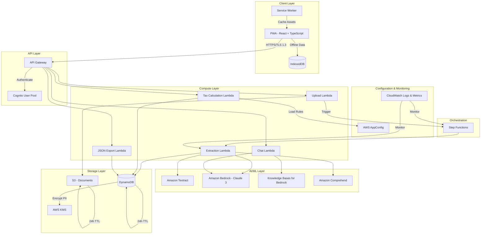
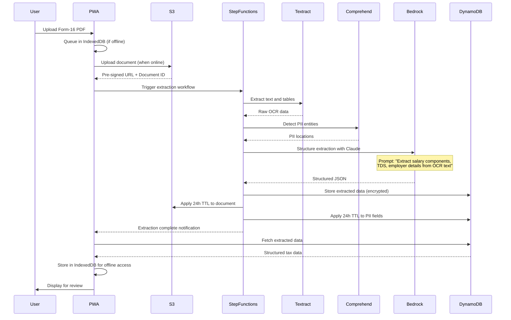
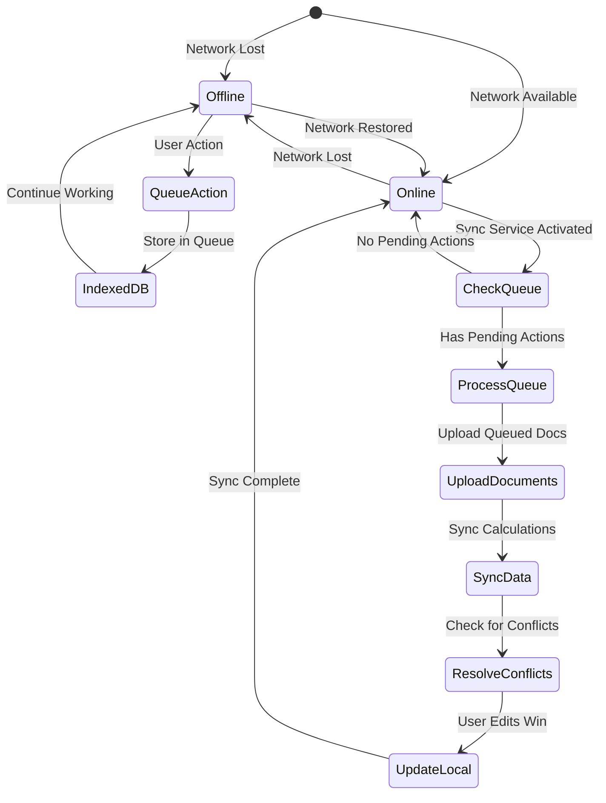
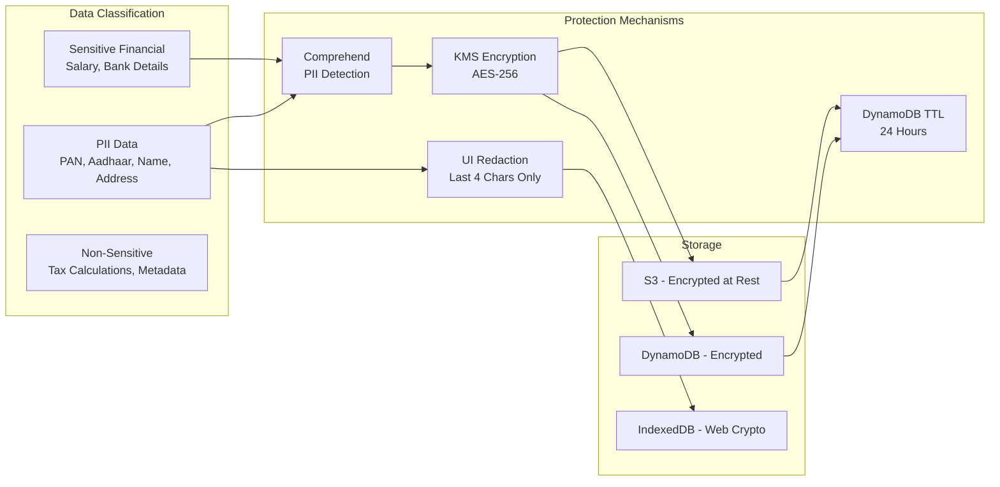
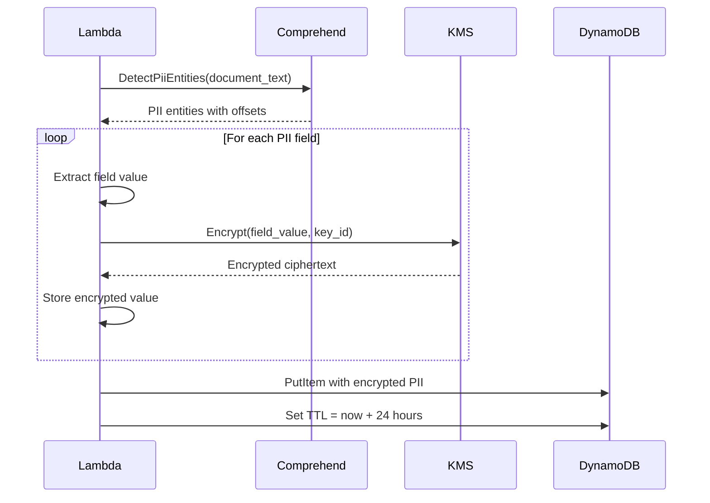
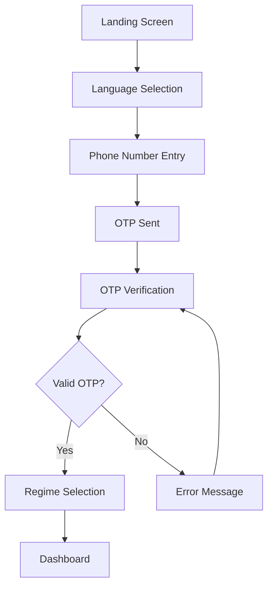
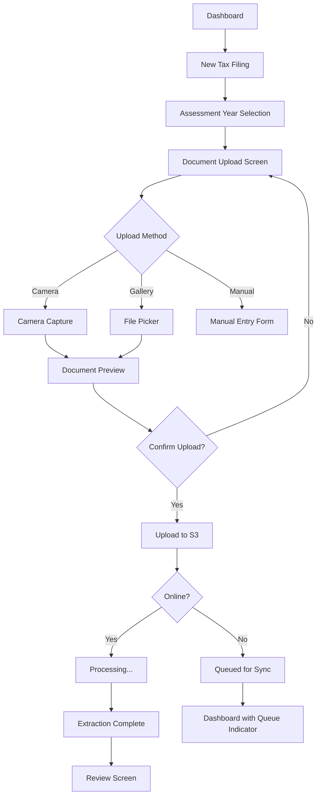
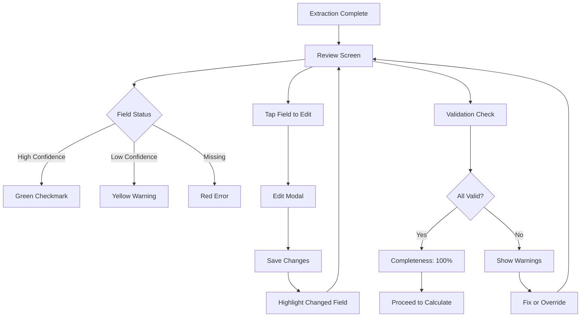
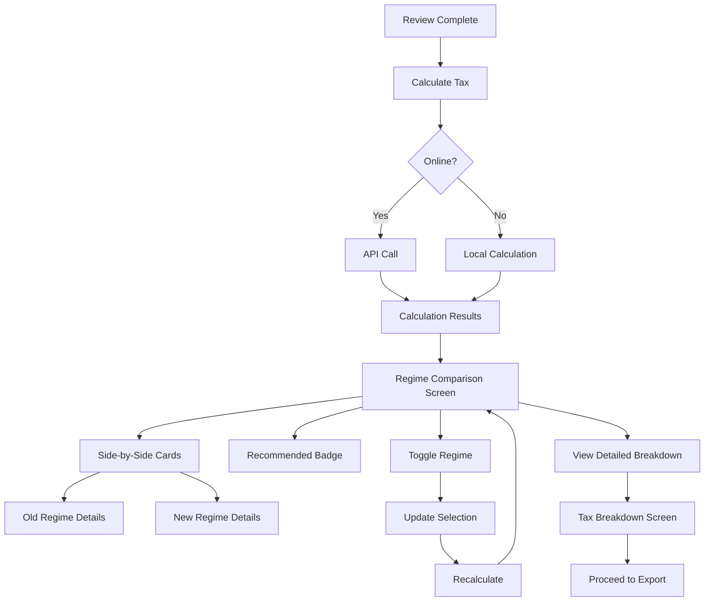
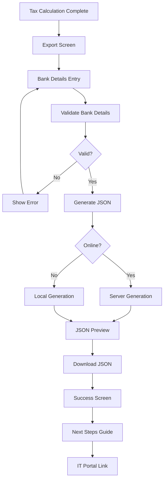

# Design Document: Bharat Tax Mitra

## Overview

Bharat Tax Mitra is an offline-first, AI-powered Progressive Web Application (PWA) designed to simplify income tax filing for Indian taxpayers in Tier-2 and Tier-3 cities. The system combines AWS serverless architecture with client-side intelligence to provide a seamless tax filing experience that works reliably even with poor network connectivity.

### Core Design Principles

1. **Offline-First**: All critical functionality must work without network connectivity
2. **Privacy by Design**: PII is encrypted, isolated, and automatically deleted after 24 hours
3. **Mobile-First**: Optimized for smartphone users with limited bandwidth
4. **AI-Assisted, Human-Verified**: AI extracts data, but users always review and approve
5. **Deterministic Tax Calculation**: Tax computation follows exact Income Tax Act rules without AI interpretation

> ⚠️ **PROVIDER MIGRATION (2026-07-18) — Bharat Tax Mitra 2.0.** Every AWS-AI-model reference in this document (Bedrock / Claude 3 model IDs / Textract / Comprehend / Bedrock Knowledge Base) is **SUPERSEDED**. The 2.0 direction (see `tasks.md` Phase 5, **Module 5.2**) moves off AWS models to a provider-agnostic layer:
> - **Bedrock (Claude 3, Knowledge Base) → Anthropic API direct** (current Claude generation), proxied server-side with PII redaction; Sarvam per-language + offline rule-based fallbacks.
> - **Textract (OCR) → vision-capable model extraction now, on-device OCR later** — not Textract.
> - **Comprehend (PII) → local/regex PII detection (`frontend/src/utils/pii.ts`) + provider guardrails** — not Comprehend.
> - **Bedrock Knowledge Base (RAG) → self-hosted statute corpus + retrieval** — not a Bedrock KB.
>
> AWS infra services (DynamoDB / KMS / AppConfig) remain **optional, deployment-only** — never AI models. The AWS-model text below is retained for traceability; build against Phase 5.

### Key Technical Decisions

- **PWA over Native Apps**: Eliminates app store friction, enables instant updates, reduces development complexity
- **AWS Serverless (optional)**: Auto-scaling, pay-per-use — infra only; AI now runs on the Anthropic API, not AWS models (see migration notice above)
- **Amazon Textract + Bedrock** ⚠️ *superseded → Anthropic API + vision-model/on-device OCR (see migration notice)*: Best-in-class OCR with AI reasoning for complex document layouts
- **IndexedDB for Offline Storage**: Browser-native, supports large datasets, encrypted via Web Crypto API
- **DynamoDB with TTL**: Automatic data deletion for privacy compliance
- **Step Functions for Orchestration**: Reliable document processing pipeline with built-in retry logic

## Architecture

### High-Level System Architecture


```mermaid
graph TB
    subgraph "Client Layer"
        PWA[PWA - React + TypeScript]
        SW[Service Worker]
        IDB[(IndexedDB)]
    end
    
    subgraph "API Layer"
        APIGW[API Gateway]
        AUTH[Cognito User Pool]
    end
    
    subgraph "Compute Layer"
        UPLOAD[Upload Lambda]
        EXTRACT[Extraction Lambda]
        TAX[Tax Calculation Lambda]
        EXPORT[JSON Export Lambda]
        CHAT[Chat Lambda]
    end
    
    subgraph "Orchestration"
        SF[Step Functions]
    end
    
    subgraph "AI/ML Layer"
        TEXTRACT[Amazon Textract]
        BEDROCK[Amazon Bedrock - Claude 3]
        KB[Knowledge Bases for Bedrock]
        COMPREHEND[Amazon Comprehend]
    end
    
    subgraph "Storage Layer"
        S3[S3 - Documents]
        DDB[(DynamoDB)]
        KMS[AWS KMS]
    end
    
    subgraph "Configuration & Monitoring"
        APPCONFIG[AWS AppConfig]
        CW[CloudWatch Logs & Metrics]
    end
    
    PWA -->|HTTPS/TLS 1.3| APIGW
    SW -->|Cache Assets| PWA
    PWA -->|Offline Data| IDB
    
    APIGW -->|Authenticate| AUTH
    APIGW --> UPLOAD
    APIGW --> TAX
    APIGW --> EXPORT
    APIGW --> CHAT
    
    UPLOAD -->|Trigger| SF
    SF --> EXTRACT
    EXTRACT --> TEXTRACT
    EXTRACT --> COMPREHEND
    EXTRACT --> BEDROCK
    
    CHAT --> BEDROCK
    CHAT --> KB
    
    UPLOAD --> S3
    EXTRACT --> DDB
    TAX --> DDB
    EXPORT --> DDB
    
    S3 -->|24h TTL| S3
    DDB -->|24h TTL| DDB
    
    DDB -->|Encrypt PII| KMS
    
    TAX -->|Load Rules| APPCONFIG
    CW -->|Monitor| SF
    CW -->|Monitor| EXTRACT
```

### Data Flow Architecture

#### Document Processing Pipeline


```mermaid
sequenceDiagram
    participant User
    participant PWA
    participant S3
    participant StepFunctions
    participant Textract
    participant Comprehend
    participant Bedrock
    participant DynamoDB
    
    User->>PWA: Upload Form-16 PDF
    PWA->>PWA: Queue in IndexedDB (if offline)
    PWA->>S3: Upload document (when online)
    S3-->>PWA: Pre-signed URL + Document ID
    PWA->>StepFunctions: Trigger extraction workflow
    
    StepFunctions->>Textract: Extract text and tables
    Textract-->>StepFunctions: Raw OCR data
    
    StepFunctions->>Comprehend: Detect PII entities
    Comprehend-->>StepFunctions: PII locations
    
    StepFunctions->>Bedrock: Structure extraction with Claude
    Note over Bedrock: Prompt: "Extract salary components,<br/>TDS, employer details from OCR text"
    Bedrock-->>StepFunctions: Structured JSON
    
    StepFunctions->>DynamoDB: Store extracted data (encrypted)
    StepFunctions->>S3: Apply 24h TTL to document
    StepFunctions->>DynamoDB: Apply 24h TTL to PII fields
    
    StepFunctions-->>PWA: Extraction complete notification
    PWA->>DynamoDB: Fetch extracted data
    DynamoDB-->>PWA: Structured tax data
    PWA->>PWA: Store in IndexedDB for offline access
    PWA->>User: Display for review
```

#### Offline-First Sync Architecture


```mermaid
stateDiagram-v2
    [*] --> Offline: Network Lost
    [*] --> Online: Network Available
    
    Offline --> QueueAction: User Action
    QueueAction --> IndexedDB: Store in Queue
    IndexedDB --> Offline: Continue Working
    
    Offline --> Online: Network Restored
    
    Online --> CheckQueue: Sync Service Activated
    CheckQueue --> ProcessQueue: Has Pending Actions
    ProcessQueue --> UploadDocuments: Upload Queued Docs
    UploadDocuments --> SyncData: Sync Calculations
    SyncData --> ResolveConflicts: Check for Conflicts
    ResolveConflicts --> UpdateLocal: User Edits Win
    UpdateLocal --> Online: Sync Complete
    
    CheckQueue --> Online: No Pending Actions
    
    Online --> Offline: Network Lost
```

### Privacy and Security Architecture


```mermaid
graph LR
    subgraph "Data Classification"
        PII[PII Data<br/>PAN, Aadhaar, Name, Address]
        SENSITIVE[Sensitive Financial<br/>Salary, Bank Details]
        NON_SENSITIVE[Non-Sensitive<br/>Tax Calculations, Metadata]
    end
    
    subgraph "Protection Mechanisms"
        DETECT[Comprehend<br/>PII Detection]
        ENCRYPT[KMS Encryption<br/>AES-256]
        TTL[DynamoDB TTL<br/>24 Hours]
        REDACT[UI Redaction<br/>Last 4 Chars Only]
    end
    
    subgraph "Storage"
        S3_ENCRYPTED[S3 - Encrypted at Rest]
        DDB_ENCRYPTED[DynamoDB - Encrypted]
        IDB_ENCRYPTED[IndexedDB - Web Crypto]
    end
    
    PII --> DETECT
    SENSITIVE --> DETECT
    DETECT --> ENCRYPT
    ENCRYPT --> DDB_ENCRYPTED
    ENCRYPT --> S3_ENCRYPTED
    
    DDB_ENCRYPTED --> TTL
    S3_ENCRYPTED --> TTL
    
    PII --> REDACT
    REDACT --> IDB_ENCRYPTED
```

## Components and Interfaces

### Frontend Components (React + TypeScript + Tailwind CSS)

#### Core Application Components


**1. App Shell (`App.tsx`)**
- Root component managing routing, authentication state, and offline detection
- Renders language selector, connectivity indicator, and main navigation
- Manages Service Worker registration and update notifications

**2. Authentication Module (`auth/`)**
- `LoginScreen.tsx`: Mobile number input and OTP verification
- `OTPInput.tsx`: 6-digit OTP entry with auto-focus
- `LanguageSelector.tsx`: Multi-language selection with flag icons
- Uses Cognito SDK for authentication, stores tokens in IndexedDB

**3. Document Upload Module (`upload/`)**
- `DocumentUploader.tsx`: Drag-drop and file picker with progress bar
- `DocumentQueue.tsx`: Shows queued uploads in offline mode
- `DocumentPreview.tsx`: PDF/image viewer with zoom controls
- Handles file validation, compression, and queuing

**4. Data Review Module (`review/`)**
- `ExtractionReview.tsx`: Side-by-side view of original doc and extracted data
- `EditableField.tsx`: Input field with change highlighting and validation
- `ValidationWarnings.tsx`: List of warnings and errors with guidance
- `CompletenessScore.tsx`: Progress indicator showing % completion
- Manages local state with auto-save every 30 seconds

**5. Tax Calculation Module (`tax/`)**
- `RegimeComparison.tsx`: Side-by-side Old vs New regime comparison
- `TaxBreakdown.tsx`: Detailed breakdown by income type and deductions
- `DeductionCalculator.tsx`: Interactive calculators for 80C, 80D, HRA
- `TaxSummary.tsx`: Final tax liability with visual charts
- Runs calculations locally using cached tax rules

**6. Chat Assistant Module (`chat/`)**
- `ChatInterface.tsx`: Message list with user/assistant bubbles
- `ChatInput.tsx`: Text input with send button and typing indicator
- `ContextualHelp.tsx`: Inline help triggered from form fields
- `OfflineFAQ.tsx`: Cached FAQ responses for offline mode
- Integrates with Bedrock API for real-time responses

**7. Export Module (`export/`)**
- `JSONExportPreview.tsx`: Preview of key JSON fields before download
- `PDFSummaryGenerator.tsx`: Client-side PDF generation using jsPDF
- `DownloadManager.tsx`: Handles file downloads with progress tracking
- Validates JSON against IT Portal schema before export

**8. Offline Sync Module (`sync/`)**
- `SyncManager.tsx`: Background sync orchestrator
- `ConflictResolver.tsx`: UI for resolving sync conflicts
- `SyncStatus.tsx`: Visual indicator of sync progress
- Uses Background Sync API when available


#### Shared UI Components

**1. Form Components (`components/forms/`)**
- `CurrencyInput.tsx`: Formatted input for Indian rupees (lakhs/crores)
- `PANInput.tsx`: Masked input with format validation (AAAAA9999A)
- `DatePicker.tsx`: Touch-friendly date selector
- `Dropdown.tsx`: Searchable dropdown with keyboard navigation

**2. Layout Components (`components/layout/`)**
- `MobileNav.tsx`: Bottom navigation bar for mobile
- `Header.tsx`: Top bar with logo, language selector, connectivity indicator
- `Card.tsx`: Reusable card container with shadow and padding
- `Modal.tsx`: Accessible modal dialog with backdrop

**3. Feedback Components (`components/feedback/`)**
- `Toast.tsx`: Temporary notification messages
- `LoadingSpinner.tsx`: Loading indicator with text
- `ErrorBoundary.tsx`: Catches React errors and displays fallback UI
- `ProgressBar.tsx`: Linear progress indicator

### Backend Lambda Functions

#### 1. Upload Handler (`upload-handler/`)

**Purpose**: Handles document uploads and initiates processing pipeline

**Trigger**: API Gateway POST /documents

**Runtime**: Python 3.11

**Memory**: 512 MB

**Timeout**: 30 seconds

**Key Operations**:
- Validates file type and size (max 10MB)
- Generates pre-signed S3 URL for direct upload
- Creates document record in DynamoDB
- Triggers Step Functions extraction workflow
- Returns document ID and upload URL to client

**Environment Variables**:
- `DOCUMENTS_BUCKET`: S3 bucket name
- `DOCUMENTS_TABLE`: DynamoDB table name
- `EXTRACTION_STATE_MACHINE_ARN`: Step Functions ARN


#### 2. Extraction Lambda (`extraction-handler/`)

**Purpose**: Orchestrates AI-powered data extraction from documents

**Trigger**: Step Functions state machine

**Runtime**: Python 3.12

**Memory**: 2048 MB

**Timeout**: 5 minutes

**Key Operations**:
- Calls Textract `AnalyzeDocument` API with FORMS and TABLES features
- Parses Textract response to extract key-value pairs and tables
- Calls Comprehend `DetectPiiEntities` to identify PII
- Constructs prompt for Bedrock with OCR data and document type
- Calls Bedrock `InvokeModel` with Claude 3 Sonnet
- Parses structured JSON response from Claude
- Encrypts PII fields using KMS
- Stores extracted data in DynamoDB with TTL
- Returns extraction confidence scores

**Bedrock Prompt Template** (Form-16):
```
You are a tax document extraction assistant. Extract structured data from the following Form-16 OCR text.

OCR Text:
{ocr_text}

Extract the following fields in JSON format:
{
  "employerName": string,
  "employerPAN": string (format: AAAAA9999A),
  "employerTAN": string (format: AAAA99999A),
  "employeeName": string,
  "employeePAN": string,
  "assessmentYear": string (format: 2025-26),
  "salaryComponents": {
    "basicSalary": number,
    "hra": number,
    "specialAllowance": number,
    "grossSalary": number
  },
  "deductions": {
    "standardDeduction": number,
    "professionalTax": number,
    "totalDeductions": number
  },
  "tds": {
    "q1": number,
    "q2": number,
    "q3": number,
    "q4": number,
    "total": number
  }
}

Return only valid JSON. If a field is not found, use null.
```

**Environment Variables**:
- `TEXTRACT_ROLE_ARN`: IAM role for Textract
- `BEDROCK_MODEL_ID`: Claude 3 model ID
- `KMS_KEY_ID`: KMS key for PII encryption
- `EXTRACTION_TABLE`: DynamoDB table name


#### 3. Tax Calculation Lambda (`tax-calculator/`)

**Purpose**: Computes tax liability using deterministic rules

**Trigger**: API Gateway POST /calculate

**Runtime**: Python 3.12

**Memory**: 1024 MB

**Timeout**: 10 seconds

**Key Operations**:
- Loads tax rules from AppConfig
- Validates input data completeness
- Calculates gross total income
- Applies deductions (80C, 80D, HRA) for Old Regime
- Computes taxable income for both regimes
- Applies tax slabs and calculates tax liability
- Applies rebates (87A) and surcharges
- Computes cess (4% of tax)
- Rounds to nearest rupee
- Stores calculation results in DynamoDB
- Returns comparison of both regimes

**Tax Calculation Algorithm** (FY 2025-26):

Old Regime Slabs:
- Up to ₹2.5 lakh: Nil
- ₹2.5 lakh to ₹5 lakh: 5%
- ₹5 lakh to ₹10 lakh: 20%
- Above ₹10 lakh: 30%

New Regime Slabs:
- Up to ₹3 lakh: Nil
- ₹3 lakh to ₹6 lakh: 5%
- ₹6 lakh to ₹9 lakh: 10%
- ₹9 lakh to ₹12 lakh: 15%
- ₹12 lakh to ₹15 lakh: 20%
- Above ₹15 lakh: 30%

Section 87A Rebate (New Regime):
- If taxable income ≤ ₹5 lakh: Rebate = min(tax, ₹12,500)

**Environment Variables**:
- `APPCONFIG_APP_ID`: AppConfig application ID
- `APPCONFIG_ENV_ID`: AppConfig environment ID
- `APPCONFIG_CONFIG_ID`: Tax rules configuration profile ID
- `CALCULATIONS_TABLE`: DynamoDB table name


#### 4. JSON Export Lambda (`json-exporter/`)

**Purpose**: Generates ITR JSON files conforming to IT Portal schema

**Trigger**: API Gateway POST /export

**Runtime**: Python 3.12

**Memory**: 1024 MB

**Timeout**: 15 seconds

**Key Operations**:
- Fetches user profile, extracted data, and calculations from DynamoDB
- Determines appropriate ITR form type (ITR-1, ITR-2, ITR-3, ITR-4)
- Maps internal data model to IT Portal JSON schema
- Validates against JSON schema using jsonschema library
- Generates digital signature if credentials provided
- Stores export record in DynamoDB
- Returns JSON file for download

**ITR Form Type Selection Logic**:
- ITR-1: Salary income only, total income < ₹50 lakh, one house property
- ITR-2: Salary + capital gains, multiple properties, no business income
- ITR-3: Business/profession income (non-presumptive)
- ITR-4: Presumptive business income under Section 44AD/44ADA

**Environment Variables**:
- `ITR_SCHEMA_BUCKET`: S3 bucket with IT Portal schemas
- `EXPORTS_TABLE`: DynamoDB table name
- `SIGNING_KEY_ID`: KMS key for digital signature

#### 5. Chat Lambda (`chat-handler/`)

**Purpose**: Provides AI-powered tax guidance using RAG

**Trigger**: API Gateway POST /chat

**Runtime**: Python 3.12

**Memory**: 1024 MB

**Timeout**: 30 seconds

**Key Operations**:
- Maintains conversation context in DynamoDB (last 10 messages)
- Queries Bedrock Knowledge Base for relevant tax information
- Constructs prompt with user question, context, and retrieved documents
- Calls Bedrock with Claude 3 for response generation
- Filters responses to ensure tax domain relevance
- Translates response to user's selected language if needed
- Returns response with source citations

**Knowledge Base Content**:
- Income Tax Act sections (80C, 80D, 87A, 44AD, etc.)
- Form-16 and AIS explanation guides
- Common tax filing scenarios and examples
- Deduction eligibility criteria
- Regime comparison guidelines

**Environment Variables**:
- `KNOWLEDGE_BASE_ID`: Bedrock Knowledge Base ID
- `BEDROCK_MODEL_ID`: Claude 3 model ID
- `CHAT_SESSIONS_TABLE`: DynamoDB table name
- `MAX_CONTEXT_MESSAGES`: Maximum conversation history (default: 10)


### Step Functions Workflows

#### Document Extraction Workflow

**State Machine**: `DocumentExtractionStateMachine`

**Trigger**: Upload Lambda after document upload

**States**:

1. **ExtractText** (Task State)
   - Calls Textract via Lambda
   - Retry: 3 attempts with exponential backoff
   - Catch: Transitions to NotifyFailure on error

2. **DetectPII** (Task State)
   - Calls Comprehend via Lambda
   - Parallel execution with ExtractText results

3. **StructureData** (Task State)
   - Calls Bedrock via Extraction Lambda
   - Uses Textract and Comprehend outputs

4. **ValidateConfidence** (Choice State)
   - If confidence < 85%: Transition to FlagForReview
   - Else: Transition to StoreData

5. **FlagForReview** (Task State)
   - Updates document record with low-confidence flag
   - Sends notification to user

6. **StoreData** (Task State)
   - Encrypts PII fields with KMS
   - Stores in DynamoDB with 24h TTL
   - Updates document status to "completed"

7. **NotifyUser** (Task State)
   - Sends extraction complete notification
   - Triggers PWA refresh via WebSocket (optional)

8. **NotifyFailure** (Task State)
   - Logs error to CloudWatch
   - Updates document status to "failed"
   - Notifies user of failure

**Execution Time**: 10-30 seconds typical

**Error Handling**: All states have retry logic and catch blocks


### AI/ML Integration Layer

#### Amazon Textract Configuration

**API**: `AnalyzeDocument`

**Features Enabled**:
- `FORMS`: Extracts key-value pairs (e.g., "Employee Name: John Doe")
- `TABLES`: Extracts tabular data (e.g., quarterly TDS breakup)

**Document Types Supported**:
- PDF (up to 10MB, 3000 pages)
- JPEG/PNG (up to 10MB)

**Output Format**: JSON with blocks, relationships, and confidence scores

**Cost Optimization**:
- Process only first 5 pages of Form-16 (typically sufficient)
- Cache results in DynamoDB to avoid reprocessing

#### Amazon Bedrock Configuration

> ⚠️ **SUPERSEDED (2026-07-18)** — do NOT wire a Bedrock model ID. Use the **Anthropic API directly** (current Claude generation, model id chosen at build time) via the Module 5.2 provider layer. Section retained for historical context only.

**Model**: Claude 3 Sonnet (`anthropic.claude-3-sonnet-20240229-v1:0`)

**Use Cases**:
1. **Structured Data Extraction**: Convert OCR text to JSON
2. **Tax Guidance Chat**: Answer user questions with RAG
3. **Anomaly Explanation**: Explain unusual values in extracted data

**Prompt Engineering Strategy**:
- Use few-shot examples for extraction tasks
- Specify exact JSON schema in prompts
- Include validation rules in prompts
- Request confidence scores for extracted fields

**Inference Parameters**:
- Temperature: 0.1 (low for deterministic extraction)
- Max Tokens: 2048
- Top P: 0.9

**Cost Optimization**:
- Cache common prompts
- Batch multiple fields in single request
- Use streaming for chat responses

#### Bedrock Knowledge Bases

**Data Sources**:
- Income Tax Act sections (PDF documents)
- IT Department circulars and notifications
- Tax filing guides in multiple languages
- Common Q&A pairs

**Embedding Model**: Titan Embeddings G1 - Text

**Vector Store**: Amazon OpenSearch Serverless

**Retrieval Configuration**:
- Top K: 5 documents
- Similarity threshold: 0.7
- Metadata filtering by language and year


#### Amazon Comprehend Configuration

**API**: `DetectPiiEntities`

**Language**: English (en)

**PII Entity Types Detected**:
- `NAME`: Person names
- `ADDRESS`: Physical addresses
- `PHONE`: Phone numbers
- `EMAIL`: Email addresses
- `SSN`: PAN/Aadhaar numbers (detected as SSN equivalent)
- `BANK_ACCOUNT_NUMBER`: Bank account numbers
- `BANK_ROUTING`: IFSC codes

**Output**: Entity type, text, confidence score, begin/end offsets

**Usage**: Identify PII fields for encryption and redaction

### Privacy Layer

#### PII Detection and Encryption Flow


```mermaid
sequenceDiagram
    participant Lambda
    participant Comprehend
    participant KMS
    participant DynamoDB
    
    Lambda->>Comprehend: DetectPiiEntities(document_text)
    Comprehend-->>Lambda: PII entities with offsets
    
    loop For each PII field
        Lambda->>Lambda: Extract field value
        Lambda->>KMS: Encrypt(field_value, key_id)
        KMS-->>Lambda: Encrypted ciphertext
        Lambda->>Lambda: Store encrypted value
    end
    
    Lambda->>DynamoDB: PutItem with encrypted PII
    Lambda->>DynamoDB: Set TTL = now + 24 hours
```

#### KMS Key Configuration

**Key Type**: Symmetric (AES-256-GCM)

**Key Policy**:
- Allow Lambda execution roles to encrypt/decrypt
- Deny all other principals
- Enable automatic key rotation (yearly)

**Key Alias**: `alias/bharat-tax-mitra-pii-key`

**Encryption Context**: 
```json
{
  "userId": "user-123",
  "documentId": "doc-456",
  "fieldType": "PAN"
}
```

**Usage**: Provides additional authentication and audit trail


#### TTL-Based Data Deletion

**DynamoDB TTL Configuration**:
- TTL attribute name: `expiresAt`
- Value: Unix timestamp (seconds since epoch)
- Deletion: Within 48 hours of expiration (DynamoDB guarantee)
- Monitoring: CloudWatch metric `UserErrors` for TTL deletions

**S3 Lifecycle Policy**:
```json
{
  "Rules": [
    {
      "Id": "DeleteDocumentsAfter24Hours",
      "Status": "Enabled",
      "Expiration": {
        "Days": 1
      },
      "NoncurrentVersionExpiration": {
        "NoncurrentDays": 1
      }
    }
  ]
}
```

**Deletion Verification**:
- CloudWatch Logs Insights query to verify deletions
- Daily Lambda function to audit TTL compliance
- Alert if documents older than 25 hours exist

## Data Models

### DynamoDB Tables

#### 1. Users Table

**Table Name**: `BharatTaxMitra-Users`

**Primary Key**: 
- Partition Key: `userId` (String) - UUID v4

**Attributes**:
```typescript
{
  userId: string;              // UUID v4
  phoneNumber: string;         // E.164 format: +91XXXXXXXXXX
  phoneNumberHash: string;     // SHA-256 hash for lookup
  createdAt: number;           // Unix timestamp (ms)
  lastLoginAt: number;         // Unix timestamp (ms)
  preferredLanguage: string;   // ISO 639-1 code (en, hi, ta, etc.)
  preferredRegime: string;     // "OLD" | "NEW"
  deviceId: string;            // Device fingerprint
  profileVersion: number;      // Optimistic locking
}
```

**GSI**: `PhoneNumberHashIndex`
- Partition Key: `phoneNumberHash`
- Projection: ALL

**TTL**: None (user profiles persist)

**Capacity**: On-demand


#### 2. TaxSessions Table

**Table Name**: `BharatTaxMitra-TaxSessions`

**Primary Key**:
- Partition Key: `userId` (String)
- Sort Key: `sessionId` (String) - UUID v4

**Attributes**:
```typescript
{
  userId: string;
  sessionId: string;
  assessmentYear: string;      // "2025-26"
  createdAt: number;
  updatedAt: number;
  status: string;              // "DRAFT" | "REVIEW" | "EXPORTED" | "FILED"
  completenessScore: number;   // 0-100
  selectedRegime: string;      // "OLD" | "NEW"
  documentIds: string[];       // Array of document IDs
  calculationId?: string;      // Reference to CalculationResults
  exportId?: string;           // Reference to exported JSON
}
```

**GSI**: `UserSessionsIndex`
- Partition Key: `userId`
- Sort Key: `createdAt`
- Projection: ALL

**TTL**: None (sessions persist for historical reference)

**Capacity**: On-demand

#### 3. Documents Table

**Table Name**: `BharatTaxMitra-Documents`

**Primary Key**:
- Partition Key: `documentId` (String) - UUID v4

**Attributes**:
```typescript
{
  documentId: string;
  userId: string;
  sessionId: string;
  documentType: string;        // "FORM_16" | "AIS" | "BANK_STATEMENT"
  s3Key: string;               // S3 object key
  s3Bucket: string;
  uploadedAt: number;
  processedAt?: number;
  status: string;              // "UPLOADED" | "PROCESSING" | "COMPLETED" | "FAILED"
  extractionConfidence?: number; // 0-100
  flaggedForReview: boolean;
  extractedData?: object;      // Structured JSON (encrypted if contains PII)
  errorMessage?: string;
  expiresAt: number;           // TTL: uploadedAt + 24 hours
}
```

**GSI**: `UserDocumentsIndex`
- Partition Key: `userId`
- Sort Key: `uploadedAt`
- Projection: ALL

**TTL Attribute**: `expiresAt`

**Capacity**: On-demand


#### 4. CalculationResults Table

**Table Name**: `BharatTaxMitra-CalculationResults`

**Primary Key**:
- Partition Key: `calculationId` (String) - UUID v4

**Attributes**:
```typescript
{
  calculationId: string;
  userId: string;
  sessionId: string;
  calculatedAt: number;
  
  // Income
  grossSalary: number;
  otherIncome: number;
  businessIncome: number;
  capitalGains: number;
  grossTotalIncome: number;
  
  // Deductions (Old Regime)
  section80C: number;
  section80D: number;
  hra: number;
  standardDeduction: number;
  totalDeductions: number;
  
  // Old Regime Calculation
  oldRegimeTaxableIncome: number;
  oldRegimeTaxBeforeRebate: number;
  oldRegimeRebate: number;
  oldRegimeSurcharge: number;
  oldRegimeCess: number;
  oldRegimeTotalTax: number;
  
  // New Regime Calculation
  newRegimeTaxableIncome: number;
  newRegimeTaxBeforeRebate: number;
  newRegimeRebate: number;
  newRegimeSurcharge: number;
  newRegimeCess: number;
  newRegimeTotalTax: number;
  
  // Comparison
  recommendedRegime: string;   // "OLD" | "NEW"
  taxSavings: number;          // Positive if recommended regime saves money
  
  // Metadata
  taxRulesVersion: string;     // AppConfig version used
}
```

**GSI**: `UserCalculationsIndex`
- Partition Key: `userId`
- Sort Key: `calculatedAt`
- Projection: ALL

**TTL**: None (calculations persist for audit)

**Capacity**: On-demand


#### 5. AuditEvents Table

**Table Name**: `BharatTaxMitra-AuditEvents`

**Primary Key**:
- Partition Key: `userId` (String)
- Sort Key: `timestamp` (Number) - Unix timestamp (ms)

**Attributes**:
```typescript
{
  userId: string;
  timestamp: number;
  eventType: string;           // "LOGIN" | "UPLOAD" | "EXTRACTION" | "CALCULATION" | "EXPORT" | "DATA_DELETION"
  eventDetails: object;        // Event-specific data
  ipAddress?: string;          // Hashed for privacy
  userAgent?: string;
  sessionId?: string;
  documentId?: string;
  success: boolean;
  errorMessage?: string;
}
```

**GSI**: `EventTypeIndex`
- Partition Key: `eventType`
- Sort Key: `timestamp`
- Projection: ALL

**TTL**: `timestamp + 90 days` (compliance retention)

**Capacity**: On-demand

### S3 Bucket Structure

**Bucket Name**: `bharat-tax-mitra-documents-{region}-{account-id}`

**Key Naming Convention**:
```
{userId}/{sessionId}/{documentType}/{documentId}.{extension}

Example:
user-123e4567/session-89ab/FORM_16/doc-cdef0123.pdf
```

**Bucket Configuration**:
- Versioning: Enabled
- Encryption: AES-256 (SSE-S3)
- Public Access: Blocked
- Lifecycle Policy: Delete after 1 day
- CORS: Enabled for pre-signed URL uploads

**CORS Configuration**:
```json
[
  {
    "AllowedOrigins": ["https://bharattaxmitra.in"],
    "AllowedMethods": ["PUT", "POST"],
    "AllowedHeaders": ["*"],
    "MaxAgeSeconds": 3000
  }
]
```


### IndexedDB Schema (Client-Side)

**Database Name**: `BharatTaxMitraDB`

**Version**: 1

**Object Stores** (names match `frontend/src/lib/db.ts` implementation):

#### 1. `profiles`
```typescript
{
  keyPath: "userId",
  data: {
    userId: string;
    phoneNumber: string;
    preferredLanguage: string;
    preferredRegime: string;
    authToken: string;         // Encrypted
    refreshToken: string;      // Encrypted
    lastSyncAt: number;
  }
}
```

#### 2. `sessions`
```typescript
{
  keyPath: "sessionId",
  indexes: [
    { name: "userId", keyPath: "userId" },
    { name: "createdAt", keyPath: "createdAt" }
  ],
  data: {
    sessionId: string;
    userId: string;
    assessmentYear: string;
    status: string;
    completenessScore: number;
    selectedRegime: string;
    createdAt: number;
    updatedAt: number;
    syncStatus: string;        // "SYNCED" | "PENDING" | "CONFLICT"
  }
}
```

#### 3. `documents`
```typescript
{
  keyPath: "documentId",
  indexes: [
    { name: "sessionId", keyPath: "sessionId" },
    { name: "uploadedAt", keyPath: "uploadedAt" }
  ],
  data: {
    documentId: string;
    sessionId: string;
    documentType: string;
    file?: Blob;               // Stored only if not uploaded to S3
    extractedData?: object;
    status: string;
    uploadedAt: number;
    syncStatus: string;
  }
}
```

#### 4. `calculations`
```typescript
{
  keyPath: "calculationId",
  indexes: [
    { name: "sessionId", keyPath: "sessionId" }
  ],
  data: {
    calculationId: string;
    sessionId: string;
    // Same fields as CalculationResults table
    calculatedAt: number;
    syncStatus: string;
  }
}
```

#### 5. `syncQueue`
```typescript
{
  keyPath: "queueId",
  autoIncrement: true,
  indexes: [
    { name: "createdAt", keyPath: "createdAt" }
  ],
  data: {
    queueId: number;
    action: string;            // "UPLOAD_DOCUMENT" | "SAVE_CALCULATION" | "EXPORT_JSON"
    payload: object;
    retryCount: number;
    createdAt: number;
    status: string;            // "PENDING" | "PROCESSING" | "COMPLETED" | "FAILED"
  }
}
```

#### 6. `taxRules`
```typescript
{
  keyPath: "version",
  data: {
    version: string;           // "FY2025-26"
    rules: object;             // Tax slabs, limits, rates
    cachedAt: number;
  }
}
```

#### 7. `chatHistory`
```typescript
{
  keyPath: "messageId",
  autoIncrement: true,
  indexes: [
    { name: "sessionId", keyPath: "sessionId" },
    { name: "timestamp", keyPath: "timestamp" }
  ],
  data: {
    messageId: number;
    sessionId: string;
    role: string;              // "user" | "assistant"
    content: string;
    timestamp: number;
  }
}
```


### JSON Schemas

#### Internal Tax Data Schema

```typescript
// NOTE: This internal schema matches shared/types/tax-calculation.ts exactly.
// The income.salary field is a single object (not array) — ITR multi-employer
// support is handled by the JSON export layer, not the internal calculation model.
interface TaxData {
  personalInfo: {
    name: string;              // Full name as on PAN card
    pan: string;               // Format: AAAAA9999A
    aadhaar?: string;          // Format: XXXX-XXXX-XXXX (optional)
    dateOfBirth: string;       // ISO 8601: YYYY-MM-DD
    age: number;               // Calculated from DOB (determines slab category)
    isSeniorCitizen: boolean;  // age >= 60
    isSuperSeniorCitizen: boolean; // age >= 80
    residentialStatus: 'resident' | 'non-resident' | 'rnor';
    address: {
      line1: string;
      line2?: string;
      city: string;
      state: string;
      pincode: string;
    };
    email?: string;
    phone: string;
  };

  income: {
    salary: {
      // Primary employer salary (most taxpayers have one)
      grossSalary: number;       // Total salary before deductions
      hraReceived: number;       // HRA component in salary
      specialAllowance: number;
      otherAllowances: number;
      professionalTax: number;   // Deducted by employer
    };

    houseProperty?: {
      annualValue: number;
      municipalTaxes: number;
      interestOnHomeLoan: number;
    };

    businessIncome?: {
      grossReceipts: number;     // Total = digital + cash
      digitalReceipts: number;   // For 44AD: taxed at 6%
      cashReceipts: number;      // For 44AD: taxed at 8%
      expenses: number;          // Only used if 44AD not applicable
    };

    capitalGains?: {
      shortTerm: number;
      longTerm: number;
    };

    otherSources?: {
      interestIncome: number;
      dividendIncome: number;
      other: number;
    };
  };

  deductions: {
    section80C: {
      lic: number;
      ppf: number;
      elss: number;
      nsc: number;
      homeLoanPrincipal: number;
      tuitionFees: number;
      sukanyaSamriddhi: number;
      other: number;
      // total is computed, not stored: min(sum, 150000)
    };
    section80CCD1B: {
      npsAdditional: number;  // max ₹50,000
    };
    section80D: {
      selfPremium: number;
      parentsPremium: number;
      preventiveHealthCheckup: number;
      isSelfSenior: boolean;
      isParentsSenior: boolean;
    };
    section80E: {
      educationLoanInterest: number;  // no limit
    };
    section80G: {
      donations: number;  // 50% deduction applied by engine
    };
    hra: {
      rentPaid: number;
      basicSalary: number;
      isMetro: boolean;
      // HRA exemption is computed: min(actual HRA, rent-10%basic, 50%/40% basic)
    };
  };

  tds: {
    salary: number;
    otherSources: number;
    total: number;
  };

  taxPayments: {
    advanceTax: number;
    selfAssessmentTax: number;
    tcs: number;
  };
}
```


#### IT Portal JSON Export Schema (ITR-1 Simplified)

```typescript
interface ITR1Export {
  ITR: {
    ITR1: {
      CreationInfo: {
        SWVersionNo: string;
        SWCreatedBy: string;
        JSONCreatedBy: string;
        JSONCreationDate: string;  // YYYY-MM-DD
      };
      
      Form_ITR1: {
        PersonalInfo: {
          AssesseeType: string;      // "Individual"
          PAN: string;
          AadhaarCardNo: string;
          DOB: string;
          EmployerCategory: string;  // "PSU" | "GOVT" | "PRIVATE" | "OTHER"
          Name: {
            FirstName: string;
            MiddleName?: string;
            SurName: string;
          };
          Address: {
            ResidenceNo: string;
            RoadOrStreet: string;
            LocalityOrArea: string;
            CityOrTownOrDistrict: string;
            StateCode: string;
            PinCode: string;
            CountryCode: string;       // "91" for India
          };
        };
        
        FilingStatus: {
          ReturnFiledUnderSec: string; // "11" for normal
          SeventhProviso139: string;   // "N"
          FilingDate: string;
          OriginalOrRevised: string;   // "O" | "R"
        };
        
        ITR1_IncomeDeductions: {
          Salary: {
            SalaryDtls: {
              EmployerName: string;
              TAN: string;
              GrossSalary: number;
              Allowances: number;
              PerquisitesValue: number;
              ProfitsInLieuOfSalary: number;
              TotalSalary: number;
              StandardDeduction: number;
              EntertainmentAllowance: number;
              TaxOnEmployment: number;
              NetSalary: number;
            }[];
          };
          
          IncomeFromOS: {
            IncOthThanOwnRaceHorse: {
              OthersInc: {
                OthersIncDtls: {
                  SourceDescription: string;
                  IncAmt: number;
                }[];
              };
            };
          };
          
          TotalIncomeAfterDeductions: number;
        };
        
        TaxComputation: {
          TotalTaxPayable: number;
          Rebate87A: number;
          TaxPayableOnTI: number;
          Surcharge: number;
          EducationCess: number;
          GrossTaxLiability: number;
          Section89: number;
          NetTaxLiability: number;
        };
        
        TaxPaid: {
          TDS: {
            TDSonSalary: {
              TDSonSalaryDtls: {
                TAN: string;
                EmployerName: string;
                TaxDeducted: number;
              }[];
            };
          };
          AdvanceTax: number;
          SelfAssessmentTax: number;
          TotalTaxesPaid: number;
        };
        
        Refund: {
          RefundDue: number;
          BankAccountDtls: {
            IFSCCode: string;
            BankName: string;
            BankAccountNo: string;
          };
        };
      };
    };
  };
}
```


## API Design

### REST API Endpoints

**Base URL**: `https://api.bharattaxmitra.in/v1`

**Authentication**: Bearer token in `Authorization` header

**Common Headers**:
```
Authorization: Bearer {jwt_token}
Content-Type: application/json
X-Language: en|hi|ta|te|mr|bn|gu
X-Device-Id: {device_fingerprint}
```

#### Authentication Endpoints

**POST /auth/send-otp**

Request:
```json
{
  "phoneNumber": "+919876543210",
  "language": "en"
}
```

Response (200):
```json
{
  "success": true,
  "message": "OTP sent successfully",
  "expiresIn": 300
}
```

**POST /auth/verify-otp**

Request:
```json
{
  "phoneNumber": "+919876543210",
  "otp": "123456",
  "deviceId": "device-fingerprint-hash"
}
```

Response (200):
```json
{
  "success": true,
  "userId": "user-123e4567",
  "accessToken": "eyJhbGc...",
  "refreshToken": "eyJhbGc...",
  "expiresIn": 3600,
  "profile": {
    "preferredLanguage": "en",
    "preferredRegime": "NEW"
  }
}
```

**POST /auth/refresh**

Request:
```json
{
  "refreshToken": "eyJhbGc..."
}
```

Response (200):
```json
{
  "accessToken": "eyJhbGc...",
  "expiresIn": 3600
}
```


#### Session Management Endpoints

**POST /sessions**

Request:
```json
{
  "assessmentYear": "2025-26"
}
```

Response (201):
```json
{
  "sessionId": "session-89ab",
  "assessmentYear": "2025-26",
  "status": "DRAFT",
  "createdAt": 1704067200000
}
```

**GET /sessions**

Response (200):
```json
{
  "sessions": [
    {
      "sessionId": "session-89ab",
      "assessmentYear": "2025-26",
      "status": "DRAFT",
      "completenessScore": 65,
      "createdAt": 1704067200000,
      "updatedAt": 1704153600000
    }
  ]
}
```

**GET /sessions/{sessionId}**

Response (200):
```json
{
  "sessionId": "session-89ab",
  "assessmentYear": "2025-26",
  "status": "DRAFT",
  "completenessScore": 65,
  "selectedRegime": "NEW",
  "documentIds": ["doc-123", "doc-456"],
  "calculationId": "calc-789",
  "createdAt": 1704067200000,
  "updatedAt": 1704153600000
}
```

#### Document Management Endpoints

**POST /documents/upload-url**

Request:
```json
{
  "sessionId": "session-89ab",
  "documentType": "FORM_16",
  "fileName": "form16.pdf",
  "fileSize": 2048576,
  "contentType": "application/pdf"
}
```

Response (200):
```json
{
  "documentId": "doc-cdef0123",
  "uploadUrl": "https://s3.amazonaws.com/...",
  "expiresIn": 300
}
```

**POST /documents/{documentId}/process**

Request: (Empty body)

Response (202):
```json
{
  "documentId": "doc-cdef0123",
  "status": "PROCESSING",
  "executionArn": "arn:aws:states:..."
}
```

**GET /documents/{documentId}**

Response (200):
```json
{
  "documentId": "doc-cdef0123",
  "sessionId": "session-89ab",
  "documentType": "FORM_16",
  "status": "COMPLETED",
  "extractionConfidence": 92,
  "flaggedForReview": false,
  "uploadedAt": 1704067200000,
  "processedAt": 1704067215000,
  "extractedData": {
    "employerName": "ABC Corp",
    "employerPAN": "AAAAA1234A",
    "grossSalary": 1200000,
    "tds": 120000
  }
}
```

**GET /documents/{documentId}/download**

Response (200):
```json
{
  "downloadUrl": "https://s3.amazonaws.com/...",
  "expiresIn": 300
}
```


#### Tax Calculation Endpoints

**POST /calculate**

Request:
```json
{
  "sessionId": "session-89ab",
  "taxData": {
    "income": {
      "salary": {
        "grossSalary": 1200000,
        "standardDeduction": 50000,
        "professionalTax": 2400
      },
      "otherSources": {
        "interestIncome": 15000
      }
    },
    "deductions": {
      "section80C": {
        "ppf": 100000,
        "elss": 50000,
        "total": 150000
      },
      "section80D": {
        "selfAndFamily": 25000,
        "total": 25000
      }
    },
    "tds": {
      "salary": 120000
    }
  }
}
```

Response (200):
```json
{
  "calculationId": "calc-789",
  "grossTotalIncome": 1215000,
  "oldRegime": {
    "taxableIncome": 987600,
    "taxBeforeRebate": 97760,
    "rebate": 0,
    "surcharge": 0,
    "cess": 3910,
    "totalTax": 101670
  },
  "newRegime": {
    "taxableIncome": 1162600,
    "taxBeforeRebate": 116260,
    "rebate": 0,
    "surcharge": 0,
    "cess": 4650,
    "totalTax": 120910
  },
  "recommendedRegime": "OLD",
  "taxSavings": 19240,
  "calculatedAt": 1704067200000
}
```

**GET /calculate/{calculationId}**

Response (200): Same as POST response

#### Export Endpoints

**POST /export/json**

Request:
```json
{
  "sessionId": "session-89ab",
  "calculationId": "calc-789",
  "itrFormType": "ITR1",
  "bankDetails": {
    "ifscCode": "SBIN0001234",
    "accountNumber": "12345678901"
  }
}
```

Response (200):
```json
{
  "exportId": "export-xyz",
  "downloadUrl": "https://s3.amazonaws.com/...",
  "fileName": "ITR1_2025-26_AAAAA1234A.json",
  "expiresIn": 3600,
  "validationStatus": "PASSED",
  "generatedAt": 1704067200000
}
```

**POST /export/pdf**

Request:
```json
{
  "sessionId": "session-89ab",
  "calculationId": "calc-789",
  "includeDocuments": false
}
```

Response (200):
```json
{
  "downloadUrl": "https://s3.amazonaws.com/...",
  "fileName": "TaxSummary_2025-26.pdf",
  "expiresIn": 3600
}
```


#### Chat Assistant Endpoints

**POST /chat**

Request:
```json
{
  "sessionId": "session-89ab",
  "message": "What is Section 80C?",
  "context": {
    "currentScreen": "deductions",
    "fieldName": "section80C"
  }
}
```

Response (200):
```json
{
  "messageId": "msg-123",
  "response": "Section 80C allows deductions up to ₹1.5 lakh for investments in PPF, ELSS, life insurance, etc.",
  "sources": [
    {
      "title": "Income Tax Act - Section 80C",
      "url": "https://..."
    }
  ],
  "timestamp": 1704067200000
}
```

**GET /chat/history/{sessionId}**

Response (200):
```json
{
  "messages": [
    {
      "messageId": "msg-122",
      "role": "user",
      "content": "What is Section 80C?",
      "timestamp": 1704067190000
    },
    {
      "messageId": "msg-123",
      "role": "assistant",
      "content": "Section 80C allows...",
      "timestamp": 1704067200000
    }
  ]
}
```

#### User Profile Endpoints

**GET /profile**

Response (200):
```json
{
  "userId": "user-123e4567",
  "phoneNumber": "+919876543210",
  "preferredLanguage": "en",
  "preferredRegime": "NEW",
  "createdAt": 1704067200000,
  "lastLoginAt": 1704153600000
}
```

**PATCH /profile**

Request:
```json
{
  "preferredLanguage": "hi",
  "preferredRegime": "OLD"
}
```

Response (200):
```json
{
  "success": true,
  "profile": {
    "userId": "user-123e4567",
    "preferredLanguage": "hi",
    "preferredRegime": "OLD"
  }
}
```

**DELETE /profile**

Response (200):
```json
{
  "success": true,
  "message": "All data will be deleted within 1 hour",
  "deletionScheduledAt": 1704067200000
}
```


### Error Response Format

All error responses follow this structure:

```json
{
  "error": {
    "code": "ERROR_CODE",
    "message": "Human-readable error message",
    "details": {
      "field": "fieldName",
      "constraint": "validation rule"
    },
    "requestId": "req-123456"
  }
}
```

**Common Error Codes**:
- `UNAUTHORIZED` (401): Invalid or expired token
- `FORBIDDEN` (403): Insufficient permissions
- `NOT_FOUND` (404): Resource not found
- `VALIDATION_ERROR` (400): Invalid request data
- `RATE_LIMIT_EXCEEDED` (429): Too many requests
- `INTERNAL_ERROR` (500): Server error
- `SERVICE_UNAVAILABLE` (503): Temporary service issue

## UX Flows

### Mobile-First Screen Flows

#### 1. Onboarding Flow


```mermaid
graph TD
    A[Landing Screen] --> B[Language Selection]
    B --> C[Phone Number Entry]
    C --> D[OTP Sent]
    D --> E[OTP Verification]
    E --> F{Valid OTP?}
    F -->|Yes| G[Regime Selection]
    F -->|No| H[Error Message]
    H --> E
    G --> I[Dashboard]
```

**Screen Details**:

**Landing Screen**:
- Hero image with Indian flag colors
- Tagline: "File your taxes in minutes, not hours"
- "Get Started" button
- Language selector in top-right

**Language Selection**:
- Grid of language cards with native script
- English, हिंदी, தமிழ், తెలుగు, मराठी, বাংলা, ગુજરાતી
- Selected language highlighted
- "Continue" button

**Phone Number Entry**:
- Country code fixed to +91
- 10-digit number input with numeric keyboard
- "Send OTP" button
- Privacy notice: "We'll never share your number"

**OTP Verification**:
- 6-digit OTP input with auto-focus
- Countdown timer (5:00)
- "Resend OTP" button (enabled after 30s)
- "Verify" button

**Regime Selection**:
- Two cards: "Old Regime" vs "New Regime"
- Brief explanation of each
- "Learn More" link to detailed comparison
- "You can change this later" note
- "Continue" button


#### 2. Document Upload Flow


```mermaid
graph TD
    A[Dashboard] --> B[New Tax Filing]
    B --> C[Assessment Year Selection]
    C --> D[Document Upload Screen]
    D --> E{Upload Method}
    E -->|Camera| F[Camera Capture]
    E -->|Gallery| G[File Picker]
    E -->|Manual| H[Manual Entry Form]
    F --> I[Document Preview]
    G --> I
    I --> J{Confirm Upload?}
    J -->|Yes| K[Upload to S3]
    J -->|No| D
    K --> L{Online?}
    L -->|Yes| M[Processing...]
    L -->|No| N[Queued for Sync]
    M --> O[Extraction Complete]
    N --> P[Dashboard with Queue Indicator]
    O --> Q[Review Screen]
```

**Screen Details**:

**Document Upload Screen**:
- Three large buttons:
  - "Take Photo" (camera icon)
  - "Choose from Gallery" (image icon)
  - "Enter Manually" (keyboard icon)
- Document type selector: Form-16, AIS, Bank Statement
- Progress indicator: "Step 1 of 4"
- "Skip for Now" link

**Document Preview**:
- Full-screen image/PDF viewer
- Pinch-to-zoom enabled
- Rotate button
- "Looks Good" button
- "Retake" button

**Processing Screen**:
- Animated spinner
- Progress text: "Extracting data from your document..."
- Estimated time: "This usually takes 10-15 seconds"
- Cannot be dismissed

**Queued Screen** (Offline):
- Orange banner: "You're offline. Document will upload when connected."
- Document thumbnail with "Queued" badge
- "Continue Offline" button


#### 3. Data Review and Correction Flow


```mermaid
graph TD
    A[Extraction Complete] --> B[Review Screen]
    B --> C{Field Status}
    C -->|High Confidence| D[Green Checkmark]
    C -->|Low Confidence| E[Yellow Warning]
    C -->|Missing| F[Red Error]
    B --> G[Tap Field to Edit]
    G --> H[Edit Modal]
    H --> I[Save Changes]
    I --> J[Highlight Changed Field]
    J --> B
    B --> K[Validation Check]
    K --> L{All Valid?}
    L -->|Yes| M[Completeness: 100%]
    L -->|No| N[Show Warnings]
    N --> O[Fix or Override]
    O --> B
    M --> P[Proceed to Calculate]
```

**Screen Details**:

**Review Screen**:
- Split view: Original document (left) | Extracted data (right)
- On mobile: Swipe between document and data
- Fields grouped by category:
  - Personal Info
  - Employer Details
  - Salary Components
  - Deductions
  - TDS
- Color coding:
  - Green: High confidence (>85%)
  - Yellow: Low confidence (<85%)
  - Red: Missing or invalid
- Completeness score at top: "65% Complete"
- "Ask AI" button for each field
- "Save Draft" button (auto-saves every 30s)
- "Calculate Tax" button (enabled when >80% complete)

**Edit Modal**:
- Field label with "?" icon for help
- Current value (extracted)
- Input field for correction
- "Original Value" shown below in gray
- "Save" and "Cancel" buttons
- Keyboard type matches field (numeric for amounts)

**Validation Warnings**:
- Bottom sheet with list of issues
- Each issue shows:
  - Field name
  - Problem description
  - Suggested fix
  - "Fix Now" or "Override" buttons
- Cannot proceed until all errors fixed or overridden


#### 4. Tax Calculation and Regime Comparison Flow


```mermaid
graph TD
    A[Review Complete] --> B[Calculate Tax]
    B --> C{Online?}
    C -->|Yes| D[API Call]
    C -->|No| E[Local Calculation]
    D --> F[Calculation Results]
    E --> F
    F --> G[Regime Comparison Screen]
    G --> H[Side-by-Side Cards]
    H --> I[Old Regime Details]
    H --> J[New Regime Details]
    G --> K[Recommended Badge]
    G --> L[Toggle Regime]
    L --> M[Update Selection]
    M --> N[Recalculate]
    N --> G
    G --> O[View Detailed Breakdown]
    O --> P[Tax Breakdown Screen]
    P --> Q[Proceed to Export]
```

**Screen Details**:

**Regime Comparison Screen**:
- Two cards side-by-side (stack on mobile)
- Each card shows:
  - Regime name
  - Total tax liability (large, bold)
  - Effective tax rate (%)
  - Key deductions (Old Regime only)
- Recommended regime has green "Recommended" badge
- Savings amount shown: "Save ₹19,240 with Old Regime"
- "Why is this recommended?" link
- Toggle switch to select regime
- "View Detailed Breakdown" button
- "Export Results" button

**Tax Breakdown Screen**:
- Accordion sections:
  - Income Summary
    - Salary: ₹11,47,600
    - Other Sources: ₹15,000
    - Gross Total Income: ₹11,62,600
  - Deductions (Old Regime)
    - Section 80C: ₹1,50,000
    - Section 80D: ₹25,000
    - Total: ₹1,75,000
  - Taxable Income: ₹9,87,600
  - Tax Calculation
    - Up to ₹2.5L: ₹0
    - ₹2.5L - ₹5L: ₹12,500
    - ₹5L - ₹9.87L: ₹97,520
    - Total: ₹1,10,020
  - Rebates & Cess
    - Rebate u/s 87A: ₹0
    - Cess (4%): ₹4,401
  - Final Tax: ₹1,14,421
  - TDS Paid: ₹1,20,000
  - Refund Due: ₹5,579
- Visual charts (bar/pie)
- "Download PDF Summary" button


#### 5. Export and Filing Flow


```mermaid
graph TD
    A[Tax Calculation Complete] --> B[Export Screen]
    B --> C[Bank Details Entry]
    C --> D[Validate Bank Details]
    D --> E{Valid?}
    E -->|No| F[Show Error]
    F --> C
    E -->|Yes| G[Generate JSON]
    G --> H{Online?}
    H -->|Yes| I[Server Generation]
    H -->|No| J[Local Generation]
    I --> K[JSON Preview]
    J --> K
    K --> L[Download JSON]
    L --> M[Success Screen]
    M --> N[Next Steps Guide]
    N --> O[IT Portal Link]
```

**Screen Details**:

**Export Screen**:
- Progress indicator: "Step 4 of 4"
- "You're almost done!" message
- Bank details form:
  - IFSC Code (auto-suggests bank name)
  - Account Number
  - Confirm Account Number
- "Why do we need this?" link
- "Generate ITR JSON" button
- "Download PDF Summary" button (secondary)

**JSON Preview Screen**:
- "Your ITR JSON is ready!" message
- File name: ITR1_2025-26_AAAAA1234A.json
- File size: 45 KB
- Key fields preview:
  - PAN: AAAAA1234A
  - Assessment Year: 2025-26
  - Total Income: ₹11,62,600
  - Tax Payable: ₹1,14,421
  - Refund: ₹5,579
- "Download JSON" button (primary)
- "Download PDF Summary" button (secondary)
- "Share via Email" button

**Success Screen**:
- Green checkmark animation
- "Your tax return is ready to file!"
- Next steps:
  1. Visit Income Tax e-Filing portal
  2. Login with your credentials
  3. Upload the JSON file
  4. Verify and submit
- "Open IT Portal" button (opens incometax.gov.in)
- "Done" button (returns to dashboard)


#### 6. Chat Assistant Flow

```mermaid
graph TD
    A[Any Screen] --> B[Tap Chat Icon]
    B --> C[Chat Interface]
    C --> D[Type Question]
    D --> E{Online?}
    E -->|Yes| F[Send to Bedrock]
    E -->|No| G[Search Cached FAQs]
    F --> H[Streaming Response]
    G --> I[Show Cached Answer]
    H --> J[Display with Sources]
    I --> J
    J --> K[Follow-up Question]
    K --> D
    C --> L[Tap "Explain This Field"]
    L --> M[Contextual Help]
    M --> J
```

**Screen Details**:

**Chat Interface**:
- Bottom sheet (mobile) or sidebar (desktop)
- Message bubbles:
  - User: Right-aligned, blue
  - Assistant: Left-aligned, gray
- Input field at bottom with "Send" button
- "Suggested Questions" chips:
  - "What is Section 80C?"
  - "Should I choose Old or New Regime?"
  - "How is HRA calculated?"
- Typing indicator when AI is responding
- Source citations as expandable cards
- "Clear Chat" button in header
- Offline indicator: "Limited to cached answers"

**Contextual Help**:
- Triggered from "?" icon next to form fields
- Automatically includes field context in question
- Example: User taps "?" on HRA field
  - Auto-question: "How is HRA exemption calculated?"
  - Response includes formula and example
- "Got it" button to dismiss

### Offline vs Online Capabilities

**Fully Offline**:
- View previously extracted data
- Edit and correct data
- Calculate tax using cached rules
- Generate JSON export
- Generate PDF summary
- View cached chat responses
- Navigate all screens

**Requires Online**:
- Upload new documents
- AI extraction (Textract + Bedrock)
- Chat with AI (new questions)
- Sync data to cloud
- Download updated tax rules
- Fetch latest IT Portal schemas

**Sync Behavior**:
- Auto-sync when online (every 2 minutes)
- Manual sync button in header
- Sync queue shows pending actions
- Conflict resolution: User edits always win
- Progress indicator during sync


### Error Handling and Validation Flows

#### Document Upload Errors

**File Too Large**:
- Error message: "File size exceeds 10MB limit"
- Suggestion: "Try compressing the PDF or taking a clearer photo"
- "Try Again" button

**Invalid File Type**:
- Error message: "Only PDF, JPEG, and PNG files are supported"
- "Choose Another File" button

**Upload Failed** (Network Error):
- Error message: "Upload failed. Check your connection."
- "Retry" button (3 attempts)
- "Save for Later" button (queues for offline sync)

#### Extraction Errors

**Low Confidence**:
- Yellow banner: "We're not very confident about some fields"
- Affected fields highlighted in yellow
- "Review Carefully" message
- User must manually verify each flagged field

**Extraction Failed**:
- Error message: "We couldn't extract data from this document"
- Possible reasons:
  - Document is too blurry
  - Document format not recognized
  - Document is corrupted
- "Try Another Document" button
- "Enter Manually" button

#### Validation Errors

**Missing Mandatory Fields**:
- Red banner: "Please fill all required fields"
- Scroll to first missing field
- Field highlighted in red with error message

**Invalid Values**:
- Field-level error: "PAN format should be AAAAA9999A"
- Inline error message below field
- Cannot proceed until fixed

**Anomaly Warnings**:
- Orange banner: "We noticed something unusual"
- Examples:
  - "TDS (₹1,50,000) is 50% of salary (₹3,00,000). Is this correct?"
  - "HRA claimed (₹2,00,000) exceeds 50% of basic salary (₹3,00,000)"
- "Yes, this is correct" button
- "Let me fix it" button


#### Calculation Errors

**Tax Rules Not Available**:
- Error message: "Tax rules for FY 2025-26 are not available offline"
- "Connect to internet to download latest rules"
- "Use Cached Rules" button (if older version available)

**Calculation Failed**:
- Error message: "Unable to calculate tax. Please try again."
- "Retry" button
- "Report Issue" button (captures error context)

#### Export Errors

**JSON Validation Failed**:
- Error message: "Generated JSON doesn't meet IT Portal requirements"
- List of specific errors:
  - "Field 'EmployerTAN' is missing"
  - "Field 'GrossSalary' must be a positive number"
- "Fix Issues" button (navigates to relevant screen)

**Download Failed**:
- Error message: "Unable to download file"
- "Retry" button
- "Copy to Clipboard" button (as fallback)

## Implementation Details

### Tax Calculation Algorithms

#### Old Regime Tax Calculation (FY 2025-26)

```python
def calculate_old_regime_tax(gross_total_income, deductions, age=30):
    """
    Calculate tax under Old Regime with deductions.
    NOTE: Senior/super-senior citizen slabs apply based on age.
    Source: Finance Bill 2025, First Schedule, Paragraph A.
    """
    # Apply deductions (capped at gross income)
    total_deductions = min(
        deductions['section80C'] +
        deductions['section80D'] +
        deductions['hra'] +
        deductions['other'],
        gross_total_income
    )

    taxable_income = gross_total_income - total_deductions

    # Apply tax slabs based on age category (Finance Bill 2025, Paragraph A)
    tax = 0
    if age >= 80:
        # Super Senior Citizen: nil up to 5L
        if taxable_income > 500000:
            tax += min(taxable_income - 500000, 500000) * 0.20   # 5L - 10L
        if taxable_income > 1000000:
            tax += (taxable_income - 1000000) * 0.30             # Above 10L
    elif age >= 60:
        # Senior Citizen: nil up to 3L
        if taxable_income > 300000:
            tax += min(taxable_income - 300000, 200000) * 0.05   # 3L - 5L
        if taxable_income > 500000:
            tax += min(taxable_income - 500000, 500000) * 0.20   # 5L - 10L
        if taxable_income > 1000000:
            tax += (taxable_income - 1000000) * 0.30             # Above 10L
    else:
        # Standard: nil up to 2.5L
        if taxable_income > 250000:
            tax += min(taxable_income - 250000, 250000) * 0.05   # 2.5L - 5L
        if taxable_income > 500000:
            tax += min(taxable_income - 500000, 500000) * 0.20   # 5L - 10L
        if taxable_income > 1000000:
            tax += (taxable_income - 1000000) * 0.30             # Above 10L

    # Section 87A rebate for old regime: min(tax, 12500) if income <= 5L
    # Only for resident individuals (not senior citizens for rebate threshold)
    rebate = 0
    if taxable_income <= 500000:
        rebate = min(tax, 12500)

    tax_after_rebate = max(0, tax - rebate)

    # Surcharge — use elif chain to apply exactly ONE bracket
    surcharge = 0
    if taxable_income > 50000000:
        surcharge = tax_after_rebate * 0.37    # Above 5Cr
    elif taxable_income > 20000000:
        surcharge = tax_after_rebate * 0.25    # 2Cr - 5Cr
    elif taxable_income > 10000000:
        surcharge = tax_after_rebate * 0.15    # 1Cr - 2Cr
    elif taxable_income > 5000000:
        surcharge = tax_after_rebate * 0.10    # 50L - 1Cr

    # Apply marginal relief: total tax+surcharge must not exceed
    # the tax at the threshold + income above the threshold
    for threshold in [5000000, 10000000, 20000000, 50000000]:
        if taxable_income > threshold:
            tax_at_threshold = calculate_old_regime_tax_at_income(threshold, age)
            max_allowed = tax_at_threshold + (taxable_income - threshold)
            if tax_after_rebate + surcharge > max_allowed:
                surcharge = max(0, max_allowed - tax_after_rebate)

    # Health and Education Cess: 4% of (tax after rebate + surcharge)
    cess = (tax_after_rebate + surcharge) * 0.04

    total_tax = round(tax_after_rebate + surcharge + cess)

    return {
        'taxable_income': taxable_income,
        'tax_before_rebate': round(tax),
        'rebate': round(rebate),
        'tax_after_rebate': round(tax_after_rebate),
        'surcharge': round(surcharge),
        'cess': round(cess),
        'total_tax': total_tax
    }
```


#### New Regime Tax Calculation (FY 2025-26)

```python
def calculate_new_regime_tax(gross_total_income):
    """
    Calculate tax under New Regime (FY 2025-26, AY 2025-26).
    Only standard deduction (Rs. 50,000) allowed.
    Source: Section 115BAC(1A) — 6-slab table, pre-Finance Bill 2025 amendment.
    NOTE: Finance Bill 2025 Clause 24 changes slabs to 7-slab table, effective AY 2026-27 only.
    """
    # Only standard deduction allowed
    standard_deduction = 50000
    taxable_income = max(0, gross_total_income - standard_deduction)

    # Apply tax slabs (New Regime, AY 2025-26 — 6 slabs)
    tax = 0
    if taxable_income > 300000:
        tax += min(taxable_income - 300000, 300000) * 0.05   # 3L - 6L
    if taxable_income > 600000:
        tax += min(taxable_income - 600000, 300000) * 0.10   # 6L - 9L
    if taxable_income > 900000:
        tax += min(taxable_income - 900000, 300000) * 0.15   # 9L - 12L
    if taxable_income > 1200000:
        tax += min(taxable_income - 1200000, 300000) * 0.20  # 12L - 15L
    if taxable_income > 1500000:
        tax += (taxable_income - 1500000) * 0.30             # Above 15L

    # Section 87A rebate (New Regime, AY 2025-26):
    # Up to Rs. 25,000 for income <= Rs. 7,00,000
    # Finance Bill 2025 Clause 20 raises this to Rs. 60,000 / Rs. 12L from AY 2026-27
    rebate = 0
    if taxable_income <= 700000:
        rebate = min(tax, 25000)
    elif tax > (taxable_income - 700000):
        # Marginal relief per proviso (b): rebate = tax - (income - 7L)
        rebate = tax - (taxable_income - 700000)

    tax_after_rebate = max(0, tax - rebate)

    # Surcharge — use elif for exactly one bracket
    surcharge = 0
    if taxable_income > 50000000:
        surcharge = tax_after_rebate * 0.37
    elif taxable_income > 20000000:
        surcharge = tax_after_rebate * 0.25
    elif taxable_income > 10000000:
        surcharge = tax_after_rebate * 0.15
    elif taxable_income > 5000000:
        surcharge = tax_after_rebate * 0.10

    # Apply marginal relief (same as old regime)
    # (implementation same pattern as old regime)

    # Health and Education Cess: 4% of (tax after rebate + surcharge)
    cess = (tax_after_rebate + surcharge) * 0.04

    total_tax = round(tax_after_rebate + surcharge + cess)

    return {
        'taxable_income': taxable_income,
        'tax_before_rebate': round(tax),
        'rebate': round(rebate),
        'tax_after_rebate': round(tax_after_rebate),
        'surcharge': round(surcharge),
        'cess': round(cess),
        'total_tax': total_tax
    }
```

#### HRA Exemption Calculation

```python
def calculate_hra_exemption(basic_salary, hra_received, rent_paid, metro_city):
    """
    Calculate HRA exemption under Section 10(13A) / Rule 2A.
    Exemption = minimum of three options.
    """
    option1 = hra_received
    option2 = max(0, rent_paid - (basic_salary * 0.10))
    option3 = basic_salary * (0.50 if metro_city else 0.40)

    exemption = min(option1, option2, option3)

    return {
        'hra_received': hra_received,
        'rent_paid': rent_paid,
        'exemption': exemption,
        'taxable_hra': hra_received - exemption
    }
```


#### Section 44AD Presumptive Taxation

```python
def calculate_presumptive_income_44ad(digital_receipts, cash_receipts):
    """
    Calculate presumptive income under Section 44AD.
    RATES (Income-tax Act 1961, Section 44AD):
      - 6% of DIGITAL receipts (lower rate incentivises digital payments)
      - 8% of CASH receipts
    THRESHOLD:
      - Rs. 2 crore if cash receipts > 5% of total
      - Rs. 3 crore if cash receipts <= 5% of total (Finance Act 2023, unchanged by Finance Bill 2025)
    """
    total_receipts = digital_receipts + cash_receipts
    cash_percentage = cash_receipts / total_receipts if total_receipts > 0 else 0

    # Determine applicable threshold
    threshold = 20000000 if cash_percentage > 0.05 else 30000000

    if total_receipts > threshold:
        return {
            'eligible': False,
            'reason': f'Total receipts Rs. {total_receipts:,} exceed threshold Rs. {threshold:,}',
            'presumptive_income': 0
        }

    # 6% on digital, 8% on cash
    presumptive_income = (digital_receipts * 0.06) + (cash_receipts * 0.08)

    return {
        'eligible': True,
        'digital_receipts': digital_receipts,
        'cash_receipts': cash_receipts,
        'digital_income': round(digital_receipts * 0.06),
        'cash_income': round(cash_receipts * 0.08),
        'presumptive_income': round(presumptive_income),
        'threshold_used': threshold
    }
```

### Form-16 Parser Logic

```python
import re
from typing import Dict, Optional

def parse_form16(ocr_text: str) -> Dict:
    """
    Parse Form-16 OCR text and extract structured data
    """
    result = {
        'employer': {},
        'employee': {},
        'salary': {},
        'deductions': {},
        'tds': {}
    }
    
    # Extract employer details
    employer_pan_match = re.search(r'PAN of the Employer[:\s]+([A-Z]{5}[0-9]{4}[A-Z])', ocr_text)
    if employer_pan_match:
        result['employer']['pan'] = employer_pan_match.group(1)
    
    employer_tan_match = re.search(r'TAN of the Employer[:\s]+([A-Z]{4}[0-9]{5}[A-Z])', ocr_text)
    if employer_tan_match:
        result['employer']['tan'] = employer_tan_match.group(1)
    
    employer_name_match = re.search(r'Name and address of the Employer[:\s]+([^\n]+)', ocr_text)
    if employer_name_match:
        result['employer']['name'] = employer_name_match.group(1).strip()
    
    # Extract employee details
    employee_pan_match = re.search(r'PAN of the Employee[:\s]+([A-Z]{5}[0-9]{4}[A-Z])', ocr_text)
    if employee_pan_match:
        result['employee']['pan'] = employee_pan_match.group(1)
    
    employee_name_match = re.search(r'Name of the Employee[:\s]+([^\n]+)', ocr_text)
    if employee_name_match:
        result['employee']['name'] = employee_name_match.group(1).strip()
    
    # Extract salary components (from Part B)
    gross_salary_match = re.search(r'Gross salary.*?(\d+(?:,\d+)*(?:\.\d+)?)', ocr_text, re.IGNORECASE)
    if gross_salary_match:
        result['salary']['gross'] = parse_indian_number(gross_salary_match.group(1))
    
    # Extract deductions
    std_deduction_match = re.search(r'Standard deduction.*?(\d+(?:,\d+)*(?:\.\d+)?)', ocr_text, re.IGNORECASE)
    if std_deduction_match:
        result['deductions']['standard'] = parse_indian_number(std_deduction_match.group(1))
    
    # Extract TDS (quarterly breakup)
    tds_pattern = r'Quarter\s+(\d+).*?(\d+(?:,\d+)*(?:\.\d+)?)'
    tds_matches = re.findall(tds_pattern, ocr_text, re.IGNORECASE)
    result['tds']['quarterly'] = {}
    for quarter, amount in tds_matches:
        result['tds']['quarterly'][f'q{quarter}'] = parse_indian_number(amount)
    
    result['tds']['total'] = sum(result['tds']['quarterly'].values())
    
    return result

def parse_indian_number(num_str: str) -> float:
    """
    Parse Indian number format (e.g., "12,34,567.89")
    """
    return float(num_str.replace(',', ''))
```


### AIS Parser Logic

```python
def parse_ais(ocr_text: str) -> Dict:
    """
    Parse Annual Information Statement (AIS) and extract income sources
    """
    result = {
        'salary': [],
        'interest': [],
        'dividend': [],
        'capital_gains': [],
        'tds': []
    }
    
    # Extract salary entries
    # AIS format: "Salary - [Employer Name] - [Amount]"
    salary_pattern = r'Salary.*?([A-Z]{10}).*?(\d+(?:,\d+)*(?:\.\d+)?)'
    salary_matches = re.findall(salary_pattern, ocr_text, re.IGNORECASE)
    for tan, amount in salary_matches:
        result['salary'].append({
            'tan': tan,
            'amount': parse_indian_number(amount)
        })
    
    # Extract interest income
    # Format: "Interest from Savings Bank - [Bank Name] - [Amount]"
    interest_pattern = r'Interest.*?Savings.*?([A-Z]{4}0[0-9]{6}).*?(\d+(?:,\d+)*(?:\.\d+)?)'
    interest_matches = re.findall(interest_pattern, ocr_text, re.IGNORECASE)
    for ifsc, amount in interest_matches:
        result['interest'].append({
            'ifsc': ifsc,
            'amount': parse_indian_number(amount)
        })
    
    # Extract dividend income
    dividend_pattern = r'Dividend.*?([A-Z]{5}[0-9]{4}[A-Z]).*?(\d+(?:,\d+)*(?:\.\d+)?)'
    dividend_matches = re.findall(dividend_pattern, ocr_text, re.IGNORECASE)
    for pan, amount in dividend_matches:
        result['dividend'].append({
            'payer_pan': pan,
            'amount': parse_indian_number(amount)
        })
    
    # Extract TDS entries
    tds_pattern = r'TDS.*?([A-Z]{10}).*?(\d+(?:,\d+)*(?:\.\d+)?)'
    tds_matches = re.findall(tds_pattern, ocr_text, re.IGNORECASE)
    for tan, amount in tds_matches:
        result['tds'].append({
            'deductor_tan': tan,
            'amount': parse_indian_number(amount)
        })
    
    return result
```

### ITR JSON Generation Logic

```python
def generate_itr1_json(tax_data: Dict, calculation: Dict, bank_details: Dict) -> Dict:
    """
    Generate ITR-1 JSON conforming to IT Portal schema
    """
    itr_json = {
        "ITR": {
            "ITR1": {
                "CreationInfo": {
                    "SWVersionNo": "1.0",
                    "SWCreatedBy": "Bharat Tax Mitra",
                    "JSONCreatedBy": "SW",
                    "JSONCreationDate": datetime.now().strftime("%Y-%m-%d")
                },
                "Form_ITR1": {
                    "PersonalInfo": {
                        "AssesseeType": "Individual",
                        "PAN": tax_data['personalInfo']['pan'],
                        "AadhaarCardNo": tax_data['personalInfo'].get('aadhaar', ''),
                        "DOB": tax_data['personalInfo']['dateOfBirth'],
                        "EmployerCategory": "PRIVATE",
                        "Name": {
                            "FirstName": extract_first_name(tax_data['personalInfo']['name']),
                            "SurName": extract_last_name(tax_data['personalInfo']['name'])
                        },
                        "Address": {
                            "ResidenceNo": tax_data['personalInfo']['address']['line1'],
                            "RoadOrStreet": tax_data['personalInfo']['address'].get('line2', ''),
                            "LocalityOrArea": "",
                            "CityOrTownOrDistrict": tax_data['personalInfo']['address']['city'],
                            "StateCode": get_state_code(tax_data['personalInfo']['address']['state']),
                            "PinCode": tax_data['personalInfo']['address']['pincode'],
                            "CountryCode": "91"
                        }
                    },
                    "FilingStatus": {
                        "ReturnFiledUnderSec": "11",
                        "SeventhProviso139": "N",
                        "FilingDate": datetime.now().strftime("%Y-%m-%d"),
                        "OriginalOrRevised": "O"
                    },
                    "ITR1_IncomeDeductions": generate_income_deductions(tax_data),
                    "TaxComputation": generate_tax_computation(calculation),
                    "TaxPaid": generate_tax_paid(tax_data),
                    "Refund": {
                        "RefundDue": max(0, tax_data['tds']['total'] - calculation['total_tax']),
                        "BankAccountDtls": {
                            "IFSCCode": bank_details['ifscCode'],
                            "BankName": get_bank_name(bank_details['ifscCode']),
                            "BankAccountNo": bank_details['accountNumber']
                        }
                    }
                }
            }
        }
    }
    
    return itr_json

def validate_itr_json(itr_json: Dict, schema_path: str) -> List[str]:
    """
    Validate ITR JSON against official schema
    Returns list of validation errors (empty if valid)
    """
    import jsonschema
    
    with open(schema_path, 'r') as f:
        schema = json.load(f)
    
    errors = []
    try:
        jsonschema.validate(instance=itr_json, schema=schema)
    except jsonschema.ValidationError as e:
        errors.append(f"{e.json_path}: {e.message}")
    
    return errors
```


## Correctness Properties

*A property is a characteristic or behavior that should hold true across all valid executions of a system-essentially, a formal statement about what the system should do. Properties serve as the bridge between human-readable specifications and machine-verifiable correctness guarantees.*

### Property Reflection

After analyzing all acceptance criteria, I identified the following consolidation opportunities to eliminate redundancy:

**Consolidation 1**: Form-16 extraction properties (15.1-15.5) can be combined into a single comprehensive property about required fields.

**Consolidation 2**: AIS extraction properties (16.1-16.5) can be combined similarly.

**Consolidation 3**: ITR JSON validation properties (17.3-17.8) can be combined into a single comprehensive validation property.

**Consolidation 4**: Tax calculation properties for both regimes (5.2, 18.1, 18.2) overlap and can be streamlined.

**Consolidation 5**: PII encryption properties (4.1, 4.2) can be combined into a single property about PII handling.

**Consolidation 6**: TTL properties (4.3, 4.4) can be combined into a single property about TTL application.

### Property 1: Authentication Token Encryption

*For any* authentication token stored in IndexedDB, the token must be encrypted using Web Crypto API before storage.

**Validates: Requirements 1.4**

### Property 2: Profile Persistence Round-Trip

*For any* user profile with regime preference, storing the preference and then retrieving it should return the same regime value.

**Validates: Requirements 1.6**

### Property 3: Offline Profile Access

*For any* previously authenticated user profile, the profile data should be accessible from IndexedDB when the application is in offline mode.

**Validates: Requirements 1.5**

### Property 4: File Size Validation

*For any* file upload, files under 10MB with valid types (PDF, JPEG, PNG) should be accepted, and files over 10MB or with invalid types should be rejected.

**Validates: Requirements 2.1, 2.7, 2.8**

### Property 5: Offline Document Queueing

*For any* document uploaded while offline, the document should appear in the IndexedDB sync queue with status "PENDING".

**Validates: Requirements 2.2**

### Property 6: Form-16 Required Fields Extraction

*For any* successfully processed Form-16 document, the extracted data must contain employer details (name, PAN, TAN), employee details (name, PAN), salary components (basic, HRA, gross), deductions (standard, professional tax), and TDS (quarterly breakup and total).

**Validates: Requirements 15.1, 15.2, 15.3, 15.4, 15.5**

### Property 7: AIS Required Fields Extraction

*For any* successfully processed AIS document, the extracted data must contain salary income entries, interest income, dividend income, capital gains, TDS by deductor, and tax payments.

**Validates: Requirements 16.1, 16.2, 16.3, 16.4, 16.5**

### Property 8: Low Confidence Field Flagging

*For any* extracted field with confidence score below 85%, the field should be flagged for user review in the system.

**Validates: Requirements 3.4**

### Property 9: Extraction Data Offline Storage

*For any* completed document extraction, the extracted structured data should be stored in IndexedDB for offline access.

**Validates: Requirements 3.8**

### Property 10: PII Detection and Encryption

*For any* document containing PII (as detected by Comprehend), all PII fields must be encrypted using KMS before being stored in DynamoDB.

**Validates: Requirements 4.1, 4.2**

### Property 11: TTL Application

*For any* uploaded document in S3 or extracted PII data in DynamoDB, a 24-hour TTL attribute must be set at creation time.

**Validates: Requirements 4.3, 4.4**

### Property 12: PII Redaction Display

*For any* PII field displayed in the UI, only the last 4 characters should be visible, with all preceding characters redacted.

**Validates: Requirements 4.5**

### Property 13: IndexedDB Data Encryption

*For any* data stored in IndexedDB by the PWA, the data must be encrypted using Web Crypto API.

**Validates: Requirements 4.8**


### Property 14: Deduction Calculation

*For any* tax calculation input containing Section 80C, 80D, or HRA deductions, the tax engine must calculate and apply these deductions in the Old Regime calculation.

**Validates: Requirements 5.2**

### Property 15: Presumptive Taxation Application

*For any* business income under ₹2 crore, Section 44AD presumptive taxation (6% for cash, 8% for digital) must be applied when selected.

**Validates: Requirements 5.3**

### Property 16: Section 87A Rebate Application

*For any* New Regime calculation where taxable income is ₹5 lakh or less, a rebate equal to the minimum of calculated tax or ₹12,500 must be applied.

**Validates: Requirements 5.4**

### Property 17: Dual Regime Calculation

*For any* tax calculation input, both Old Regime and New Regime tax liabilities must be computed and returned.

**Validates: Requirements 5.5**

### Property 18: Deduction Limit Invariant

*For any* tax calculation, the total deductions claimed must not exceed the gross total income.

**Validates: Requirements 5.7**

### Property 19: Tax Rounding

*For any* calculated tax liability, the final amount must be rounded to the nearest rupee (no decimal places).

**Validates: Requirements 5.8**

### Property 20: Offline Tax Calculation

*For any* tax calculation performed in offline mode, the calculation must use tax rules cached in IndexedDB and produce valid results without network access.

**Validates: Requirements 5.9**

### Property 21: Chat Language Consistency

*For any* chat response, the response language must match the user's selected preferred language setting.

**Validates: Requirements 6.4**

### Property 22: Contextual Help Availability

*For any* form field with an "explain" button, clicking the button must display contextual help content related to that specific field.

**Validates: Requirements 6.5**

### Property 23: Out-of-Domain Question Rejection

*For any* chat question that is not related to Indian income tax, the system must decline to answer and suggest tax-related topics.

**Validates: Requirements 6.7**

### Property 24: Conversation Context Limit

*For any* chat session, the system must maintain conversation context for the most recent 10 message exchanges (20 messages total: 10 user + 10 assistant).

**Validates: Requirements 6.8**

### Property 25: Offline FAQ Access

*For any* FAQ question asked while offline, the system must return a cached response from IndexedDB if available.

**Validates: Requirements 6.9**

### Property 26: Field Modification Highlighting

*For any* extracted field that is modified by the user, the field must be visually highlighted to indicate it has been changed from the original extracted value.

**Validates: Requirements 7.2**

### Property 27: Mandatory Field Validation

*For any* tax data submission, the validation engine must check all mandatory fields and generate warnings for any missing fields.

**Validates: Requirements 7.3**

### Property 28: Anomaly Detection

*For any* tax data where TDS exceeds 50% of salary, or claimed deductions exceed statutory limits, the validation engine must flag the anomaly.

**Validates: Requirements 7.4**

### Property 29: Validation Error Messaging

*For any* validation error detected, the system must display an error message with specific guidance on how to correct the issue.

**Validates: Requirements 7.5**

### Property 30: Validation Override Capability

*For any* validation warning (non-error), the user must be able to explicitly override the warning and proceed.

**Validates: Requirements 7.6**

### Property 31: Audit Trail Preservation

*For any* user correction to an extracted field, both the original extracted value and the user-corrected value must be preserved in the system.

**Validates: Requirements 7.7**

### Property 32: Completeness Score Calculation

*For any* tax filing session, the system must calculate and display a completeness score as a percentage of filled mandatory fields.

**Validates: Requirements 7.8**

### Property 33: Export Blocking on Incomplete Data

*For any* tax filing session where mandatory fields are incomplete or validation errors exist, the system must prevent progression to JSON export.

**Validates: Requirements 7.9**

### Property 34: ITR JSON Schema Conformance

*For any* generated ITR JSON file, the JSON must validate successfully against the official IT Portal schema for the selected ITR form type (ITR-1, ITR-2, ITR-3, or ITR-4).

**Validates: Requirements 8.1, 8.2, 17.1**

### Property 35: Mandatory Field Inclusion

*For any* ITR JSON export, all mandatory fields required by the IT Portal schema must be present in the generated JSON.

**Validates: Requirements 8.3, 17.3**

### Property 36: Offline JSON Generation

*For any* JSON export request made while offline, the PWA must generate the ITR JSON locally using cached data and schemas without requiring network access.

**Validates: Requirements 8.6**

### Property 37: JSON Validation Error Reporting

*For any* ITR JSON that fails schema validation, the system must return specific field paths and error descriptions for each validation failure.

**Validates: Requirements 8.8, 17.2**

### Property 38: Comprehensive JSON Validation

*For any* ITR JSON, the validation engine must check data types, field lengths, pattern matching (PAN format, date format), cross-field dependencies, numerical constraints (non-negative amounts), and enum values against IT Portal allowed values.

**Validates: Requirements 17.4, 17.5, 17.6, 17.7, 17.8**

### Property 39: Digital Signature Application

*For any* JSON export where user credentials are provided, the JSON must be digitally signed using the provided credentials.

**Validates: Requirements 8.9**

### Property 40: Form-16 Round-Trip Property

*For any* successfully extracted Form-16 data, formatting the data with the Pretty_Printer and then parsing the formatted output must produce data equivalent to the original extracted data.

**Validates: Requirements 15.8**

### Property 41: AIS Round-Trip Property

*For any* successfully extracted AIS data, formatting the data with the Pretty_Printer and then parsing the formatted output must produce data equivalent to the original extracted data.

**Validates: Requirements 16.8**

### Property 42: Parser Error Messaging

*For any* Form-16 or AIS parsing failure, the parser must return a descriptive error message indicating which section or field caused the failure.

**Validates: Requirements 15.6, 16.6**

### Property 43: Regime Recommendation

*For any* regime comparison, the system must highlight the regime with the lower tax liability as the recommended regime.

**Validates: Requirements 18.4**

### Property 44: Tax Savings Calculation

*For any* regime comparison, the system must calculate and display the tax savings amount as the absolute difference between Old Regime and New Regime tax liabilities.

**Validates: Requirements 18.5**

### Property 45: Regime Toggle Recalculation

*For any* regime toggle action by the user, the system must immediately recalculate tax liability using the newly selected regime's rules.

**Validates: Requirements 18.7**

### Property 46: Regime Choice Persistence

*For any* regime selection by the user, storing the selection and then retrieving it must return the same regime value (round-trip property).

**Validates: Requirements 18.8**


## Error Handling

### Error Classification

**1. User Errors** (400-level)
- Invalid input data (wrong format, out of range)
- Missing mandatory fields
- File size/type violations
- Authentication failures

**Strategy**: Display user-friendly error messages with specific guidance on how to fix the issue. Never expose technical details.

**2. System Errors** (500-level)
- Lambda timeouts
- DynamoDB throttling
- S3 upload failures
- Textract/Bedrock API errors

**Strategy**: Log detailed error context to CloudWatch, display generic message to user, implement automatic retry with exponential backoff.

**3. Network Errors**
- Connection timeout
- DNS resolution failure
- TLS handshake failure

**Strategy**: Queue operations for offline sync, display connectivity status, allow user to continue working offline.

**4. Validation Errors**
- Schema validation failures
- Business rule violations
- Anomaly detection

**Strategy**: Display specific field-level errors, allow user to override warnings (but not errors), provide contextual help.

### Retry Strategy

**Exponential Backoff Configuration**:
```typescript
interface RetryConfig {
  maxAttempts: 3;
  initialDelayMs: 1000;
  maxDelayMs: 10000;
  backoffMultiplier: 2;
  jitterFactor: 0.1;
}

async function retryWithBackoff<T>(
  operation: () => Promise<T>,
  config: RetryConfig
): Promise<T> {
  let lastError: Error;
  
  for (let attempt = 1; attempt <= config.maxAttempts; attempt++) {
    try {
      return await operation();
    } catch (error) {
      lastError = error;
      
      if (attempt === config.maxAttempts) {
        throw lastError;
      }
      
      // Calculate delay with jitter
      const baseDelay = Math.min(
        config.initialDelayMs * Math.pow(config.backoffMultiplier, attempt - 1),
        config.maxDelayMs
      );
      const jitter = baseDelay * config.jitterFactor * (Math.random() - 0.5);
      const delay = baseDelay + jitter;
      
      await sleep(delay);
    }
  }
  
  throw lastError;
}
```

**Retryable Operations**:
- Document uploads to S3
- API calls to Lambda functions
- DynamoDB read/write operations
- Textract/Bedrock API calls

**Non-Retryable Errors**:
- Authentication failures (401)
- Authorization failures (403)
- Validation errors (400)
- Resource not found (404)

### Circuit Breaker Pattern

For external service calls (Textract, Bedrock), implement circuit breaker to prevent cascading failures:

```typescript
class CircuitBreaker {
  private failureCount = 0;
  private lastFailureTime = 0;
  private state: 'CLOSED' | 'OPEN' | 'HALF_OPEN' = 'CLOSED';
  
  constructor(
    private failureThreshold: number = 5,
    private resetTimeoutMs: number = 60000
  ) {}
  
  async execute<T>(operation: () => Promise<T>): Promise<T> {
    if (this.state === 'OPEN') {
      if (Date.now() - this.lastFailureTime > this.resetTimeoutMs) {
        this.state = 'HALF_OPEN';
      } else {
        throw new Error('Circuit breaker is OPEN');
      }
    }
    
    try {
      const result = await operation();
      this.onSuccess();
      return result;
    } catch (error) {
      this.onFailure();
      throw error;
    }
  }
  
  private onSuccess() {
    this.failureCount = 0;
    this.state = 'CLOSED';
  }
  
  private onFailure() {
    this.failureCount++;
    this.lastFailureTime = Date.now();
    
    if (this.failureCount >= this.failureThreshold) {
      this.state = 'OPEN';
    }
  }
}
```

### Error Logging

**CloudWatch Logs Structure**:
```json
{
  "timestamp": "2025-01-15T10:30:45.123Z",
  "level": "ERROR",
  "service": "extraction-lambda",
  "userId": "user-123e4567",
  "sessionId": "session-89ab",
  "documentId": "doc-cdef0123",
  "errorType": "TextractError",
  "errorMessage": "Document format not supported",
  "stackTrace": "...",
  "requestId": "req-xyz",
  "metadata": {
    "documentType": "FORM_16",
    "fileSize": 2048576,
    "attemptNumber": 2
  }
}
```

**Error Metrics** (CloudWatch Metrics):
- `ExtractionFailureRate`: Percentage of failed extractions
- `ValidationErrorRate`: Percentage of validation failures
- `APIErrorRate`: Percentage of API call failures
- `OfflineSyncFailureRate`: Percentage of failed sync operations

**Alarms**:
- Alert when `ExtractionFailureRate` > 10% over 1 hour
- Alert when `APIErrorRate` > 5% over 5 minutes
- Alert when Lambda error count > 100 in 5 minutes


## Testing Strategy

### Dual Testing Approach

This system requires both unit testing and property-based testing for comprehensive coverage:

**Unit Tests**: Focus on specific examples, edge cases, error conditions, and integration points between components. Unit tests validate concrete scenarios and ensure components work correctly in isolation.

**Property Tests**: Focus on universal properties that hold for all inputs. Property tests use randomization to explore the input space and catch edge cases that might be missed by example-based tests.

Together, these approaches provide comprehensive coverage: unit tests catch concrete bugs in specific scenarios, while property tests verify general correctness across all possible inputs.

### Property-Based Testing Configuration

**Library Selection**:
- **Frontend (TypeScript)**: fast-check
- **Backend (Python)**: Hypothesis

**Test Configuration**:
- Minimum 100 iterations per property test (due to randomization)
- Seed-based reproducibility for failed tests
- Shrinking enabled to find minimal failing examples

**Property Test Tagging**:
Each property-based test must include a comment tag referencing the design document property:

```typescript
// Feature: bharat-tax-mitra, Property 1: Authentication Token Encryption
test('authentication tokens are encrypted before storage', async () => {
  await fc.assert(
    fc.asyncProperty(fc.string(), async (token) => {
      const stored = await storeToken(token);
      expect(stored).not.toBe(token);
      expect(await isEncrypted(stored)).toBe(true);
    }),
    { numRuns: 100 }
  );
});
```

### Frontend Testing

#### Unit Tests (Jest + React Testing Library)

**Component Tests**:
- Render tests for all UI components
- User interaction tests (click, type, swipe)
- Accessibility tests (ARIA labels, keyboard navigation)
- Responsive layout tests (mobile, tablet, desktop)

**Example**:
```typescript
describe('DocumentUploader', () => {
  it('should display error for files over 10MB', () => {
    const file = new File(['x'.repeat(11 * 1024 * 1024)], 'large.pdf');
    render(<DocumentUploader />);
    fireEvent.change(screen.getByLabelText('Upload'), { target: { files: [file] } });
    expect(screen.getByText(/exceeds 10MB limit/i)).toBeInTheDocument();
  });
  
  it('should accept valid PDF files', () => {
    const file = new File(['pdf content'], 'form16.pdf', { type: 'application/pdf' });
    render(<DocumentUploader />);
    fireEvent.change(screen.getByLabelText('Upload'), { target: { files: [file] } });
    expect(screen.getByText(/upload successful/i)).toBeInTheDocument();
  });
});
```

#### Property-Based Tests (fast-check)

**Property 4: File Size Validation**
```typescript
// Feature: bharat-tax-mitra, Property 4: File Size Validation
test('file size validation property', async () => {
  await fc.assert(
    fc.asyncProperty(
      fc.integer({ min: 0, max: 20 * 1024 * 1024 }), // 0-20MB
      fc.constantFrom('application/pdf', 'image/jpeg', 'image/png', 'text/plain'),
      async (fileSize, mimeType) => {
        const file = new File(['x'.repeat(fileSize)], 'test.pdf', { type: mimeType });
        const result = await validateFile(file);
        
        const isValidSize = fileSize <= 10 * 1024 * 1024;
        const isValidType = ['application/pdf', 'image/jpeg', 'image/png'].includes(mimeType);
        const shouldAccept = isValidSize && isValidType;
        
        expect(result.accepted).toBe(shouldAccept);
      }
    ),
    { numRuns: 100 }
  );
});
```

**Property 19: Tax Rounding**
```typescript
// Feature: bharat-tax-mitra, Property 19: Tax Rounding
test('tax amounts are always rounded to nearest rupee', () => {
  fc.assert(
    fc.property(
      fc.double({ min: 0, max: 10000000, noNaN: true }),
      (taxAmount) => {
        const rounded = roundTax(taxAmount);
        expect(Number.isInteger(rounded)).toBe(true);
        expect(Math.abs(rounded - taxAmount)).toBeLessThanOrEqual(0.5);
      }
    ),
    { numRuns: 100 }
  );
});
```

**Property 40: Form-16 Round-Trip**
```typescript
// Feature: bharat-tax-mitra, Property 40: Form-16 Round-Trip Property
test('form-16 parse-print-parse round trip', () => {
  fc.assert(
    fc.property(
      form16Generator(), // Custom generator for valid Form-16 data
      (originalData) => {
        const printed = prettyPrintForm16(originalData);
        const reparsed = parseForm16PrettyPrint(printed);
        expect(reparsed).toEqual(originalData);
      }
    ),
    { numRuns: 100 }
  );
});
```

### Backend Testing

#### Unit Tests (pytest)

**Lambda Function Tests**:
- Input validation tests
- Business logic tests
- Error handling tests
- Integration tests with mocked AWS services (moto)

**Example**:
```python
def test_calculate_old_regime_tax():
    """Test Old Regime tax calculation with known values"""
    result = calculate_old_regime_tax(
        gross_total_income=1200000,
        deductions={'section80C': 150000, 'section80D': 25000, 'hra': 0, 'other': 0}
    )
    
    assert result['taxable_income'] == 1025000
    assert result['total_tax'] == 114421  # Pre-calculated expected value
    
def test_calculate_tax_with_zero_income():
    """Edge case: zero income"""
    result = calculate_old_regime_tax(
        gross_total_income=0,
        deductions={'section80C': 0, 'section80D': 0, 'hra': 0, 'other': 0}
    )
    
    assert result['total_tax'] == 0
```

#### Property-Based Tests (Hypothesis)

**Property 18: Deduction Limit Invariant**
```python
# Feature: bharat-tax-mitra, Property 18: Deduction Limit Invariant
@given(
    gross_income=st.integers(min_value=0, max_value=100000000),
    section_80c=st.integers(min_value=0, max_value=150000),
    section_80d=st.integers(min_value=0, max_value=50000),
    hra=st.integers(min_value=0, max_value=5000000)
)
@settings(max_examples=100)
def test_deductions_do_not_exceed_income(gross_income, section_80c, section_80d, hra):
    """Property: Total deductions should never exceed gross income"""
    deductions = {
        'section80C': section_80c,
        'section80D': section_80d,
        'hra': hra,
        'other': 0
    }
    
    result = calculate_old_regime_tax(gross_income, deductions)
    total_deductions = section_80c + section_80d + hra
    
    # The actual deductions applied should not exceed gross income
    assert result['taxable_income'] >= 0
    assert result['taxable_income'] <= gross_income
```

**Property 16: Section 87A Rebate**
```python
# Feature: bharat-tax-mitra, Property 16: Section 87A Rebate Application
@given(
    taxable_income=st.integers(min_value=0, max_value=1000000)
)
@settings(max_examples=100)
def test_section_87a_rebate_application(taxable_income):
    """Property: Rebate should be applied correctly for income <= 5 lakh"""
    result = calculate_new_regime_tax(taxable_income)
    
    if taxable_income <= 500000:
        # Rebate should be min(tax, 12500)
        expected_rebate = min(result['tax_before_rebate'], 12500)
        assert result['rebate'] == expected_rebate
    else:
        # No rebate for income > 5 lakh
        assert result['rebate'] == 0
```

**Property 34: ITR JSON Schema Conformance**
```python
# Feature: bharat-tax-mitra, Property 34: ITR JSON Schema Conformance
@given(
    tax_data=tax_data_generator()  # Custom strategy for valid tax data
)
@settings(max_examples=100)
def test_generated_json_validates_against_schema(tax_data):
    """Property: All generated ITR JSON must validate against IT Portal schema"""
    itr_json = generate_itr1_json(tax_data, {}, {})
    errors = validate_itr_json(itr_json, 'schemas/ITR1_schema.json')
    
    assert len(errors) == 0, f"Validation errors: {errors}"
```

### Integration Testing

**End-to-End Tests** (Playwright):
- Complete user flows from login to export
- Offline mode testing
- Cross-browser testing (Chrome, Firefox, Safari)
- Mobile device testing (iOS, Android)

**AWS Integration Tests**:
- Test Step Functions workflows with actual AWS services
- Test S3 upload/download with TTL
- Test DynamoDB TTL deletion
- Test Textract/Bedrock API integration

### Performance Testing

**Load Testing** (Artillery):
- Concurrent user simulation (100, 500, 1000 users)
- Document upload throughput
- API response time under load
- Lambda cold start optimization

**Metrics to Track**:
- P50, P95, P99 latency for all API endpoints
- Document processing time (Textract + Bedrock)
- Offline sync time
- PWA load time on 2G/3G/4G networks

### Security Testing

**Penetration Testing**:
- SQL injection attempts (N/A for DynamoDB, but test input validation)
- XSS attacks on user input
- CSRF protection
- Authentication bypass attempts

**Privacy Testing**:
- Verify PII encryption at rest
- Verify PII encryption in transit
- Verify TTL deletion execution
- Verify data isolation between users

### Test Coverage Goals

- **Unit Test Coverage**: Minimum 80% code coverage
- **Property Test Coverage**: All 46 correctness properties implemented
- **Integration Test Coverage**: All critical user flows
- **E2E Test Coverage**: Top 10 user journeys

### Continuous Testing

**CI/CD Pipeline** (GitHub Actions):
1. Run unit tests on every commit
2. Run property tests on every PR
3. Run integration tests on merge to main
4. Run E2E tests nightly
5. Run performance tests weekly

**Test Failure Handling**:
- Block PR merge on unit test failures
- Block deployment on integration test failures
- Alert on E2E test failures
- Alert on performance regression (>10% slower)


---

## Gap Analysis & Missing Components

*This section documents all architectural gaps identified between the current implementation and the complete system design. Each gap includes a root cause, impact, and the exact component(s) required to close it.*

---

### GAP 1: MainApp Page — App Cannot Run

**Root Cause**: `App.tsx` routes authenticated users to `<MainApp>` at `./pages/MainApp`, but `frontend/src/pages/` is empty. No page-level components exist.

**Impact**: **Critical blocker.** The app currently cannot run. All built components (forms, calculators, dashboards) are isolated and unreachable.

**Required Components**:

#### `frontend/src/pages/MainApp.tsx`
Root page that wraps the full authenticated experience.

**Responsibilities**:
- Receive `authState` (userId, language, regime) from App.tsx
- Render `TaxWizard` (step-based form flow)
- Render `Header` with navigation and logout
- Render `BottomNav` on mobile
- Mount `ChatAssistant` floating button
- Mount offline sync status indicator

**Step flow**:
```
Step 1: PersonalInfoForm
Step 2: SalaryIncomeForm
Step 3: DeductionsForm  (only when Old Regime)
Step 4: BusinessIncomeForm (optional, if business income flag)
Step 5: RegimeComparison  (calculated result)
Step 6: TaxBreakdown      (detailed view)
Step 7: TaxSummaryDashboard → Export
```

**Auto-save behavior**: Collect all form state into a unified `TaxFormData` object; auto-save to IndexedDB `savedDrafts` every 30 seconds.

**Calculation trigger**: Call `TaxCalculator.compareRegimes()` client-side whenever salary, deductions, or business income fields change (debounced 500ms).

---

### GAP 2: Missing Shared Form State & TaxFormData Type

**Root Cause**: Each form component (PersonalInfoForm, SalaryIncomeForm, etc.) manages its own local state. There is no shared top-level state object to pass between steps or to the calculator.

**Impact**: Forms cannot feed data to the calculator. Regime comparison has no input.

**Required Components**:

#### `shared/types/form-data.ts`
Unified form state type passed between all wizard steps.

```typescript
export interface PersonalInfo {
  fullName: string;
  pan: string;
  aadhaar?: string;
  dateOfBirth: string;
  address: { line1: string; city: string; state: string; pincode: string };
  email?: string;
}

export interface SalaryIncome {
  grossSalary: number;
  basicSalary: number;
  hraReceived: number;
  specialAllowance: number;
  otherAllowances: number;
  professionalTax: number;
  employerTAN?: string;
  tdsDeducted: number;
}

export interface DeductionInfo {
  section80C: { lic: number; ppf: number; elss: number; nsc: number; homeLoanPrincipal: number; other: number };
  section80D: { selfPremium: number; parentsPremium: number; isSelfSenior: boolean; isParentsSenior: boolean };
  hra: { rentPaid: number; isMetro: boolean };
  npsAdditional: number;
  educationLoanInterest: number;
  donations: number;
}

export interface BusinessInfo {
  hasBusinessIncome: boolean;
  digitalReceipts: number;
  cashReceipts: number;
  businessType: string;
}

export interface TaxFormData {
  personalInfo: Partial<PersonalInfo>;
  salaryIncome: Partial<SalaryIncome>;
  deductions: Partial<DeductionInfo>;
  businessInfo: Partial<BusinessInfo>;
  selectedRegime: 'old' | 'new';
  lastSavedAt?: number;
}
```

#### `frontend/src/hooks/useTaxForm.ts`
Custom hook managing TaxFormData state, auto-save, and draft restoration.

**Responsibilities**:
- Holds the full `TaxFormData` in React state
- Provides `updatePersonalInfo`, `updateSalaryIncome`, `updateDeductions`, `updateBusinessInfo` setters
- Auto-saves to IndexedDB `savedDrafts` every 30 seconds using `useEffect` + `setInterval`
- Restores from IndexedDB on mount
- Exposes `isDirty`, `lastSavedAt`, `clearDraft`

---

### GAP 3: AuthFlow Has No Real API Connection

**Root Cause**: `AuthFlow.tsx` uses `setTimeout` simulations instead of real API calls. The `// TODO: Call backend API` comments mark both `send-otp` and `verify-otp` as unimplemented.

**Impact**: OTP authentication doesn't work. The app uses a fake session with no real JWT token.

**Required Components**:

#### `frontend/src/services/authService.ts`
API client for authentication endpoints.

```typescript
const API_BASE = import.meta.env.VITE_API_URL ?? 'http://localhost:3001';

export async function sendOTP(mobileNumber: string): Promise<{ expiresIn: number }>;
export async function verifyOTP(mobileNumber: string, otp: string): Promise<{
  userId: string;
  accessToken: string;
  refreshToken: string;
}>;
export async function refreshToken(refreshToken: string): Promise<{ accessToken: string }>;
```

**Design notes**:
- All requests include `X-Device-Id` header derived from `crypto.ts` device fingerprint
- JWT access token stored encrypted in IndexedDB via `db.saveProfile()`
- Refresh token stored encrypted separately
- `401` responses trigger token refresh then retry once
- Network errors are caught and thrown as typed `AuthError` with `code` field

#### `frontend/.env.example` additions
```
VITE_API_URL=https://api.bharattaxmitra.in/v1
VITE_ENV=development
```

---

### GAP 4: No AWS Infrastructure Code

**Root Cause**: `infrastructure/` contains only config JSON files (`cdk.json`, `dev.json`, `staging.json`, `prod.json`). No CDK stack files exist. There is no deployable infrastructure.

**Impact**: Backend Lambdas cannot be deployed. DynamoDB tables don't exist. API Gateway has no routes. The entire backend is unrunnable.

**Required Components**:

#### `infrastructure/lib/stacks/auth-stack.ts`
CDK stack for authentication infrastructure.

**Resources**:
- `DynamoDB Table`: `BharatTaxMitra-OTPs` — partition key: `mobileNumber` (String), TTL attribute: `expiresAt`, GSI: `mobile-timestamp-index`
- `DynamoDB Table`: `BharatTaxMitra-Users` — partition key: `userId` (String), GSI: `PhoneNumberHashIndex` on `phoneNumberHash`
- `Lambda Function`: `send-otp` — Python 3.11, 256MB, 30s timeout, env vars: `OTP_TABLE_NAME`, `SNS_REGION`
- `Lambda Function`: `verify-otp` — Python 3.11, 256MB, 30s timeout, env vars: `OTP_TABLE_NAME`, `USERS_TABLE_NAME`, `JWT_SECRET` (from SSM), `KMS_KEY_ID`
- `API Gateway REST API`: `BharatTaxMitraAPI` — routes: `POST /auth/send-otp`, `POST /auth/verify-otp`, `POST /auth/refresh`
- `IAM Roles`: Lambda execution roles with least-privilege DynamoDB/SNS/KMS access

#### `infrastructure/lib/stacks/frontend-stack.ts`
CDK stack for frontend hosting.

**Resources**:
- `S3 Bucket`: Static website hosting (private, served via CloudFront)
- `CloudFront Distribution`: OAC access to S3, custom domain, TLS 1.3 minimum, security headers via CloudFront response headers policy
- `Route53 records`: A and AAAA aliases to CloudFront

#### `infrastructure/lib/stacks/database-stack.ts`
CDK stack for core data tables.

**Resources**:
- `BharatTaxMitra-TaxSessions` — PK: `userId`, SK: `sessionId`, TTL: none
- `BharatTaxMitra-Documents` — PK: `documentId`, TTL attribute: `expiresAt`
- `BharatTaxMitra-CalculationResults` — PK: `calculationId`
- `BharatTaxMitra-AuditEvents` — PK: `userId`, SK: `timestamp`, TTL: 90 days

#### `infrastructure/lib/main-stack.ts`
Root CDK app that instantiates all stacks with environment-specific config from `config/dev.json` / `staging.json` / `prod.json`.

---

### GAP 5: No Local Development Mock Server

**Root Cause**: The backend Lambdas require DynamoDB, SNS, and KMS — none of which exist locally. There is no mock or local server, so frontend development is blocked unless AWS is fully deployed.

**Impact**: Frontend developers cannot run the auth flow, making iterative development very slow.

**Required Components**:

#### `backend/src/local/mock_server.py`
FastAPI-based local development server that mocks all Lambda endpoints.

**Routes**:
- `POST /auth/send-otp` — Returns success, logs OTP to console (no real SNS)
- `POST /auth/verify-otp` — Accepts any 6-digit OTP starting with `123`, returns mock JWT
- `POST /sessions` — Creates session in local SQLite
- `GET /sessions` — Returns sessions from local SQLite
- `POST /calculate` — Delegates to the real `taxCalculator.ts` logic (or a Python equivalent)

**Startup**: `uvicorn mock_server:app --reload --port 3001`

**Design notes**: Uses `SQLite` for ephemeral local storage. No real encryption needed. Sets `VITE_API_URL=http://localhost:3001` when running locally.

---

### GAP 6: Missing Layout & Navigation Shell

**Root Cause**: No `Header`, `BottomNav`, `Sidebar`, or layout wrapper components exist. The design spec describes them but they were never built.

**Impact**: The app has no navigation chrome. Users have no way to move between sections or see their connection status.

**Required Components**:

#### `frontend/src/components/layout/Header.tsx`
Top navigation bar.

**Content**:
- Bharat Tax Mitra logo (left)
- Connectivity indicator: green dot (online), yellow (slow), red (offline)
- Sync status: "Last synced 5m ago" or spinning icon
- Language selector (compact, icon+label)
- User avatar / logout menu (right)

#### `frontend/src/components/layout/BottomNav.tsx`
Mobile-only bottom navigation (hidden on screens ≥ 768px).

**Tabs**: Dashboard | Upload | Calculate | Export | Help

**Behavior**: Active tab highlighted, routes via `react-router-dom`

#### `frontend/src/components/layout/WizardStepper.tsx`
Horizontal step indicator for the 7-step tax wizard.

**Behavior**:
- Shows step names (Personal, Salary, Deductions, Business, Compare, Breakdown, Export)
- Completed steps show checkmark
- Current step highlighted
- Clicking a completed step navigates back
- On mobile: shows "Step 3 of 7" text instead of full labels

#### `frontend/src/components/layout/ConnectivityBanner.tsx`
Full-width banner shown when offline.

**Content**: "You're offline — changes will sync when you reconnect" with sync queue count

---

### GAP 7: Missing Auto-Save & Draft Restoration

**Root Cause**: `PersonalInfoForm.tsx` has a comment mentioning auto-save but doesn't implement it. No component saves form data to IndexedDB. The `savedDrafts` table in `db.ts` exists but is never written to.

**Impact**: Data loss on page refresh or network interruption. Requirement 20.5 ("auto-save every 30 seconds") is entirely unmet.

**Required Components**:

#### Auto-save in `useTaxForm.ts` hook (see GAP 2)
```typescript
// Every 30s: serialize TaxFormData and write to db.savedDrafts
useEffect(() => {
  const interval = setInterval(async () => {
    if (isDirty) {
      await db.savedDrafts.put({
        draftId: `draft-${userId}`,
        sessionId: currentSessionId,
        formData: taxFormData,
        savedAt: Date.now(),
        autoSave: true,
      });
      setLastSavedAt(Date.now());
      setIsDirty(false);
    }
  }, 30_000);
  return () => clearInterval(interval);
}, [isDirty, taxFormData]);
```

#### `frontend/src/components/layout/AutoSaveIndicator.tsx`
Small inline indicator shown in the Header or form footer.

**States**: "Saving..." (spinner) → "Saved 2m ago" (gray text) → "Not saved" (yellow, if save failed)

---

### GAP 8: Missing Offline Sync Service

**Root Cause**: `db.ts` defines a `PendingRequest` table and `pendingRequests` object store. `vite.config.ts` configures Workbox. But no JavaScript code ever writes to `pendingRequests`, reads from it, or triggers sync.

**Impact**: Background sync (Requirement 10.5, 10.6) doesn't function. Offline operations are lost.

**Required Components**:

#### `frontend/src/services/syncService.ts`
Manages the offline operation queue and background sync.

**Responsibilities**:
- `enqueue(endpoint, method, payload)`: Writes a `PendingRequest` to IndexedDB
- `processPending()`: Reads all `PendingRequest` items, replays them in order against the real API, marks each `completed` or increments `retryCount`
- `startSync()`: Called when `navigator.onLine` becomes true; triggers `processPending()`
- `getSyncStatus()`: Returns `{ pending: number, lastSyncAt: number }`

**Integration**: Registers a `window.addEventListener('online', startSync)` listener in `main.tsx`

**Retry logic**: Exponential backoff — 1s, 2s, 4s, 8s up to max 30s. After `maxRetries` (3), marks as `failed` and notifies user.

---

### GAP 9: Missing Backend Tax Calculation Lambda

**Root Cause**: The design specifies a `POST /calculate` backend endpoint, but no `tax-calculator` Lambda Python file exists. The frontend currently runs tax calculation client-side only — which is fine for offline, but the backend endpoint is needed for server-side audit logging and future compliance.

**Impact**: No server-side calculation audit trail. `POST /calculate` API endpoint doesn't exist.

**Required Components**:

#### `backend/src/lambdas/tax_calculation/calculate.py`
Python Lambda mirroring the TypeScript `TaxCalculator` logic.

**Key operations**:
- Load tax rules from AWS AppConfig (with fallback to bundled JSON)
- Accept `TaxData` payload from API Gateway
- Run Old Regime and New Regime calculations
- Store result in `BharatTaxMitra-CalculationResults` DynamoDB table
- Return `RegimeComparisonResult` JSON response
- Log calculation event to `BharatTaxMitra-AuditEvents`

**Note**: The calculation logic must be numerically identical to `taxCalculator.ts` — both reference `tax-rules-fy2025-26.json`. A shared property test (see task cross-verification) must confirm both produce the same result for the same input.

---

### GAP 10: Missing Session Management

**Root Cause**: The `TaxSession` table is defined in both `db.ts` (IndexedDB) and the DynamoDB design, but no code creates, reads, or updates sessions. Users go directly from auth to forms with no session context.

**Impact**: No way to track filing progress, restore prior sessions, or link documents to a tax session. Multi-session support (filing for prior years) is impossible.

**Required Components**:

#### `frontend/src/services/sessionService.ts`
Manages tax filing sessions.

```typescript
export async function createSession(userId: string, financialYear: string): Promise<TaxSession>;
export async function getActiveSession(userId: string): Promise<TaxSession | null>;
export async function getAllSessions(userId: string): Promise<TaxSession[]>;
export async function updateSession(sessionId: string, updates: Partial<TaxSession>): Promise<void>;
export async function updateCompleteness(sessionId: string, formData: TaxFormData): Promise<number>;
```

**Completeness calculation**:
```
score = (filled_mandatory_fields / total_mandatory_fields) * 100
mandatory = [PAN, fullName, DOB, grossSalary, tdsDeducted]
optional = [aadhaar, address, email, deductions, businessIncome]
```

---

### GAP 11: Missing Error Boundary & Toast System

**Root Cause**: No `ErrorBoundary.tsx` or `Toast.tsx` component exists. React rendering errors propagate uncaught. There is no system for surface-level error feedback to users.

**Impact**: Any component crash brings down the whole app silently. API errors have nowhere to display.

**Required Components**:

#### `frontend/src/components/feedback/ErrorBoundary.tsx`
React class component wrapping the main app.

```tsx
class ErrorBoundary extends React.Component {
  state = { hasError: false, error: null };
  static getDerivedStateFromError(error) { return { hasError: true, error }; }
  componentDidCatch(error, info) { /* log to CloudWatch via API */ }
  render() { if (this.state.hasError) return <AppCrashScreen />; return this.props.children; }
}
```

#### `frontend/src/components/feedback/Toast.tsx` + `useToast.ts`
Lightweight toast notification system.

```typescript
// useToast hook
const { toast } = useToast();
toast({ type: 'success', message: 'Draft saved' });
toast({ type: 'error', message: 'Network error. Retrying...' });
toast({ type: 'warning', message: '3 operations pending sync' });
```

**Position**: Bottom-center on mobile, top-right on desktop. Auto-dismisses after 4 seconds.

---

### GAP 12: Missing DLT / SNS Registration for Production OTP

**Root Cause**: `send_otp.py` uses `SenderID: 'BTAXMTR'` — this is a TRAI-regulated SMS sender ID. Production SMS delivery in India requires DLT (Distributed Ledger Technology) registration with TRAI, a pre-approved sender ID, and an approved SMS template.

**Impact**: OTP SMS will be blocked by Indian telecom providers in production without DLT registration.

**Required Actions** (non-code, but must be tracked as tasks):
- Register on DLT portal (TRAI-mandated, done via telecom operator like Airtel/Jio Business)
- Register sender ID `BTAXMTR` (6-character)
- Register SMS template: "Your Bharat Tax Mitra OTP is: {#var#}. Valid for 5 minutes. Do not share with anyone."
- Obtain `templateId` and `entityId` from DLT portal
- Update `send_otp.py` to pass `templateId` in SNS `MessageAttributes`

**Design addition to `send_otp.py`**:
```python
MessageAttributes={
  'AWS.SNS.SMS.SMSType': { 'DataType': 'String', 'StringValue': 'Transactional' },
  'AWS.MM.SMS.OriginationNumber': { 'DataType': 'String', 'StringValue': 'BTAXMTR' },
  'AWS.SNS.SMS.EntityId': { 'DataType': 'String', 'StringValue': os.environ['DLT_ENTITY_ID'] },
  'AWS.SNS.SMS.TemplateId': { 'DataType': 'String', 'StringValue': os.environ['DLT_TEMPLATE_ID'] },
}
```

---

### GAP 13: Missing ITR JSON Schema Files

**Root Cause**: `JSON Export Lambda` (`3.2.2`) references an ITR Portal JSON schema for validation, but the actual schema files aren't bundled with the project. The IT Portal publishes offline utilities including schema files, but they must be sourced and stored.

**Required Components**:

#### `backend/src/lambdas/tax_calculation/schemas/itr1_schema_fy2025-26.json`
IT Portal ITR-1 JSON schema for FY 2025-26. Source: IT Department offline utility at `https://www.incometax.gov.in/iec/foportal/downloads/offline-utilities`.

**Usage in export Lambda**: `jsonschema.validate(itr_payload, schema)` — returns field-level errors if validation fails.

**Note**: This file must be reviewed annually when the IT Department releases updated schema versions.

---

### GAP 14: Missing Backend Tests

**Root Cause**: `backend/tests/` is completely empty. `pytest.ini` is configured, but there are zero Python test files.

**Impact**: No validation that OTP Lambda logic, rate limiting, lockout, or JWT generation work correctly. CI pipeline runs tests against nothing.

**Required Test Files**:

#### `backend/tests/test_send_otp.py`
Unit tests for `send_otp.py`.
- Test: valid 10-digit number → OTP generated and stored
- Test: invalid number (9 digits) → 400 error
- Test: rate limit exceeded (4th OTP in 15 min) → 429 error
- Test: SNS failure → 500 error

#### `backend/tests/test_verify_otp.py`
Unit tests for `verify_otp.py`.
- Test: valid OTP → 200 + JWT tokens
- Test: expired OTP → 401
- Test: wrong OTP → 401 with remaining attempts
- Test: 3 wrong attempts → account locked
- Test: locked account → 401 lockout message

#### `backend/tests/conftest.py`
Pytest fixtures for mocking DynamoDB, SNS, KMS using `moto` library.

---

### GAP 15: Missing `MainApp` → Component Integration Wiring

**Root Cause**: The `TaxCalculator` class exists and takes `IncomeData` + `DeductionData` as typed parameters, but `SalaryIncomeForm`, `DeductionsForm`, and `BusinessIncomeForm` each produce their own local form objects that don't map to `IncomeData` / `DeductionData` types.

**Impact**: Even if `MainApp` is built, passing form data to the calculator requires explicit mapping logic.

**Required Components**:

#### `frontend/src/utils/formDataMapper.ts`
Maps wizard form state to calculator inputs.

```typescript
export function toIncomeData(salary: SalaryIncome, business: BusinessInfo): IncomeData;
export function toDeductionData(deductions: DeductionInfo, salary: SalaryIncome): DeductionData;
```

This ensures the wizard's `TaxFormData` can be fed directly to `TaxCalculator.compareRegimes()` without ad-hoc type coercions scattered across components.

---

### Summary of Missing Components

| Gap | Category | Criticality | Files Required |
|-----|----------|-------------|----------------|
| 1 | Page | **Blocker** | `pages/MainApp.tsx` |
| 2 | State | **Blocker** | `types/form-data.ts`, `hooks/useTaxForm.ts` |
| 3 | API Client | High | `services/authService.ts` |
| 4 | Infrastructure | High | `infrastructure/lib/stacks/*.ts` |
| 5 | Dev Experience | High | `backend/src/local/mock_server.py` |
| 6 | UI Shell | High | `layout/Header.tsx`, `BottomNav.tsx`, `WizardStepper.tsx` |
| 7 | Auto-save | Medium | `AutoSaveIndicator.tsx` (handled in `useTaxForm.ts`) |
| 8 | Sync | Medium | `services/syncService.ts` |
| 9 | Backend Calc | Medium | `lambdas/tax_calculation/calculate.py` |
| 10 | Sessions | Medium | `services/sessionService.ts` |
| 11 | Error Handling | Medium | `ErrorBoundary.tsx`, `Toast.tsx`, `useToast.ts` |
| 12 | Compliance | High (prod) | DLT registration + `send_otp.py` update |
| 13 | Data | High | `schemas/itr1_schema_fy2025-26.json` |
| 14 | Tests | High | `backend/tests/*.py` |
| 15 | Type Bridge | Medium | `utils/formDataMapper.ts` |


---

## Finance Bill 2025 — Statutory Compliance Audit

*Statutory reference: Finance Bill 2025, Bill No. 14 of 2025, as introduced in Lok Sabha on 1st February 2025. Text extracted directly from the bill PDF (`docs/reference/Finance_Bill.pdf`).*

---

### Critical Finding: Year-Boundary Error in Original Design

The original design and the initial `tax-rules-fy2025-26.json` contained a significant architectural error: **the new regime slabs and Section 87A rebate values from the Finance Bill 2025 amendments were applied to FY 2025-26, when they actually take effect from AY 2026-27.**

Finance Bill 2025 has two amendment groups with different effective dates:
- Amendments effective **1st April 2025 (AY 2025-26)**: Various TDS threshold changes, Section 23 house property, Section 80-IAC startup extension, etc.
- Amendments effective **1st April 2026 (AY 2026-27)**: Section 115BAC new regime slabs (Clause 24), Section 87A rebate hike (Clause 20), Section 80CCD NPS Vatsalya extension (Clause 17), etc.

---

### Section 87A — Correct Values Per Finance Bill 2025

**Statutory text (Clause 20, page 149 of Finance Bill 2025):**
> *"It is proposed to amend the proviso to the said section to substitute the seven hundred thousand rupees with twelve hundred thousand rupees and twenty-five thousand rupees with sixty thousand rupees respectively. These amendments will take effect from 1st April, 2026."*

| AY | Regime | Income Threshold | Max Rebate |
|----|--------|-----------------|------------|
| **AY 2025-26 (FY 2025-26)** | Old Regime | ₹5,00,000 | ₹12,500 |
| **AY 2025-26 (FY 2025-26)** | New Regime (115BAC) | ₹7,00,000 | ₹25,000 |
| AY 2026-27 (FY 2026-27) | New Regime (115BAC) | ₹12,00,000 | ₹60,000 |

**Bug in original code**: `tax-rules-fy2025-26.json` had `incomeThreshold: 700000, maxRebate: 25000` for new regime — this is correct for FY 2025-26. However the `requirements.md` stated "up to ₹25,000 for income ≤ ₹7L" which matches the pre-amendment provision, so this was actually correct. The design document incorrectly stated "Section 87A Rebate: Up to ₹25,000 for income ≤ ₹7L" in the New Regime description — this is correct for AY 2025-26.

---

### Section 115BAC (New Regime Slabs) — Correct Values Per Finance Bill 2025

**Statutory text (Clause 24, pages 152-153 of Finance Bill 2025):**
> *"These amendments will take effect from the 1st April, 2026 and will, accordingly, apply in relation to the assessment year 2026-2027 and subsequent assessment years."*

**Table from Clause 24 (AY 2026-27 onwards):**

| Sl. No. | Total Income | Rate of Tax |
|---------|-------------|-------------|
| 1 | Up to Rs. 4,00,000 | Nil |
| 2 | Rs. 4,00,001 to Rs. 8,00,000 | 5 per cent |
| 3 | Rs. 8,00,001 to Rs. 12,00,000 | 10 per cent |
| 4 | Rs. 12,00,001 to Rs. 16,00,000 | 15 per cent |
| 5 | Rs. 16,00,001 to Rs. 20,00,000 | 20 per cent |
| 6 | Rs. 20,00,001 to Rs. 24,00,000 | 25 per cent |
| 7 | Above Rs. 24,00,000 | 30 per cent |

**FY 2025-26 (AY 2025-26) new regime — 6 slabs (unchanged by Finance Bill 2025):**

| Income | Rate |
|--------|------|
| Up to ₹3,00,000 | 0% |
| ₹3,00,001 – ₹6,00,000 | 5% |
| ₹6,00,001 – ₹9,00,000 | 10% |
| ₹9,00,001 – ₹12,00,000 | 15% |
| ₹12,00,001 – ₹15,00,000 | 20% |
| Above ₹15,00,000 | 30% |

The original `tax-rules-fy2025-26.json` had the **correct 6-slab table** for FY 2025-26. No change needed to the calculator for AY 2025-26.

---

### Old Regime Slabs — Confirmed Correct Per Finance Bill 2025

**Statutory text (First Schedule, Part III, Paragraph A, Item I, pages 100-101):**

| Income | Rate |
|--------|------|
| Up to ₹2,50,000 | Nil |
| ₹2,50,001 – ₹5,00,000 | 5% |
| ₹5,00,001 – ₹10,00,000 | 20% |
| Above ₹10,00,000 | 30% |

**Status**: The original `tax-rules-fy2025-26.json` had **4 slabs with the correct rates**. Confirmed correct per Finance Bill 2025.

**Senior Citizen (60-79 years) — Paragraph A, Item II:**
- Nil up to ₹3,00,000; 5% on ₹3L-₹5L; 20% on ₹5L-₹10L; 30% above ₹10L

**Super Senior Citizen (80+ years) — Paragraph A, Item III:**
- Nil up to ₹5,00,000; 20% on ₹5L-₹10L; 30% above ₹10L

These were **missing** from the original design — senior citizen and super senior citizen slabs are separate statutory provisions and must be handled separately.

---

### Surcharge — Confirmed Correct Per Finance Bill 2025

Per Finance Bill 2025, First Schedule, Paragraph A Surcharge (pages 101-103):

| Income Range | Surcharge Rate |
|-------------|---------------|
| > ₹50L, ≤ ₹1Cr | 10% |
| > ₹1Cr, ≤ ₹2Cr | 15% |
| > ₹2Cr, ≤ ₹5Cr | 25% |
| > ₹5Cr | 37% |

**Marginal relief** applies at each threshold band (statutory provisos in Paragraph A). The current calculator does NOT implement marginal relief — this is a gap.

**Status**: Rates are correct. Marginal relief is missing from implementation.

---

### Section 44AD — Confirmed Per Finance Bill 2025

Finance Bill 2025 does **not** amend Section 44AD for AY 2025-26. The existing provisions apply:
- Threshold: ₹2 crore (where cash receipts > 5% of total)
- Enhanced threshold: ₹3 crore (introduced by Finance Act 2023, where cash receipts ≤ 5% of total)
- Rate: 8% cash, 6% digital

The original code used ₹2 crore as the threshold without implementing the ₹3 crore enhanced threshold condition. This is a partial gap.

---

### Standard Deduction — New Regime

The standard deduction for salaried employees in the new regime is ₹50,000 for FY 2025-26. Under the Finance Bill 2025 amendments (AY 2026-27), this increases to ₹75,000. The current code correctly uses ₹50,000 for FY 2025-26.

---

### Architecture Rule Updates Required

Based on the Finance Bill audit, the following changes are required to `tax-rules-fy2025-26.json` and `taxCalculator.ts`:

**1. Add senior citizen and super senior citizen slab differentiation**
- The calculator currently applies Item I slabs to all individuals
- Must check `ageAtEndOfPreviousYear` and select appropriate Paragraph A item
- Add `dateOfBirth` or `age` to `IncomeData` or `PersonalInfo`
- Slabs are statutory — cannot be omitted

**2. Implement marginal relief on surcharge**
- The Finance Bill statutory provisos mandate marginal relief
- Current `calculateSurcharge()` ignores this
- Example: If income is ₹51L and surcharge would take total tax above what it would be at ₹50L by more than ₹1L of additional income, cap the surcharge

**3. Implement Section 44AD enhanced threshold (₹3Cr)**
- Add `cashReceiptsPercentage` or compute it from `cashReceipts / totalReceipts`
- If cash ≤ 5% of total: threshold = ₹3 crore
- If cash > 5%: threshold = ₹2 crore
- Both should compute at 6% digital + 8% cash rates

**4. Bundle AY 2026-27 rules separately**
- `tax-rules-fy2025-26.json` now includes `newRegime_AY2026_27` block for forward planning
- When the app is used for FY 2026-27 filing, `TaxRulesService` should load the AY2026-27 block
- Do not apply the 7-slab table or ₹60,000 rebate for FY 2025-26 returns

**5. Section 80CCD(1B) — NPS Vatsalya (minor accounts)**
- Finance Bill 2025 Clause 17 extends 80CCD(1B) to NPS Vatsalya accounts
- Takes effect AY 2026-27 — no change needed for current year
- Add to `tax-rules-fy2026-27.json` when created

---

### Updated Architecture Rules for Tax Engine

```
RULE-TAX-001: The tax engine MUST select slabs based on the taxpayer's age category:
  - Age < 60: Paragraph A(I) slabs
  - Age 60-79: Paragraph A(II) slabs (senior citizen)
  - Age 80+: Paragraph A(III) slabs (super senior citizen)
  Source: Finance Bill 2025, First Schedule, Part III, Paragraph A

RULE-TAX-002: Surcharge MUST apply marginal relief at each threshold band.
  The total tax + surcharge at a given income MUST NOT exceed total tax at the
  threshold income by more than the excess income above the threshold.
  Source: Finance Bill 2025, First Schedule, Paragraph A surcharge provisos (pages 102-103)

RULE-TAX-003: Section 44AD MUST differentiate the threshold based on cash receipt proportion:
  - Cash receipts > 5% of total: threshold = Rs. 2,00,00,000 (₹2 crore)
  - Cash receipts <= 5% of total: threshold = Rs. 3,00,00,000 (₹3 crore)
  Source: Section 44AD as amended by Finance Act 2023 (unchanged by Finance Bill 2025)

RULE-TAX-004: Section 87A rebate for new regime (AY 2025-26) = min(tax, Rs. 25,000) when
  taxable income <= Rs. 7,00,000. Also apply marginal relief when income slightly exceeds
  Rs. 7L per proviso (b) of the existing section.
  Source: Section 87A proviso, Income-tax Act 1961 (pre-amendment for AY 2025-26)

RULE-TAX-005: Section 87A rebate for old regime (AY 2025-26) = min(tax, Rs. 12,500) when
  total income <= Rs. 5,00,000. No marginal relief provision for old regime 87A.
  Source: Section 87A main provision, Income-tax Act 1961

RULE-TAX-006: The 7-slab new regime table (₹4L/₹8L/₹12L/₹16L/₹20L/₹24L) and 87A rebate
  of Rs. 60,000 / Rs. 12L threshold are AY 2026-27 provisions. MUST NOT be applied
  for FY 2025-26 returns.
  Source: Finance Bill 2025, Clause 24 and Clause 20 — "takes effect from 1st April 2026"
```


---

## Architecture Rework Decisions

*This section records all architecture-level decisions derived from the A–Z disadvantage analysis. Each entry is a design constraint that must be respected during implementation. Indexed by the A–Z letter for traceability.*

---

### BLOCKER-1 (M) — MainApp.tsx Is the Top-Level Routing Gap

`App.tsx` routes authenticated users to `<MainApp authState onLogout>` at `./pages/MainApp`. This file does not exist. Until it is created (task 0.1.3), no UI path from auth to tax forms to results is reachable. All component tests pass in isolation, but the integrated user flow is untestable.

**Design constraint**: `MainApp.tsx` is the root page component. It owns the 7-step wizard state machine, wraps the `useTaxForm` hook, calls `TaxCalculator.compareRegimes()` on every income/deduction change (debounced 500ms), and renders `Header`, `WizardStepper`, and the active step component. It does NOT fetch data from the server on mount — it restores from IndexedDB `savedDrafts` via the `useTaxForm` hook.

---

### BLOCKER-2 (J) — JWT Secret Must Never Have a Plaintext Fallback

`verify_otp.py` contains `JWT_SECRET = os.environ.get('JWT_SECRET', 'dev-secret-key')`. If deployed without the environment variable (misconfigured CDK, missing SSM parameter), the Lambda silently uses `'dev-secret-key'`, making all issued JWTs forgeable.

**Design constraint**: Remove the hardcoded fallback entirely. Replace with:
```python
JWT_SECRET = os.environ.get('JWT_SECRET')
if not JWT_SECRET:
    raise EnvironmentError("JWT_SECRET environment variable is required")
```
The CDK auth stack (task 0.4.2) must provision the secret in SSM and inject it as an environment variable. Lambda deployment fails at startup if missing — this is the correct behavior.

---

### BLOCKER-3 (D) — DLT Registration Is a Hard Production Gate

TRAI mandates DLT registration for all commercial SMS in India. The sender ID `BTAXMTR`, the entity registration, and the SMS template must be pre-approved. This process takes 2–6 weeks and must be started immediately in parallel with code development.

**Design constraint**: The production `send_otp.py` Lambda must include `AWS.SNS.SMS.EntityId` and `AWS.SNS.SMS.TemplateId` in `MessageAttributes`. A stub version (for dev/staging) can skip DLT attributes and use a test mobile number, but the environment must have a `DLT_MODE` env var that toggles between stub and production behavior.

---

### BLOCKER-4 (R) — OTP Rate Limit GSI Must Be Provisioned Before Lambda Deploy

`send_otp.py` queries `mobile-timestamp-index` on the OTP table. If the GSI is not provisioned (task 0.4.1), the query throws a `ResourceNotFoundException`. The current code catches all exceptions and returns `False` — meaning the rate limit is silently bypassed.

**Design constraint**: The exception handler must distinguish `ResourceNotFoundException` (infrastructure failure — raise loudly) from `ProvisionedThroughputExceededException` (throttle — return False, try later). Only transient errors should be swallowed; missing infrastructure must fail loudly.

---

### BLOCKER-5 (Q) — OTP DynamoDB Table Key Structure Must Be Single-Key

`verify_otp.py` calls `table.get_item(Key={'mobileNumber': mobile_number})`. For this to work, `mobileNumber` must be the sole partition key (no sort key). But `send_otp.py`'s rate-limit GSI queries on `mobileNumber + timestamp`, which requires a sort key for ordering.

**Design constraint**: OTP table uses `mobileNumber` (PK) + `timestamp` (SK). `verify_otp.py` must use `query` with `ScanIndexForward=False, Limit=1` to get the most recent non-expired OTP, not `get_item`. The query:
```python
response = table.query(
    KeyConditionExpression=Key('mobileNumber').eq(mobile_number),
    ScanIndexForward=False,
    Limit=1
)
item = response['Items'][0] if response['Items'] else None
```

---

### BLOCKER-6 (Z) — CI Pipeline Must Fail If Backend Has Zero Tests

`backend/tests/` is empty. `pytest` with no test files exits 0 (success). CI currently passes with zero test validation. This creates false confidence — broken Lambda code would pass CI.

**Design constraint**: Add a `pytest --collect-only` step in CI that fails if discovered test count < 5. Also add `pytest-check` or a conftest fixture that asserts minimum test count. The threshold should increase as Lambdas are added.

---

### HIGH-1 (A) — Age-Based Slab Selection Is Mandatory for Old Regime

Finance Bill 2025, First Schedule, Paragraph A: Three distinct taxpayer categories determine the nil threshold (₹2.5L, ₹3L, ₹5L). Applying the wrong slab to a senior citizen overtaxes them.

**Design constraint**: `calculateOldRegime(income, deductions, personalInfo)` must accept `personalInfo` as a third parameter. Slab selection logic:
```typescript
const slabs = personalInfo.isSuperSeniorCitizen
  ? taxRules.oldRegime.superSeniorCitizenSlabs
  : personalInfo.isSeniorCitizen
    ? taxRules.oldRegime.seniorCitizenSlabs
    : taxRules.oldRegime.slabs;
```
The `compareRegimes()` method must also accept `personalInfo` and pass it through to both sub-calculations.

---

### HIGH-2 (M) — Marginal Relief on Surcharge Is a Legal Requirement

The Finance Bill 2025 Paragraph A surcharge provisos mandate that total tax+surcharge at any income level cannot exceed total tax at the threshold + the excess income. Without this, a taxpayer earning ₹50,00,001 pays more in surcharge than the ₹1 of extra income earned.

**Design constraint**: `calculateSurcharge()` must be replaced with `calculateSurchargeWithMarginalRelief(taxableIncome, taxAfterRebate, thresholds)`. For each threshold band:
```typescript
const taxAtThreshold = computeRawTaxAtIncome(threshold);
const maxAllowed = taxAtThreshold + (taxableIncome - threshold);
const rawSurcharge = taxAfterRebate * rate;
const effectiveSurcharge = Math.min(rawSurcharge, maxAllowed - taxAfterRebate);
surcharge = Math.max(0, effectiveSurcharge);
```

---

### HIGH-3 (P) — Old Regime 87A Rebate Is Missing Entirely

`calculateOldRegime()` never applies Section 87A rebate. A taxpayer with ₹4,00,000 taxable income under old regime should pay ₹7,500 tax (5% on ₹1,50,000) minus ₹7,500 rebate = zero tax. Currently the calculator returns ₹7,500.

**Design constraint**: `calculateOldRegime()` must apply 87A after computing slab tax, before surcharge and cess:
```typescript
const rebate87A_old = taxableIncome <= 500000
  ? Math.min(taxBeforeSurcharge, 12500)
  : 0;
const taxAfterRebate = Math.max(0, taxBeforeSurcharge - rebate87A_old);
// then compute surcharge on taxAfterRebate (not taxBeforeSurcharge)
```
The `OldRegime` TypeScript type now has `rebate87A: Rebate87A` — use it.

---

### HIGH-4 (G) — Professional Tax Is a Deduction, Not an Income Reduction

`calculateGrossTotalIncome()` subtracts `professionalTax` from salary inline:
```typescript
total -= income.salary.professionalTax;
```
This reduces gross total income. Under the IT Act, professional tax is a deduction under Section 16(iii) applied after computing gross salary, reducing net salary income for tax computation. It should appear in the deduction breakdown, not reduce gross income.

**Design constraint**: Remove `professionalTax` subtraction from `calculateGrossTotalIncome()`. Add it as a separate deduction line in `calculateOldRegimeDeductions()` (and in `calculateNewRegime()` since professional tax is allowed in the new regime too). This affects `TaxCalculationResult.deductionBreakdown.professionalTax` (now added to the type).

---

### HIGH-5 (H) — basicSalary Must Be Part of IncomeData

HRA exemption calculation (Rule 2A) requires basic salary for two of the three options. `IncomeData.salary` did not have `basicSalary`. `DeductionData.hra` had a redundant `basicSalary` field, forcing users to enter it twice.

**Design constraint** (already applied to `tax-calculation.ts`): `IncomeData.salary.basicSalary` is the single source of truth. `DeductionData.hra` no longer carries `basicSalary`. The `calculateHRAExemption()` method reads `income.salary.basicSalary` directly. `SalaryIncomeForm` must collect `basicSalary` and pass it to the calculator.

---

### HIGH-6 (E) — TaxSummaryDashboard Must Show "Tax Payable / Refund" Not Just "Tax Liability"

The dashboard currently shows `totalTaxLiability` as the primary metric. Users care about "how much more do I owe / will I get back," which is `totalTaxLiability - tdsDeducted`. These can differ by tens of thousands.

**Design constraint**: `TaxSummaryDashboard` must display a "Net Payable / Refund" card computed as:
```
taxPayable = max(0, totalTaxLiability - tdsDeducted)
refund = max(0, tdsDeducted - totalTaxLiability)
```
If `taxPayable > 0` → show in red "Amount Due: ₹X". If `refund > 0` → show in green "Refund Expected: ₹X". The existing `takeHomeIncome` metric is secondary and should be de-emphasized.

---

### HIGH-7 (F) — DOB Format Must Be Normalized to ISO 8601

`PersonalInfoForm` stores DOB as `DD/MM/YYYY` string. `PersonalInfo.dateOfBirth` is typed as ISO 8601 (`YYYY-MM-DD`). When `formDataMapper.ts` converts form data to `TaxFilingData`, it must normalize:
```typescript
function parseDOB(ddmmyyyy: string): string {
  const [d, m, y] = ddmmyyyy.split('/');
  return `${y}-${m.padStart(2,'0')}-${d.padStart(2,'0')}`;
}
```
Age must be computed from this normalized DOB as age at the end of the **previous year** (i.e., 31 March of the filing year), since Finance Bill uses age "at any time during the previous year" to determine slab category.

---

### HIGH-8 (V) — AppConfig CDK Stack Is Missing

Tax rule hot-reload (Requirement 11.1) requires AWS AppConfig. No CDK task currently provisions it. Without it, the `TaxRulesService` always falls back to bundled JSON and never picks up rule updates without a redeployment.

**Design constraint**: A new task `0.4.5` must provision:
- AppConfig Application: `BharatTaxMitra`
- AppConfig Environment: `prod`, `staging`, `dev`
- AppConfig Configuration Profile: `TaxRules` (freeform JSON)
- Deployment Strategy: `AppConfig.DeploymentStrategies.ALL_AT_ONCE`
- Initial deployment: upload `shared/tax-rules-fy2025-26.json` content

The Lambda execution role must have `appconfig:GetConfiguration` permission. The `TaxRulesService.refreshTaxRules()` stub must be replaced with a real AppConfig `GetConfiguration` call.

---

### HIGH-9 (I) — CDK Cross-Stack References Must Be Explicit

Tasks 0.4.1, 0.4.2, 0.4.3 create separate CDK stacks but don't define how they share resources (table ARNs, Lambda ARNs, KMS key ARNs). Without explicit `CfnOutput` exports and `Fn.importValue()` imports, CDK will error on cross-stack references.

**Design constraint**: `database-stack.ts` exports table ARNs as `CfnOutput`. `auth-stack.ts` imports them via `Fn.importValue()`. `main-stack.ts` instantiates stacks in dependency order: `DatabaseStack` → `AuthStack` → `FrontendStack`. All Lambda execution roles are defined in the stack that owns the Lambda and granted permissions to imported resource ARNs.

---

### MEDIUM-1 (B) — syncService.ts Needs Safari iOS Fallback

`BackgroundSync` API is not supported on Safari (iOS). For the Tier-2/3 market, Safari on iPhone is common.

**Design constraint**: `syncService.ts` must detect `BackgroundSync` support:
```typescript
const canUseBackgroundSync = 'serviceWorker' in navigator && 'SyncManager' in window;
if (canUseBackgroundSync) {
  await registration.sync.register('btm-sync');
} else {
  // Fallback: poll navigator.onLine every 30s
  window.addEventListener('online', () => processPending());
}
```

---

### MEDIUM-2 (J+I) — Encryption Key Must Be User-Scoped, Not Just Device-Scoped

Current key derivation: `deviceId = userAgent + language + timezone + screen dimensions`. Two users on same device derive the same key, meaning User B can decrypt User A's IndexedDB data.

**Design constraint**: Derive key from `deviceId + userId`:
```typescript
function getDeviceId(userId: string): string {
  return [navigator.userAgent, navigator.language, userId].join('|');
}
```
On first login, `userId` is known — use it in PBKDF2 derivation so each user gets a unique key even on shared devices.

---

### MEDIUM-3 (X) — Bedrock Chat Responses Need XSS Sanitization

Claude 3 returns markdown by default. Rendering this with `dangerouslySetInnerHTML` without sanitization is an XSS vector.

**Design constraint**: All Bedrock response text must pass through `DOMPurify.sanitize()` before rendering. The frontend must import `dompurify` (add to `package.json`). The chat component renders sanitized HTML using `dangerouslySetInnerHTML={{ __html: DOMPurify.sanitize(response) }}`.

---

### MEDIUM-4 (O) — Offline Context Must Be a React Context, Not Scattered State

No component currently subscribes to online/offline events in a coordinated way.

**Design constraint**: Create `frontend/src/contexts/OfflineContext.tsx`:
```typescript
interface OfflineContextValue {
  isOnline: boolean;
  pendingCount: number;
  lastSyncAt: number | null;
}
const OfflineContext = createContext<OfflineContextValue>(...);
export function OfflineProvider({ children }) {
  const [isOnline, setIsOnline] = useState(navigator.onLine);
  const [pendingCount, setPendingCount] = useState(0);
  useEffect(() => {
    window.addEventListener('online', () => setIsOnline(true));
    window.addEventListener('offline', () => setIsOnline(false));
  }, []);
  // ...
}
```
Wrap `<App>` with `<OfflineProvider>`. `ConnectivityBanner`, `Header`, and `SyncService` all consume this context.

---

### MEDIUM-5 (W) — WebSocket Reconnection + Polling Fallback for Extraction

Mobile users switch networks frequently. WebSocket drops silently.

**Design constraint**: The document extraction progress component must implement:
1. WebSocket connection with exponential backoff reconnect (1s, 2s, 4s, max 30s)
2. If WebSocket fails 3 times: fall back to polling `GET /documents/{documentId}` every 3 seconds
3. Show "Reconnecting..." indicator during backoff

---

### MEDIUM-6 (V) — Workbox skipWaiting Must Use Confirmation Dialog

`skipWaiting: true` silently updates the service worker mid-session, potentially breaking an in-progress tax filing.

**Design constraint**: Change `vite.config.ts` to:
```typescript
workbox: {
  skipWaiting: false,  // Do not auto-activate
  clientsClaim: false,
  // ...
}
```
In `main.tsx`, register a service worker update handler that shows a toast: "A new version is available. Refresh to update?" with a Refresh button that calls `registration.waiting.postMessage({ type: 'SKIP_WAITING' })`.

---

### MEDIUM-7 (L) — languagePacks IndexedDB Store Should Be Removed

The `languagePacks` store in `db.ts` is never written to or read from. Translations are already offline-available via Workbox app shell cache (bundled in the build). The store adds schema complexity with no benefit.

**Design constraint**: Remove `languagePacks` from `BharatTaxMitraDB` object stores in `db.ts`. If dynamic server-translated content (e.g., live FAQ responses) is added in Phase 4, reintroduce the store at that time with a clear purpose.

---

### MEDIUM-8 (T) — ResidentialStatus Must Be Guarded

`PersonalInfo.residentialStatus` is typed but never used. NRI tax rules are significantly different (no exemption on non-Indian income, different slab treatment). Passing `residentialStatus: 'non-resident'` to the current calculator returns wrong results silently.

**Design constraint**: Add a guard at the top of `calculateOldRegime()` and `calculateNewRegime()`:
```typescript
if (personalInfo.residentialStatus !== 'resident') {
  throw new Error('NRI/RNOR tax calculation is not supported in this version. Only resident individuals are supported.');
}
```
This surfaces the limitation explicitly rather than silently producing incorrect results.

---

### MEDIUM-9 (U) — Frontend Service Unit Tests Must Be Co-Located With Implementation Tasks

No unit test tasks exist for: `authService.ts`, `sessionService.ts`, `syncService.ts`, `formDataMapper.ts`, `useTaxForm.ts`. Property tests exist for the calculator. Unit tests don't exist for the service layer.

**Design constraint**: Each new service file in Module 0.2 must have a corresponding `__tests__/` file. Test pattern: mock IndexedDB using `fake-indexeddb`, mock `fetch` using `vi.fn()`. Test at minimum: success path, network failure path, and offline fallback.

---

### LOW-1 (S) — Slab Boundary Normalization

JSON uses `min: 250001` for the 5% slab. This causes a ₹1 misattribution in slab range computation. The calculator's iteration logic (`remainingIncome -= incomeInSlab`) correctly handles this in practice, but the JSON is misleading.

**Design constraint**: Normalize all slab `min` values to match the exact statutory band start: `0, 250000, 500000, 1000000` (not `250001` etc.). The calculator's `slabRange = slabMax - slabMin` then gives correct bands. Update `tax-rules-fy2025-26.json` accordingly.

---

### LOW-2 (N) — NPS Vatsalya Field Is Deferred to AY 2026-27

Finance Bill 2025 Clause 17 extends 80CCD(1B) to NPS Vatsalya (minor accounts). Takes effect AY 2026-27.

**Design constraint**: `DeductionData.section80CCD1B` currently has only `npsAdditional`. When AY 2026-27 rules file is created (task 0.7.6), add `npsVatsalya?: number` to the type as an optional field. The `DeductionsForm` shows this field only when `selectedFinancialYear === 'FY2026-27'`.

---

### LOW-3 (O) — Offline Export Digital Signing Descoped

Requirement 8.9: "digitally sign JSON_Export with User's credentials if provided." Offline signing is not feasible (requires e-filing portal credentials or DSC). This requirement should be explicitly descoped for offline mode.

**Design constraint**: Update Requirement 8.9 to: "THE System SHALL sign JSON_Export when uploaded to IT Portal through an integrated flow. For offline-generated exports, the file is unsigned — the portal requires separate authentication on upload." The offline export feature (task 3.2.3) generates valid unsigned JSON; signing happens at the portal.

---

### LOW-4 (K) — Knowledge Base Update Process Needs Documentation

No process exists for keeping the Bedrock Knowledge Base current when Finance Acts change annually.

**Design constraint**: Add to `README.md` a section "Annual Tax Rule Update Checklist" covering: (1) Update `shared/tax-rules-fy20XX-YY.json`, (2) Update knowledge base S3 source documents, (3) Trigger Bedrock KB re-indexing via AWS console or CLI, (4) Update AppConfig with new rules, (5) Test with IT Department sample returns.

---

### LOW-5 (Z) — JWT Phone Fragment Is Low-Risk But Should Be Removed

JWT payload contains `mobile: phone[-4:]`. JWTs are base64-decoded, not encrypted. Last 4 digits of phone number leak to anyone with the token.

**Design constraint**: Remove `mobile` from the JWT payload in `verify_otp.py`. The `userId` alone is sufficient for authentication. Phone number lookups go through the DynamoDB `Users` table, never through the JWT.

---

### DEFERRED — Year Transition UI (Y)

When a user wants to file for AY 2026-27, the 7-slab new regime table applies. A year selector UI is needed.

**Design constraint**: `MainApp` should render an `AssessmentYearSelector` dropdown showing available years. The selected year determines which `tax-rules-*.json` file `TaxRulesService` loads. Available years are returned by `TaxRulesService.getAvailableFinancialYears()`. Deferred to Phase 4 enhancement.

---

### DEFERRED — Multi-Year Filing (R)

Filing prior-year belated returns is not in requirements. The session management supports `financialYear` as a field, enabling this later.

**Design constraint**: No changes required now. The architecture is year-aware. A "Prior Year Returns" feature can be added by creating additional `tax-rules-*.json` files and enabling the year selector UI.

---

### DEFERRED — Tax Optimization "What-If" Analyzer (Y)

Not in requirements. High value for target users. Deferred as a post-Phase-4 feature.

**Design constraint**: The calculator's architecture supports this — `compareRegimes(income, deductions)` can be called with hypothetical deduction values. A "What-If" panel would call the calculator with modified inputs and show the delta without persisting changes.
